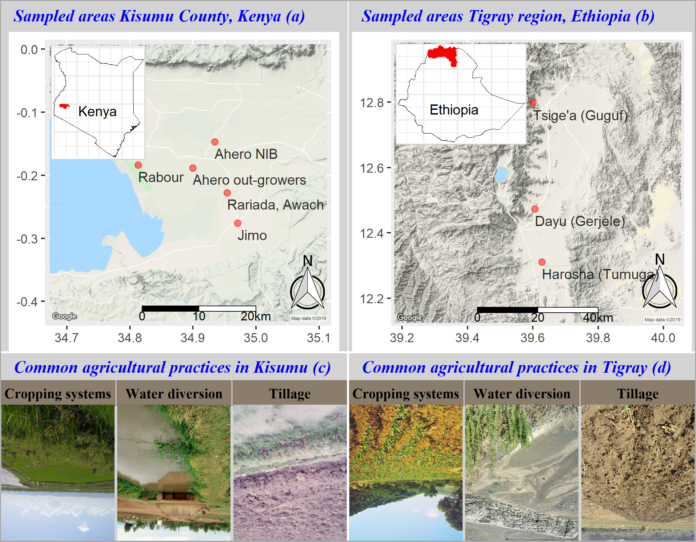

```{r setup, include=FALSE}
knitr::opts_chunk$set(echo = TRUE)
```

## I. Introduction

Modelling the performance of crops grown under specific conditions provide useful support for decision making. There are many models to simulate agricultural production (Murthy, 2004). These models have proven useful for various science and policy applications (Boote, Jones, & Pickering, 1996; Cerdan, Souchère, Lecomte, Couturier, & Le Bissonnais, 2002). While sophisticated, there are complications limiting their applicability in many ways. One important pitfalls of many models is their miscarriage to conceptualize realities (Cerdan et al., 2002; Luedeling, Whitney, Rosenstock, & Shepherd, 2017). Consequently, they fail to address their dual purpose of generating knowledge while contributing to decision impacts (Luedeling et al., 2017). These cascading issues may result from the over-simplification of processes and functions, the inadequacy in the scope of application along with the model rigidity to data and customization (Boote et al., 1996; Cerdan et al., 2002; Luedeling & Shepherd, 2016; Murthy, 2004; Rötter & Höhn, 2015; Van Ittersum et al., 2013). In crop modelling, these problems often result in unrealistic actual yield assessment (Murthy, 2004; Van Ittersum et al., 2013) urging the need for more approaches that accommodate for systems’ complexity and imperfect information upon compelling reasons. We argue that crop models should focus on data uncertainty and disregard the nature and sources of data inputs. We demonstrate the usefulness and usability of this concept by developing a flexible crop model for Flood-based Farming Systems (FBFS).
FBFS are agricultural systems receiving additional irrigation from various type of non-harmful floods that are unpredictable, of short duration, of low annual frequency and occurring in relatively lowlands areas with gentile topography where water supply to crops may be determined by complex socio-institutional arrangements for water acquisition and sharing (Haile, 2010; van Steenbergen, Lawrence, Mehari, Salman, & Faurès, 2010). Herein, flood is rather to be perceived in terms of water excess driven by the natural climate variability as in the concept of flood pulse (Junk, Bayley, & Sparks, 1989), or in the concept of Crue/Décrue (Harlan & Pasquereau, 1969) than as in its usual sense of hazard.  Many authors (FBLN, 2018; Harlan & Pasquereau, 1969; Puertas, Steenbergen, Haile, Kool, & Embaye, 2011; van Steenbergen, MacAnderson, & Mehari, 2011) have stressed on their importance for rural livelihoods in different communities.
The water management practice under FBFS takes advantage of extreme climate variability by saving water against potential drought. However, FBFS also pose many challenges for agricultural production (Puertas et al., 2011; van Steenbergen et al., 2010). These include many risk factors such as the timing, the frequency or the size of flood etc. (Puertas et al., 2011) which are to be appreciated in a context of general lack of information making the subject highly uncertain (van Steenbergen et al., 2010). The lack of information on FBFS may be due to a general lack of attention to FBFS in agricultural research and policies during the last centuries (Puertas et al., 2011; van Steenbergen et al., 2010). This emerging nature of FBFS is translated into a lack of expertise and comprehensive information on the range of best practices suited to FBFS (van Steenbergen et al., 2011). Despite their productivity, such risk factors and uncertainties are too tangible to disregard resulting in a general investment reluctancy which may lead to substantial opportunity loss (Erkossa, Langan, & Hagos, 2014; Hardaker, Anderson, Lien, & Huirne, 2015). In Kobo (Ethiopia) for instance, van Steenbergen et al. (2011) reported strong yield increases under spate irrigation compared to rainfed fields. Such positive stories will, however, only materialize when the additional water is well distributed in time and complements the shortages in rainwater. Furthermore, floods may also result in excessive water, which may cause waterlogging of soils or submergence of crop canopies with negative effects on crop production.
FBFS are clearly complex socio-ecological systems prone to many risk factors and data uncertainty. While these aspects are yet to be addressed in crop models as mentioned earlier, there is so far no crop model for FBFS in our knowledge.  The objective of this paper is to demonstrate how to develop a crop model with limited information while accounting for data uncertainty within an acceptable degree of system complexity. We applied an ensemble of decision theories methods to the concept of FBFS considering all available information and factors that seem important to ultimately simulate the performance of some crops along with their expected production risks. For the model to understand the farmers ‘realities, it needs to be able to account for qualitative as well as quantitative variables. We, therefore used Bayesian Networks (BNs) within a framework of Monte Carlo (MC) models to develop a crop model which was used as reasoning engine. The BNs were used to describe important qualitative processes, mostly related to agricultural constraints (e.g. the cropping systems and management options adopted by the farmer), and the MC models were used to describe the quantitative ones (e.g. biomass accumulation across crop development stages).  FBFS are considered as showcase but the concept is customizable to any other complex systems particularly for solution-oriented research. Two study areas in Ethiopia and Kenya were selected as referential to provide a generic model that could be applied to many contexts with minimal modification. The two areas were systematically chosen to provide most of the scenario (biophysical systems type, agricultural managements, social and institutional arrangements etc.) found in FBFS.

## II.	Study Area

 

The study areas, namely the Kisumu County and the Tigray region respectively in Kenya and Ethiopia, are located within relatively low-lying lands with each being in its own. While FBFS in Kisumu mainly source their water from permanent reservoirs via inundation canals, those in Tigray mostly obtain their water from ephemeral rivers where farmers are required to divert important amount of spate flow within a relatively short period of time. In addition, different communities within each study areas have their own peculiarities, especially in the ways they manage agronomic flooding and other agricultural managements (Figure 1). These discrepancies were addressed in a stratified sampling frame during field works. In Tigray region (Ethiopia), three villages including In Tsige’a (Guguf), Harosha (Tumuga), and Dayu (Gerjele) were sampled owing to their difference in flood water diversion. While flood is diverted using improved water diversion in Tsige’a, it is rather the traditional type of diversion that are used in Harosha whereas the modern type is used in Dayu. In Kisumu county (Kenya) where five areas (Awach Kano (Ririada), East Kano (Ahero), West Kano (Rabour), Out-growers (Ahero), East Nyankach (Jimo)) were considered, different stories are encountered. In Awach Kano, water is acquired via simple gravity from Awach river contrary to East Kano and West Kano where water is pumped using huge machines respectively from river Nyando and Lake Victoria. It worth to mention the East and West Kano schemes are conventional irrigation schemes managed by the Kenyan National Irrigation Board (NIB) even though they share many properties with FBFS. The scheme of the so called Out-growers is also feed via gravity as in the case of Awach Kano from the river Nyando but also different as it constitutes a safe disposal for exceeding water from East Kano. In East Nyankach, water is obtained through runoff harvesting via various household ponds and water tanks. These differences have important implications for water, social organization, and crops grown under FBFS (Figure 1). For examples, risks related to water may be more prominent in the Out-growers’ scheme compare to the schemes managed by the NIB. While the water sources and acquisition procedures vary under rice-based systems in Kisumu (i.e. Awach Kano, East Kano, West Kano, Out-growers), cultural practices are similar.  In these areas, rice is sown (after tillage and flooding) in monocultures during floods followed by various types of flood recession crops that are intercropped depending on the farmer and water availability (Figure 1). In Tigray, however, crops (mainly Maize, Sorghum, Teff) are mostly sown based on rainfall to latter be irrigated using flood water (Figure 1).

## III.	Materials and methods
### III.1.	Conceptual Framework

We use MC model to specify deterministic relationships involving multiple draws from continuous variables (Luedeling et al., 2015; Rosenstock et al., 2014) and BNs as multivariate models specifying probabilities stemming from causal relationships between discrete variables (Jensen, 1996) with directed edges indicating the direction of the causality (Pearl, 1988). While MC models provide a means for quasi-exhaustive enumeration across the space of possibilities for quantitative risk assessment under uncertainty (Rosenstock et al., 2014), BNs are suitable for building discrete models describing different scenarios for qualitative variables (nodes) accounting for uncertainties (Jensen, 1996; Pearl, 1988). We represent discrete nodes as instances of finite set of mutually exclusive states (node states) along with their occurrence probabilities (Jensen, 1996) as conditional probability tables (CPTs) where  the states of a parent node determines that of the child node (Fenton & Neil, 2013; Jensen & Nielsen, 2007; Scutari & Denis, 2015). BNs were used to describe and inter-relate important qualitative FBFS variables of high agricultural impact. The MC model, in turn, was used for approximating probability distributions of unknown variables using probabilistic sampling by generating multiple random realisations of numerical equations aiming at quantitative biomass and grain yield assessment (Hubbard, 2014; Luedeling et al., 2015). 

 

The conceptual framework (Figure 2) defines a farmland as the smallest entity evolving within a complex farming system where functions and processes are driven by various biotic and biotic factors which are, in turn, moderated by a package of agricultural managements. The interactions between these and the resulting low-level functions and processes profile the farmland to the extent of sensible farming constraints defined as a composite variable. If the factors of farming constraints vary according to farmland, then they can be assessed in terms of their relative scores at farm levels. Consequently, these scores can be described using probability distributions across the higher order farming system making them suitable for quantitative assessment. Since the variables are causally related, the system can be described through its individual functions and processes using BNs whereas its spatio-temporal behaviour can be quantitatively assessed using MC models considering plausible sub-samples across the space of the probability distribution. With this assumption, causality chains leading to key intermediates variables were used to ultimately assessed the level of farming constraints using low-level BNs estimating the probability of farming constraint at plot level. These local BNs were connected to be used as synthetic inputs for the MC model (Figure 3; Suppl.) describing the crop development stages following the FAO nomenclature. The MC model was based on the global yield gap concept where yield is crop-specific, primarily determine by the genetic potential of the variety, the cultivar, and the farming constraints. We assume the yield potential to be the highest possible theoretical yield that is never achieved due to some prevailing constraints that are context-specific(Van Ittersum et al., 2013). Since these constraints vary at various spatial scales (e.g. at watershed level due to natural variability, at farmland due to management variability, etc.), losses in yield potential will also vary, thus quantifiable as the probability of the state of these local constraints. Then, the actual yield at a given plot is proportional to the probability of the state of local constraints at that plot. Four crops (rice, maize, sorghum and teff) were chosen based on their importance in the study areas. A high-level overview of the model is provided in section IV.1 and a more detailed description in supplementary materials.

### III.2.	Data acquisition

The mixed BNs / MC model was structured to account for causality deemed important to FBFS settings by considering various sources of information ranging from literature, online database, expert knowledge elicitation, farmers’ and experts’ interviews, to remote sensing of FBFS. The model development process conducted in 5 sequential steps aiming at developing theories to be contextualised with farmers realities, is described in Figure 3. We reviewed the essential literature regarding the subject (literature review) to understand the concept, design broad leading questions, and target potential experts for interviews (high level discussion with experts). These high-level discussions provided the theoretical framework and leading questions for focus group discussions (FGDs) with farmers and meetings with local experts upon which individuals farmers interviews were conducted (Figure 3).
The literature review covered most of the FBLN database (FBLN, 2018) and extended to other relevant sources. The high-level discussion involved 11 academic subject matter experts working with FBFS and related fields across the world. The FGDs, the local expert meetings and the farmers interviews were conducted in Ahero and Kisumu towns (Kenya) in December 2016 and June 2017 and Makelle and Alamata towns (Ethiopia) in December 2016 and January 2017. Around 20 FGDs and 159 farmers interviews were conducted. The pool of local experts, initially represented by local farmers and extension civil servants, was extended to include the participants of the Leadership Course in Flood-Based Farming and Water Harvesting in Kenya and the participants of the International Training on Integrated Watershed Management and FBFS  in Ethiopia (FBLN, 2018). Prior to the model development exercise, the experts were taken through the principals of decision analysis, calibration training (Hubbard, 2014; Luedeling et al., 2015; Whitney, Lanzanova, et al., 2018; Whitney, Shepherd, & Luedeling, 2018) and the available data. Following the 5 steps, we adopted a procedure where participants lead the discussions depending on their inclination.

 

### III.3.	Data processing
#### III.3.1.	Making conditional probability tables (CPTs)
Specifying CPTs manually can be difficult particularly for complex nodes having many states and parents (Hansson & Sjökvist, 2013). For example, a three states node having only three parents with each 5 states will require probability estimations for 375 values. The make_CPT () function from the decisionSupport package in R provides a shortcut for deriving CPTs relating a child node to its parents (Luedeling & Goehring, 2018). The function requires the prior probability distribution of the child node, the child node sensitivity relative to the parents, the parents’ effects, and the weight of influence of each parent to create the full CPT (Luedeling & Goehring, 2018) using the likelihood method (Hansson & Sjökvist, 2013). Note, these are the variable estimates and model parameters provided by the experts. The livelihood method roots in the Bayes theorem but focuses on the likelihood instead of conditional probability since the former is easier to estimate than the latter because the expert needs only to worry about a limited number of values to estimate (Hansson & Sjökvist, 2013; Whitney, Shepherd, et al., 2018). For a node of interest, the method assumes the conditional probability of a given child state to be the product of the prior probability of that child state and its likelihood given the states of the parents of the node. Since the prior can also be easily estimated by the expert, the method makes expert elicitation easier. The process becomes even easier algorithmically by taking the logarithm of the likelihood which further mathematical simplifications result in the expert only needed to provide even more easier to estimate parameters for calculating the full CPT. These are the prior distribution of the child node, the base of the logarithm, a weight factor for the child node states, and a weight factor for the parent nodes states respectively corresponding to child prior, the child node sensitivity, the child state ranking, and the parents’ effects in the make_CPT function (Hansson & Sjökvist, 2013; Luedeling & Goehring, 2018). 

#### III.3.2.	The models and the modelling interface

The make_CPT () routines were automated and interfaced with the cptable () function from the gRain package (Højsgaard, 2012), which provides architecture for computer readable graphical models, to formalise the BNs following the experts’ causal reasoning. The posterior distributions of the 3645 parameters BNs was then used as synthetic inputs to feed the MC model using a routine that recursively account for each state of the node farming constraints at run time. This is equivalent to sampling over all possible farming constraints scenario. Technically, we used MC particle filters (Kitagawa, 2016; Koller & Friedman, 2009; Scutari, 2010) to generate the probabilities of farming constraints conditional on different combination of the states of variables involved in the BNs. The farming constraint was then used as a loss factor along with other quantitative variables (e.g. yield potential, average actual yield, biomass expansion factor) to feed the MC model (Figure 2). 
The BNs were programmed to provide the 90% confidence probability distribution, the minimal, the maximal, and the median values of the farming constraint factor. Note that the probability distributions of the node farming constraints were chosen, at each stage of crop development, based on reasonable bounds for skewness and kurtosis via visual observation supported by bootstrapping (Delignette-Muller & Dutang, 2015). We fitted several candidate distributions using the fitdist () function from the fitdistrplus package (Delignette-Muller & Dutang, 2015) from which we choose the best fitting distribution. Note also that the rest of parameters (i.e. the minimal, maximal and median values) required by the decisionSupport’s  mcSimulation () function (Luedeling & Goehring, 2018), which was used to conduct the MC simulation, were simply computed from the fitted distribution using the fitdist () function and other facilities provided by the rriskDistributions package (Belgorodski, Greiner, Tolksdorf, & Schueller, 2017). The same parameters were derived for the rest of the MC nodes by the experts and cross-checked against their corresponding rainfed agriculture metrics for the same areas. 

## IV.	Result

## IV.1.	Overview of the Conceptual Model

The full potential of the model and its specifications (121 and 32 nodes respectively for the BNs and MC models) are too complex to be presented here. We provide the specifications at the initial stage of crop development (see Suppl.) to illustrate the complexity of the model whereas its usefulness and usability are presented as standalone case studies to showcase the model. The reader is encouraged to test the R code provided as supplement to the paper (see Technical material) .Nonetheless, we presented an overview of the model (Figure 4), as mentioned in section III. The 121 nodes in the main BNs were grouped into 3 local BNs at each of the 4 crop development stages and used to describe 5 different important FBFS processes. The latter were, then, used to describe the farming constraints which was considered as quantitative node to be part of the 32 nodes of the MC model. At glance, the model can be seen as a watershed with a four-order stream networks (Figure 4) where the first orders are represented by the individual variables (e.g. soil nutrients in pink), the second by the local BNs (e.g. cropping options in green) describing the sub-processes formed by these variables, the third by the main BNs describing the farming constraints (in greenish yellow) to which converge these local BNs, and the fourth by the crop development subjected to the farming constraints (gradient green).

# reference
