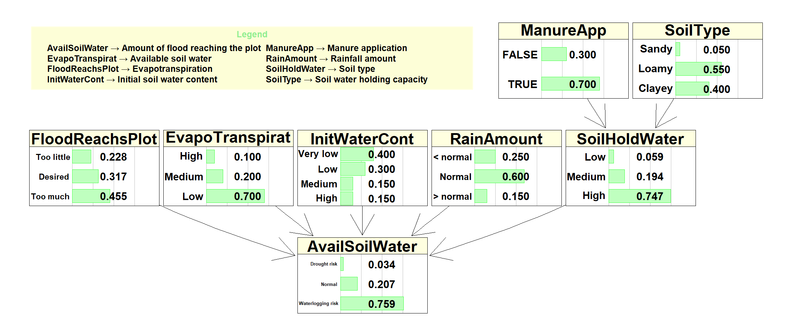
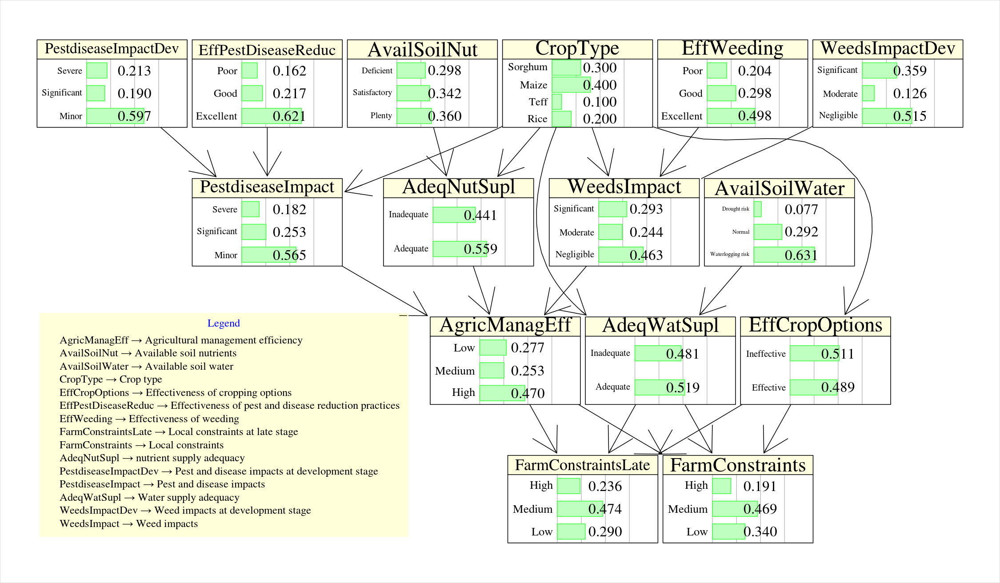

```{r setup, include=FALSE}
knitr::opts_chunk$set(echo = TRUE,out.extra = '',fig.align='center',fig.pos='!htbp',cache=TRUE)
```

# Introduction {#I}

Modelling the performance of crops grown under specific conditions provides useful support for decision making. There are many models to simulate agricultural production [@Murthy_2004]. These models have proven useful for various science and policy applications [@Boote_et_al_1996; @Cerdan_et_al_2002]. While these models are quite sophisticated, a few complications limit their broad applicability. One important pitfalls of many models is their failure to describe reality sufficiently well to support real-life decisions [@Cerdan_et_al_2002; @Luedeling_et_al_2017]. Consequently, they fail to address their dual purpose of generating knowledge while contributing actionable information to support decisions and ultimately generate impacts [@Luedeling_et_al_2017]. These limitations of traditional modelling approaches can be explained by many issues among which their inadequacy to account for systems’ complexity, the scope of application, the available data, or customization in specific settings [@Boote_et_al_1996; @Cerdan_et_al_2002; @Luedeling_and_Shepherd_2016; @Murthy_2004; @Rotter_and_Hohn_2015; @VanIttersum_et_al_2013]. Contrastingly, the development of new models that address these challenges while producing reliable results for solving real-world problems has proven to be difficult in many contexts. In crop modelling, these problems often result in unrealistic yield assessments [@Murthy_2004; @VanIttersum_et_al_2013], which highlight the need for better approaches that accommodate for systems’ complexity and imperfect information. We argue that crop models should consider data uncertainty and find ways to include data inputs of varying nature, origin and quality. We demonstrate the usefulness and usability of this concept by developing a flexible crop model for Flood-based Farming Systems (FBFS).

FBFS are agricultural systems receiving additional irrigation from various types of non-harmful floods that are unpredictable, of short duration, of low annual frequency and occurring in relatively low-lying areas with gentle topography. In FBFS, water supply to crops is often determined by complex socio-institutional arrangements for water acquisition and sharing [@Haile_2010; @VanSteenbergen_et_al_2010]. In this contexts, floods are not natural disasters but temporary situations of excess water, driven by the natural variability as in the concept of flood pulse [@Junk_et_al_1989], or in the concept of Crue/Décrue [@Harlan_Pasquereau_1969] such that the water availability is governed by recurrent floods followed by recession providing opportunities for farming. Many authors [@FBLN_2018; @Harlan_Pasquereau_1969; @Puertas_et_al_2011; @VanSteenbergen_et_al_2011] have stressed their importance for rural livelihoods in different communities.

Water management practices in FBFS take advantage of extreme rainfall variability by saving water against potential drought. However, FBFS also pose many challenges for agricultural production [@Puertas_et_al_2011; @VanSteenbergen_et_al_2010], many of which are related to the timing, frequency or size of flood [@Puertas_et_al_2011]. These risks must be appreciated in a context of a general lack of information, which makes evidence-based management very difficult [@VanSteenbergen_et_al_2010]. The lack of information on FBFS may be due to a general lack of attention to FBFS in agricultural research and policy [@Puertas_et_al_2011; @VanSteenbergen_et_al_2010], which has limited the build-up of expertise and comprehensive information on what management practices are best suited to FBFS [@VanSteenbergen_et_al_2011]. The flood-related risks and uncertainties in information and agricultural production are too tangible to disregard. Consequently, farmers and donors are reluctant to invest in FBFS despite their productivity because of the lack of risk assessment procedures suited to FBFS. Such a decision support gap results in substantial opportunity loss in many context [@Erkossa_et_al_2014; @Hardaker_et_al_2015].

The promises of spate irrigation (a variant of FBFS) compared to rainfed agriculture has been reported in Kobo (Ethiopia) as four times and double yield increase respectively for pepper and sorghum [@VanSteenbergen_et_al_2011]. Such positive stories will, however, only materialize when the additional water is well distributed in time and complements the shortages in rainwater. Furthermore, floods may also result in excessive water, which may cause waterlogging of soils or submergence of crop canopies with negative effects on crop production. FBFS are clearly promising and complex socio-ecological systems but also prone to many risk factors and data uncertainty. In FBFS, the above-mentioned limitations of traditional modelling approaches are further exacerbated by socio-economic and management aspects that are crucial for system functioning. FBFS Models must consider sediment management, infrastructure for water acquisition, social rules and other institutional arrangements for water acquisition and sharing among farmers. While these aspects are yet to be addressed in crop models as mentioned earlier, there is so far no crop model for FBFS in our knowledge. The objective of this paper is to demonstrate how to develop a crop model for complex agricultural systems with limited information while accounting for data uncertainty. We applied decision theories methods to the concept of FBFS considering the available information and factors that seem important to ultimately simulate the performance of some crops along with their expected production risks. For the model to understand the farmers ‘realities, it needs to be able to account for qualitative as well as quantitative information. We therefore used Bayesian Networks (BNs) within a framework of Monte Carlo (MC) models to develop a crop model. The BNs were used to describe important qualitative processes, mostly related to agricultural constraints (e.g. the cropping systems and management options adopted by the farmer), and the MC models were used to describe the quantitative ones (e.g. biomass accumulation across crop development stages). FBFS are considered as showcase but the concept is customizable to any other complex systems particularly for solution-oriented research. Two study areas in Ethiopia and Kenya were selected as reference locations to produce a generic model that could be applied to many contexts with minimal modification. The two areas are assumed to provide most of the complexity (e.g. biophysical systems type, agricultural managements, social and institutional arrangements) found in FBFS.

# Study Area {#II}

The study areas, namely the Kisumu County and the Tigray region respectively in Kenya and Ethiopia, are located within relatively low-lying lands with differences regarding the management of agronomic flooding and other agricultural practices (Figure \@ref(fig:fig1)). While FBFS in Kisumu mainly source their water from permanent reservoirs via inundation canals, those in Tigray mostly obtain their water from ephemeral rivers where farmers are required to divert important amounts of spate flow within a relatively short period of time.

```{r fig1, echo=FALSE, out.width = '100%', fig.cap="Differences in the practices of FBFS in Kisumu County (Kenya) and Tigray region (Ethiopia)."}
knitr::include_graphics("figures/Modelling_FBFS_study_area.png")
```

Communities in the two study areas employ specific strategies for flood and land management (Figure \@ref(fig:fig1)). These differences were addressed by a stratified sampling frame applied during field work. In the Tigray region (Ethiopia), three schemes including Tsige’a (39.59967° N, 12.79827° E), Harosha (39.62788° N, 12.31102° E), and Dayu (39.60545° N, 12.47372° E) were sampled to capture different flood water diversion strategies. While the flood is diverted using improved water diversion in Tsige’a, traditional and modern ones are found respectively in Harosha and Dayu. Here, traditional flood water diversions are to be understood as physical infrastructures (e.g. deflecting spurs, soil bunds) constructed by the farmers across flood channels using locally available materials. In modern ones, concrete infrastructures (e.g. diversion weirs) designed by engineers replace those in traditional diversion. The improved diversion type consisted in integrating both farmers and engineer knowledge in designing the infrastructures. In Kisumu county (Kenya), where five areas (Awach Kano (0.22762° S, 34.95432° E), East Kano (0.14700° S, 34.93436° E), West Kano (0.18358° S, 34.81306° E), Out-growers (0.18822° S, 34.89974° E), East Nyankach (0.27578° S, 34.97058° E)) were considered, different situations are encountered. In Awach Kano, water is acquired via simple gravity flow from the Awach river, whereas in East Kano and West Kano it is acquired by large pumps from Nyando River and Lake Victoria, respectively. It worth mentioning that the East and West Kano schemes are conventional irrigation schemes managed by the Kenyan National Irrigation Board (NIB), even though they share many properties with FBFS. The scheme of the so called Out-growers is also fed via gravity as in the case of Awach Kano from the river Nyando, but it differs from the other locations in that it also serves as a safe disposal for excessive water in East Kano. In East Nyankach, water is obtained through runoff harvesting via various household ponds and water tanks. These differences have important implications for water supply, social organization, and crops grown under FBFS (Figure \@ref(fig:fig1)). For example, risks related to water supply may be more prominent in the Out-growers’ scheme compared to the schemes managed by the NIB. While the water sources and acquisition procedures vary under rice-based systems in Kisumu (i.e. Awach Kano, East Kano, West Kano, Out-growers), cultural practices are similar. In these areas, rice is sown (after tillage and flooding) in monocultures during floods, followed by various types of flood recession crops that are intercropped depending on the farmer and water availability (Figure \@ref(fig:fig1)). In Tigray, however, crops (mainly Maize, Sorghum, Teff) are mostly sown based on rainfall to later be irrigated using flood water (Figure \@ref(fig:fig1)).

# Materials and methods {#III}

## Conceptual Framework {#III1}

### Concepts and Rational {#III11}

The modelling concept is based on two different probabilistic approaches, the MC simulation for handling continuous variables, and the BNs for handling the discrete ones, as mentioned earlier. The resulting models, embedding complex relationships among several processes of high agricultural importance, were interfaced (Figure \@ref(fig:fig2)) to provide quantitative assessment in FBFS. Our goal was to develop a detailed description of the important processes, highlighting the factors of risk and uncertainty, that influence crops development and production focusing on various yield metrics (Figure \@ref(fig:fig2)). Towards this end, the conceptual framework (Figure \@ref(fig:fig2)) defines a farmland as the smallest entity evolving within a complex farming system where processes, fulfilling specific functions, are driven by several variables. These variables defining various biotic and abiotic factors are, in turn, moderated by a package of agricultural practices [@Jax_and_Setala_2005]. The interactions between these and the resulting low-level functions and processes profile the farmland in terms of relevant farming constraints. If the processes leading to farming constraints vary according to farmland, the variable farming constraints also varies, then they can be assessed in terms of their relative effects on crops at farm levels. Consequently, the variable farming constraint can be described using the scored values of these effects as probability distribution when these effects are measurable at plot levels, hence across the higher order farming system. Since the variables involved in the processes are causally related, the system complexity can be unambiguously dealt with by understanding the individual processes (e.g. (causality chains leading to the) available soil water or available soil nutrients) within the system. These processes, in turn, can be decomposed into the respective variables (e.g. rainfall occurrence or manure application) forming them. Furthermore, the variability in the processes across farmlands implies further state changes in the variables forming them, in which case each variable can be defined in terms of the different states (i.e. rainfall occurrence is either on-site or off-site, manure application is either true or false) it may take at farming plot levels. Such complex levels of hierarchy and categorization are the domain of multinomial models and can be well specified using BNs whereas the spatio-temporal behaviour of the system can be quantitatively assessed using MC models considering plausible sub-samples across the space of the probability distribution. With this assumption, causality chains leading to key intermediate variables were used to ultimately assess the level of farming constraints using low-level BNs estimating the probability of farming constraint at plot level. These local BNs were connected to be used as synthetic inputs for the MC model (Figure \@ref(fig:fig3); Suppl.) describing the crop development stages following the FAO nomenclature [@Allen_et_al_1998].

```{r fig2, echo=FALSE, out.width = '100%', fig.cap="Conceptual framework of important processes to include in the development of a mixed model describing FBFS in Kisumu (Kenya) and Tigray (Ethiopia)."}
knitr::include_graphics("figures/Modelling_FBFS_conceptual_framework.png")
```

A Monte Carlo simulation is an intensive computation, where each unknown variable is estimated using mathematically valid rules, resulting in different scenario depending on the probabilities of the input data. These redundant calculations are repeated thousands of time to generate the scenario to portray the range of possible outcomes along with their probabilities. The inputs for MC models are continuous variables provided as probability distributions bounded by realistic value ranges to represent the associated uncertainty. BNs are probabilistic graphical model representing logical connections (directed edges) between a set of variables (nodes) where dependencies are represented by arrows (arcs) encoding the direction, and nature (i.e. direct or indirect relationship) of the causality [@Pearl_1988]. A Node describes the states a variable (node states) whereas a variable at the arrow head (child node) is influenced by the variable at the arrow tail (parent node). The strength of the influence is portrayed by the conditional probabilities [@Fenton_and_Neil_2013; @Jensen_1996; @Pearl_1988]. 
The properties described above make the MC models suitable for quantitative assessment [@Hubbard_2014], BNs suitable for predicting the extent to which specific effects are produced by certain causes [@Fenton_and_Neil_2013; @Jensen_1996; @Pearl_1988; @Scutari_and_Denis_2015], and both MC models and BNs suitable for imperfect information, expert knowledge, and explicit uncertainty. While MC models provide a means for quasi-exhaustive enumeration across the space of possibilities for quantitative risk assessment under uncertainty [@Rosenstock_et_al_2014], BNs are suitable for building discrete models describing different scenarios for qualitative variables [@Jensen_1996; @Pearl_1988]. We represent discrete nodes as instances of a finite set of mutually exclusive states (node states) along with their occurrence probabilities [@Jensen_1996] as conditional probability tables (CPTs; see also section \@ref(III31)) where the states of a parent node determines that of the child node [@Fenton_and_Neil_2013; @Jensen_and_Nielsen_2007; @Scutari_and_Denis_2015]. The MC model, in turn, was used for approximating probability distributions of unknown variables using probabilistic sampling by generating multiple random realisations of numerical equations aiming at quantitative biomass and grain yield assessment [@Hubbard_2014; @Luedeling_et_al_2015]. 

### Methodological Specifications {#III12}

We use an MC model to specify deterministic relationships targeting several unknown (dependent) variables (Figure \@ref(fig:fig2)) and estimate them based on random values of the known (independent) ones used as inputs for deterministic relationship linking the dependent to the independent variables [@Luedeling_et_al_2015; @Rosenstock_et_al_2014]. The BNs were used as multivariate models specifying the probabilities of the states of unknown variables conditional on the probabilities of the states of the known ones (Figure \@ref(fig:fig2)) as specified in a causal relationships between these discrete variables [@Jensen_1996; @Pearl_1988]. The MC model was based on the ‘yield gap’ concept where yield is crop-specific, primarily determined by the genetic potential of the variety, the cultivar, and the farming constraints. We assume the yield potential to be the highest possible theoretical yield that is never achieved due to some prevailing constraints that are context-specific[@VanIttersum_et_al_2013]. Since these constraints vary at various spatial scales (e.g. at watershed level due to natural variability, at farmland scale due to management variability), losses in yield potential will also vary. Such losses can be estimated via the probability of the states of these local constraints. Then, the actual yield at a given plot is proportional to the probability of the state of local constraints at that plot. Four crops (rice, maize, sorghum and teff) were chosen based on their importance in the study areas. A high-level overview of the model is provided in section \@ref(IV1) and a more detailed description in the supplementary materials. Crop development stages were defined from the onset to 10% ground cover as initial stage, from 10% ground cover to effective full cover as the development stage, from effective full cover to the start of maturity as the mid stage, and from the start of maturity to harvest or full senescence as the late stage [@Allen_et_al_1998]. At each of these 4 stages, local BNs were used to describe the farming plot and assess the probability of farming constraints which is assumed to inform the quality of management practices employed by the farmer. The farming constraints variable, in turns, is assumed to drive several yield metrics tracing the temporal biomass accumulation and potential opportunity losses with regards to yield improvement. The yield metrics include the yield potential defined as the cultivar yield without farming constraints (i.e. limitations in water, nutrient, and stress), the exploitable yield potential defined as the fraction of yield potential (70 – 80%) achievable by the farmers, the attainable yield potential defined as the maximum achievable yield given the farmers’ realities, the average actual yield defined as the realistic yield actually achieved by the farmer, the exploitable yield gap defined as the yield improvement opportunities for the farmer, the exploitable yield gap loss due to farming constraints defined as the yield improvement opportunity loss, the actual exploited yield gap defined as the real yield improvement actually achieved by the farmer, and the expected actual yield defined as yield expectation given the farmer’s management conditions [@VanIttersum_et_al_2013]. Note, some of these metrics at the next crop development stage depend on those at the previous stage whereas a biomass expansion factor, measuring the growth rate of the crop, was considered to control the crop growth at each of these stages. This way, crops would not arbitrary grow beyond the actual yield expectations. This cross-stage interdependencies holds also for some of the variables in BNs to account for residual effects of certain variables.

## Data acquisition {#III2}

The mixed BN / MC model was structured to account for causality deemed important to FBFS settings by considering various sources of information, including literature, online databases, expert knowledge elicitation, farmer and expert interviews and remote sensing. The model development process consisted of 5 sequential steps aiming at developing theories to be contextualised with farmers’ realities (Figure \@ref(fig:fig3)). We reviewed the essential literature regarding the subject (literature review) to understand the concept, design broad leading questions, and target potential experts for interviews (high level discussion with experts). These high-level discussions provided the theoretical framework and leading questions for focus group discussions with farmers and meetings with local experts upon which individuals farmers interviews were conducted (Figure \@ref(fig:fig3)).

The literature review covered most of the flood-based livelihood network database [@FBLN_2018] and extended to other relevant sources. The high-level discussion involved 11 academic subject matter experts working with FBFS and related fields across the world. The focus group discussions, the local expert meetings and the farmer interviews were conducted in Ahero and Kisumu towns (Kenya) in December 2016 and June 2017 and Mekelle and Alamata towns (Ethiopia) in December 2016 and January 2017. Around 20 focus group discussions and 159 farmer interviews were conducted. The pool of local experts, initially represented by local farmers and extension civil servants, was extended to include the participants of the Leadership Course in Flood-Based Farming and Water Harvesting in Kenya and the participants of the International Training on Integrated Watershed Management and FBFS in Ethiopia [@FBLN_2018]. Prior to the model development exercise, the experts were taken through the principles of decision analysis, calibration training [@Hubbard_2014; @Luedeling_et_al_2015; @Whitney_et_al_2018; @Whitney_et_al_2018a] and the available data. Following the 5 steps, we adopted a procedure where participants led the discussions depending on their expertise.

```{r fig3, echo=FALSE, out.width = '100%', fig.cap="Overview of the approach used to develop the crop model for FBFS in Kisumu (Kenya) and Tigray (Ethiopia)."}
knitr::include_graphics("figures/Modelling_FBFS_approach_overview.png")
```

## Data processing {#III3}
### Making conditional probability tables (CPTs) {#III31}
As mentioned in section \@ref(III1), BNs are complex model in which influence between child and parent nodes are represented by arcs whereas the strength of that influence is represented by the conditional probabilities. Conditional probability tables (CPTs) are stochastic matrix storing these probabilities to portray the strength of the association between the states of a child node conditional on the probabilities of the states of its parents (e.g. probability of drought risk (available soil water node) knowing that rainfall is above normal (rainfall amount node)) [@Hansson_and_Sjokvist_2013; @Scutari_and_Denis_2015]. Specifying CPTs manually can be difficult particularly for complex nodes with many states and parents [@Hansson_and_Sjokvist_2013]. For example, a three states node with only three parents, each of which can assume 5 states, will require probability estimations for 375 possible situations. The make_CPT function from the decisionSupport package in R provides a shortcut for deriving CPTs relating a child node to its parents [@Luedeling_and_Goehring_2018]. The function requires the prior probability distribution of the child node, the child node sensitivity relative to the parents, the parents’ effects, and the weight of influence of each parent to create the full CPT [@Luedeling_and_Goehring_2018] using the likelihood method [@Hansson_and_Sjokvist_2013]. Estimates of all these parameters are elicited from the experts. The likelihood method is rooted in Bayes’ theorem but focuses on the likelihood instead of conditional probability. The former is easier to estimate than the latter, because expert only need to worry about a limited number of values to estimate [@Hansson_and_Sjokvist_2013; @Whitney_et_al_2018a]. For a node of interest, the method assumes the conditional probability of a given child state to be the product of the prior probability of that child state and its likelihood given the states of the parents of the node. Since the prior can also be easily estimated by the expert, the method substantially facilitates expert elicitation. With further mathematical simplifications [@Hansson_and_Sjokvist_2013], the expert only needs to provide few easier to estimate parameters for calculating the full CPT. These are the prior distribution of the child node, the base of the logarithm, a weight factor for the child node states, and a weight factor for the parent nodes states respectively corresponding to child prior, child node sensitivity, child state ranking, and the parents’ effects in the make_CPT function [@Hansson_and_Sjokvist_2013; @Luedeling_and_Goehring_2018].

### The models and the modelling interface {#III32}

The make_CPT routines were automated and interfaced with the cptable function from the gRain package [@Hojsgaard_2012], which provides architecture for computer readable graphical models, to formalise the BNs following the experts’ causal reasoning. The posterior distributions of the 3645 parameters BNs was then used as synthetic inputs to feed the MC model using a routine that recursively accounts for each state of the node farming constraints at run time. This is equivalent to sampling over all possible farming constraint scenarios. Technically, we used MC particle filters [@Kitagawa_2016; @Koller_and_Friedman_2009; @Scutari_2010] to generate the probabilities of farming constraints conditional on different combination of the states of variables involved in the BNs. The farming constraint was then used as a loss factor along with the other quantitative yield metrics (see section \@ref(III1)) to feed the MC model (Figure \@ref(fig:fig2)).

The BNs were programmed to provide the 90% confidence probability distribution, the minimal, the maximal, and the median values of the farming constraint factor. Note that the probability distributions of the node farming constraints were chosen, at each stage of crop development, based on reasonable bounds for skewness and kurtosis via visual observation supported by bootstrapping [@Delignette-Muller_and_Dutang_2015]. We fitted several candidate distributions using the fitdist function from the fitdistrplus package [@Delignette-Muller_and_Dutang_2015] from which we chose the best fitting distribution. Note also that the remaining parameters (i.e. the minimal, maximal and median values) required by the decisionSupport’s mcSimulation function [@Luedeling_and_Goehring_2018], which was used to conduct the MC simulation, were simply computed from the fitted distribution using the fitdist function and other facilities provided by the rriskDistributions package [@Belgorodski_et_al_2017]. The same parameters were derived for the remaining MC nodes by the experts and cross-checked against their corresponding rainfed agriculture metrics for the same areas. 

# Result {#IV}

## Overview of the Conceptual Model {#IV1}

The overview of the model is presented in Figure \@ref(fig:fig4) as mentioned in section \@ref(III). For more a detailed description, the reader is referred to the supplementary material where we provided the model specifications at the initial stage of crop development (see Suppl.). The full model along with its complex specifications (121 and 32 nodes respectively for the BNs and MC models) are provided as reproducible code in the technical material. The usefulness and usability are presented as standalone case studies to showcase the model. The 121 nodes in the main BNs were grouped into 3 local BNs at each of the 4 crop development stages and used to describe 5 important FBFS processes. These processes were then used to describe the farming constraints which was considered as quantitative node to be part of the 32 nodes of the MC model. The further modelling process includes four work streams (Figure \@ref(fig:fig4)), represented by the individual variables (e.g. soil nutrients in pink), the local BNs (e.g. cropping options in green) describing the sub-processes formed by these variables, the main BNs describing the farming constraints (in greenish yellow) to which these local BNs converge, and the crop development subject to the farming constraints (light green).

```{r fig4, echo=FALSE, out.width = '100%', fig.cap="Conceptual model used to integrate the local BNs as part of a mixed model describing input allocation and agricultural management in FBFS in Kisumu (Kenya) and Tigray (Ethiopia)."}
knitr::include_graphics("figures/Modelling_FBFS_model_overview.png")
```

## Case studies {#IV2}
```{r Setting the Scene, include = FALSE, echo = FALSE, cache = FALSE}

set.seed(123)

### Installing devtools package to get decisionSupportExtra from github ####
if (!require("devtools")) {
  install.packages("devtools")
}

## Installing decisionSupportExtra package from github ####
if (!require("decisionSupportExtra")) {
  devtools::install_github("Issoufou-Liman/decisionSupportExtra", build = TRUE, force = TRUE,
                           upgrade = "always", build_opts = c("--no-resave-data", "--no-manual"))

}

## loading required packages ####
if (!require("pacman")) install.packages("pacman")
pacman::p_load(gRain,
               bnlearn,
               Rgraphviz,
               ggplot2,
               grid,
               gridExtra,
               decisionSupport,
               fitdistrplus,
               rriskDistributions,
               scales
)

## Loading decisionSupportExtra package ####
library(decisionSupportExtra)

## Loading the Bayesian network ####
source("source_files/BNs.R")

## removing objects that are no longer needed ####
rm(list=setdiff(ls(), "network_bn_fit"))

## A function responsable plotting the locol BNs
source("source_files/graphviz_chart_bn.R")

## some common plots specifications
legend_bg <- adjustcolor( "yellow", alpha.f = 0.15)
plots_lwd <- 0.5
min_plots_width_in <- 2.63
max_plots_width_in <- 7.5
max_plots_height_in <- 8.75
min_plots_res <- 300
plots_compression <- "lzw"
plots_font_family <- 'serif' # 'sans'
plots_font <- 1 # 2
plot_font_size <- 10

## exporting the plot to file.####
export_fun <- function(export, output_dir = "figures"){
  paste0(output_dir, '/', export, ".png")
}

my_theme <- theme_bw(base_size = plot_font_size, 
                     base_family = plots_font_family) +
  theme(panel.grid.minor = element_blank(),
        # strip.background = element_blank(),
        legend.title = element_blank(),
        # remove facet spacing on x-direction
        panel.spacing = unit(0,"line"),
        
        panel.border = element_rect(color = "black", fill = NA, size = 0.25),
        axis.ticks = element_line(colour = 'black', size = 0.05),
        legend.position="top",
        legend.justification = 'right',
        strip.background = element_rect(fill='lightgoldenrodyellow', color = "gray", size = 0.075),
        strip.text = element_text(colour = 'black'),
        plot.subtitle=element_text(size=9.5, face="italic", color="blue"))
```

### Qualitative Soil water Assessment under different Management Decisions at initial stage of crop development in Flood-based livelihood systems. {#IV21}

#### Abstract {#IV210}

Add some text

Keywords: FBFS, Soil water content, Soil type, manure application, water conservation

#### Introduction {#IV211}

FBFS are possible solutions to the increasing rainfall variability and drought in rainfed agriculture, because they can overcome water shortages through supplementary irrigation. To resolve potential drought risk, this irrigation must secure large amount of flood water in soil without creating a side effect of anaerobic conditions for crops. This requires maximizing water storage in soils (e.g. run-on, rainfall) while limiting waterlogging of soils and water loss (e.g. evapotranspiration, run-off, percolation). In FBFS, much of the water is acquired via flood, drought/waterlogging depend heavily on the amount of flood reaching the plot, and water losses are inversely related to the quality and quantity of soil organic amendments and other intrinsic factors related to soils along with other climatic factors. Depending on the soil type, farmers optimize the soil water at plot level by diverting the desired amount of flood, sometimes in combination with manure application and mechanic works. While most farmers use one or more of such soil and water conservation techniques, few can tell which the best option is. The objective of this case study is to demonstrate how the model could be used to prescribe optimum pre-season cultural practices for improved soil water under specific soil types using the BNs sub-model. Towards this end, we queried the BNs sub-model targeting the node available soil water (AvailSoilWater) conditional on different combination of the states of 3 parent nodes that are relevant for soil water. These are the nodes amount of flood reaching the plot (FloodReachsPlot) which is a direct parent (Figure \@ref(fig:fig5)), the soil type (SoilType) and the manure application (ManureApp) which are ancestors (indirect parents).

#### Materials and Method {#IV212}

```{r case study 1 methods rds 1,eval=TRUE, include = FALSE, echo = FALSE, cache = FALSE}

## Available soil water BNs  ####

net <- bnlearn::model2network("[SoilType][ManureApp][SoilHoldWater|SoilType:ManureApp][EvapoTranspirat][InitWaterCont][RainAmount][FloodReachsPlot][AvailSoilWater|SoilHoldWater:EvapoTranspirat:RainAmount:InitWaterCont:FloodReachsPlot]")

abbr_node_names <- bnlearn::nodes(net)

net <- bnlearn::model2network("[Soil_type][Manure_application][Soil_water_holding_capacity|Soil_type:Manure_application][Evapotranspiration_at_initial_stage][Initial_soil_water_content][Rainfall_amount_at_initial_stage][Amount_of_flood_reaching_the_plot_at_initial_stage][Available_soil_water_at_initial_stage|Soil_water_holding_capacity:Evapotranspiration_at_initial_stage:Rainfall_amount_at_initial_stage:Initial_soil_water_content:Amount_of_flood_reaching_the_plot_at_initial_stage]")

legende <- bnlearn::nodes(net)
```

```{r case study 1 methods rds 2, eval=FALSE,include=FALSE,echo=FALSE, cache = FALSE}
net <- decisionSupportExtra::extract_bn(bn = network_bn_fit, string_model = net)
saveRDS(net, paste0("output_files", "/", substring(gsub(" ", "_", gsub('-|:', '', Sys.time())), 3), "_BNs_Case_study_1.rds"))
```

```{r case study 1 methods rds 3, eval=TRUE,include=FALSE,echo=FALSE, cache = FALSE}
net <- readRDS("output_files/190511_130538_BNs_Case_study_1.rds")
```

```{r case study 1 methods plots, eval=TRUE, include = FALSE, echo = FALSE, cache = FALSE}

bnlearn::nodes(net) <- abbr_node_names[c(3, 1, 2, 4, 5, 6, 8, 7)]

legende <- mapply(paste, abbr_node_names, sprintf('\u2192'), legende)
legende <- gsub("_", " ",  legende)
legende <- gsub(" at initial stage", "",  legende)

png(export_fun(export = "Modelling_FBFS_Avail_soil_water"),
     res = min_plots_res,
     units = 'in',
     # compression = plots_compression,
     width = max_plots_width_in, 
     height = max_plots_height_in/2.75,
     pointsize = 10.5)

par(font = plots_font, family = plots_font_family, lwd=plots_lwd)

graphviz_chart_bn (x = net, type = "barprob", layout = "dot", draw.levels = TRUE,abbreviate=FALSE,
                   grid = TRUE, scale = c(max_plots_height_in/2, max_plots_width_in), col = "black", bg = "transparent",
                   text.col = "black", bar.col = "green", strip.bg = "lightyellow", main = NULL,
                   sub = NULL, target_node="AvailSoilWater")

legend('topleft', legend = legende, text.width = 0.6*strwidth(legende[which.max(nchar(legende))]), 
       cex=0.6, ncol = 2,
       bty="o", box.lwd=1, box.col='lightyellow', xjust=1, yjust=1, bg=legend_bg,
       title = 'Legend', title.col = 'lightgreen', inset=c(0.04, 0.08))

dev.off()
```

```{r fig5, echo=FALSE, out.width = '100%', fig.cap="Illustration of the causality defining the factor of soil water content in FBFS in Kisumu (Kenya) and Tigray (Ethiopia)."}

```

A split-split plot experiment with 10 repetitions was used to test the effect of 3 different treatments and their interactions on the available soil water at initial stage of crop development (Figure 10; Suppl.) as node of interest. These include 3 different soil types (clayey, loamy, sandy) as the main plot, 2 manure applications levels (true, false) as subplot and 3 levels of amount of flood reaching the plot at initial stage as sub-subplot (too little, desired, too much). Split-split plot design extends the split plot design, both extensively described in @Gomez_and_Gomez_1984; Chap. 3 - 4 and @Panse_and_Sukhatme_1957; Chap. 11. Each treatment corresponds to a combination of plot, subplot and sub-subplot. Such a design was considered as evidence based on which the BNs was queried targeting the node of interest. The resulting evidence-based posterior distributions were then fitted using an Analysis of Variance (ANOVA) Model followed by Tukey's honestly significant difference (Tukey HSD) post hoc test using the agricolae package in R [@DeMendiburu_2016; @RCoreTeam_2018]. 

#### Results and Discussions {#IV213}

```{r case study 1 results rds 1, eval=TRUE,include = FALSE, echo = FALSE, cache = FALSE}
## constructing the evidence list ####
evidence <- c('Soil_type', 'Manure_application', 'Amount_of_flood_reaching_the_plot_at_initial_stage')

bloks = 1:10
ssp <- sapply(bloks, function (nothing){
    out <- sample_cpdist(bn = network_bn_fit, node = "Available_soil_water_at_initial_stage",
                         op = "proba", evidence = evidence, include_relatives = FALSE)
    cbind(out$prior, out$posterior)
    
}, simplify = F, USE.NAMES = TRUE)

ssp  <- reshape::melt(ssp)
```

```{r case study 1 results rds 2,eval=TRUE,include = FALSE, echo = FALSE, cache = FALSE}

saveRDS(ssp, paste0("output_files", "/", substring(gsub(" ", "_", gsub('-|:', '', Sys.time())), 3), "_ssp_Case_study_1.rds"))
```

```{r fig6,echo=FALSE,fig.width=14.2,fig.height=7.14/1.25,dpi=min_plots_res,fig.cap="Effect of soil type, manure application and flood water on the available soil water for crops at initial development stage in Kisumu (Kenya) and Tigray (Ethiopia)."}

p1 <- ggplot(data = ssp, aes(x=variable, y = value, fill = variable))+
  geom_boxplot()+
  facet_grid(.~Soil_type+Manure_application+Amount_of_flood_reaching_the_plot_at_initial_stage, 
             space = 'free_x', scales = 'free_x')+
  scale_fill_discrete(labels = function(x) gsub("[.]", " ", x))+
  # labs(x = "Factors of available soil water", y = "Probability of soil water")+
  my_theme +
  # switch the facet strip label to outside 
  # remove background color
  theme(
    # strip.placement = 'outside',
        axis.text.x = element_blank(),
        axis.ticks.x = element_blank(),
        axis.title = element_blank(),
        # axis.title = element_text(size = plot_font_size+4),
        legend.text = element_text(size = plot_font_size+10),
        legend.position = 'top',
        legend.spacing.x = unit(1.0, 'cm'),
        strip.text = element_text(size = plot_font_size+2),
        axis.text = element_text(size = plot_font_size+2)

       )

p1 <- list(p1)
p1$ncol=1
# p1$top = grid::textGrob("Biomass Yield at Initial stage",
#                         x=0,hjust=0, gp = gpar(fontsize=16, face = "bold", col="grey"))
p1$left = grid::textGrob("Probability of available soil water", rot = 90, gp = gpar(fontsize=plot_font_size+6, face = "bold", col="black"))
p1$bottom <-  grid::textGrob("Factors of available soil water", gp = gpar(fontsize=plot_font_size+6, face = "bold", col="black"))

grid.newpage()
ga = do.call("grid.arrange", p1)
gb = grid.rect(.5,.5,width=unit(1,"npc"), height=unit(1,"npc"), 
               gp=gpar(lwd=1, fill=NA, col="grey"))
g <- gTree(children = gList(ga, gb))
grid.draw(g)

```

An ANOVA was conducted to test the effects of soil type, manure application and the amount of harvested flood water on the available soil water for crops at the initial stage of crop development using a split-split plot experimental design. It appears that all treatments and their interactions are statistically significant (p < 0.05; Table 1; Suppl.) for the 3 states of the target node expect the interaction between the treatments Amount of flood reaching the plot and Manure application when the target is set to waterlogging (p > 0.05; Table 1; Suppl.). Blocks effect are not statistically significant (p < 0.05) owing to their negligible contribution in the experiment.

The post hoc test (Figure 11; Suppl.) revealed that clay soils are better for soil water contrary to sandy ones. Even without manure addition and little amount of flood, drought is unlikely to occur under clayey soils. A similar situation is observed under sandy soils when it comes to waterlogging. While drought is not expected under both clayey and sandy soils supplemented with manure and good flood, the risk of waterlogging is eminent particularly under clayey soils. In general, normal conditions are rather rare as result of scoring probability below 0.5 expect in the sandy soils which have low chance for waterlogging. In general, drought, contrary to waterlogging, is equally unlikely under both loamy and clayey regardless of the manure application if at least the desired amount of flood is expected . 

### Probabilistic Assessment of Biomass Accumulation in Major Crops grown under FBFS in Kisumu, Kenya and Tigray, Ethiopia. {#IV22}

#### Introduction {#IV221}

Apart from their substantial contribution to food security, FBFS also provide extensive amounts of fodder and post-harvest grazing opportunities for livestock in many areas. In both the Tigray region and Kisumu County, livestock feed on crop residues and other flood recession grasses, which make substantial contributions to livestock production. The symbiotic relationship between crops and livestock are well known and common to many farming systems. While the crop biomass contribution is substantial for livestock, biomass yield is often overlooked in favour of grain yield by many crop models. This case study provides a purely probabilistic attempt towards using the model for assessing the expected biomass yield and other important biomass yield metric (e.g. biomass yield gap, exploited biomass yield). By providing these estimates at different stages of crop development, the model may also serve as tool for monitoring biomass accumulation over the growing season.

#### Materials and Method {#IV222}

We used the model as described in section \@ref(III3) to simulate the biomass yield at both the initial and late stage of crop development. In this lumped assessment, all possible scenarios across the different nodes specified in the BNs were considered. With the 3 states for each of the 4 nodes describing the farming constraints at different development stages (section \@ref(III1)), and the 4 metrics considered (i.e. exploitable yield gap, exploitable yield gap loss due to constraints, actual exploited yield gap, and expected actual yield), the model simulation produced 324 (324 = 3*3*3*4) results corresponding to the space of possibilities. Only a few of these results are presented here to showcase the model. We selected the initial and the late stages of crop development along with the worst, the medium, and best cases scenario to respectively show the biomass accumulation over time, and the effect of varying farming constraints.

#### Results and Discussions {#IV223}

The simulated actual biomass yield along with other yield metrics are presented in Figures 12 and 13. The yellow and the gray colors respectively represent values inside and outside the 90% confidence interval. As it can be seen there are clearly important risks in FBFS practice in the study areas. In general yield / yield gain vary according to farming constraints with relatively higher chance of low biomass with increasing farming constraints. While the variability is substantial with time and varying level of farming constraints, the distributions have not changed much.

Based on the 90% confidence intervals, the exploitable yield gap, the actual exploited yield gap, and the expected yield can nearly double between high and low farming constraints contrary to the yield opportunity loss . These have also exhibited interesting change with time. Zero chances of yield opportunity loss, which seems to have tied distribution and little change with time, are plausible with minimal farming constraints. However, there seems to be more of possibilities for high gains than there are for high losses in terms of exploitable yield gaps, and this has not much changed with time. In a nutshell, based on the 90% confidence interval, there are possibilities for substantial increases in biomass yields biomass yield regardless of the level of the farming constraints. This increase, however, seems to be more important moving from high to medium level of constraints than it is between the medium and the low level.

```{r case study 2 Results rds, eval=FALSE, include = FALSE, echo = FALSE, cache = FALSE}

## Obversed and potential grain yield for various rainfed crops near kisumu county and tigray region ####
source("data_files/yield.R")

## relative biomass accumulation accross development stages
stage_ratio = c(initial_stage = 0.27, mid_stage = 0.68, development_stage = 1, late_stage = 0.86)

## proportion of grain yield relative to biomass yield #####
harvest_index = c(0.2, 0.6)

## A function for making an informed guess of biomass yield at each stage ####
## This can also be used as checklist for the final prediction
guess_biomass_yield <- function(observed_grain_yield, 
                               harvest_index = c(0.2, 0.6), 
                               stage_ratio = c(initial_stage = 0.27, mid_stage = 0.68, development_stage = 1, late_stage = 0.86)){
  harvest_index <- runif(1000, harvest_index[1], harvest_index[2]) # 
  actu_bomass <- sapply(harvest_index, function(i){
    observed_grain_yield/i
  })
  
  actu_bomass <- sapply(stage_ratio, function (i){
    i * actu_bomass 
  }, simplify = TRUE, USE.NAMES = TRUE)
  as.data.frame(na.omit(actu_bomass))
}


# bn nodes estimates ####

Local_constraints_at_initial_stage_estimates <- make_node_states_estimates(bn=network_bn_fit, node='Local_constraints_at_initial_stage', op = 'proba', distr = 'beta', state_effects = c(0.9, 0.6, 0.1)) # , state_effects = c(0.9, 0.6, 0.1) # c(0.6, 0.3, 0.1)
Local_constraints_at_development_stage_estimates <- make_node_states_estimates(bn=network_bn_fit, node='Local_constraints_at_development_stage', op = 'proba', distr = 'beta', state_effects = c(0.9, 0.6, 0.1))
Local_constraints_at_mid_stage_estimates <- make_node_states_estimates(bn=network_bn_fit, node='Local_constraints_at_mid_stage', op = 'proba', distr = 'beta', state_effects = c(0.9, 0.6, 0.1))
Local_constraints_at_late_stage_estimates <- make_node_states_estimates(bn=network_bn_fit, node='Local_constraints_at_late_stage', op = 'proba', distr = 'beta', state_effects = c(0.9, 0.6, 0.1))

## yield potential estimate #####
mc_nodes_estimates_biomass_yield_pot <- guess_decisionSupport_estimates (data = list(potential_grain_yield, harvest_index = harvest_index, 
                                                                                     stage_ratio = stage_ratio), fun=guess_biomass_yield, distr = rep('gamma', 4), 
                                                                         percentiles = c(0.025, 0.5, 0.975), plot = FALSE, show.output = FALSE)
rownames(mc_nodes_estimates_biomass_yield_pot$marginal) <- paste0('biomass_Yield_Pot_', rownames(mc_nodes_estimates_biomass_yield_pot$marginal))

## Attainable yield estimates : Median, Lowest and Highest ####

mc_nodes_lower_exploitable_biomass_yield_pot <- data.frame(lower = c(initial_stage = 0.85-0.35, mid_stage = 0.80-0.35, development_stage = 0.75-0.35, late_stage = 0.70-0.35),
                                                           median = c(initial_stage = 0.89-0.35, mid_stage = 0.87-0.35, development_stage = 0.80-0.35, late_stage = 0.71-0.35),
                                                           upper = c(initial_stage = 0.90-0.35, mid_stage = 0.90-0.35, development_stage = 0.90-0.35, late_stage = 0.90-0.35),
                                                           distribution = c(initial_stage = 'unif', mid_stage = 'unif', development_stage = 'unif', late_stage = 'unif'),
                                                           method = c(initial_stage = 'fit', mid_stage = 'fit', development_stage = 'fit', late_stage = 'fit'),
                                                           stringsAsFactors = FALSE)

rownames(mc_nodes_lower_exploitable_biomass_yield_pot) <- paste0('lower_exploitable_biomass_yield_pot_', rownames(mc_nodes_lower_exploitable_biomass_yield_pot))
mc_nodes_lower_exploitable_biomass_yield_pot <- as.estimate(mc_nodes_lower_exploitable_biomass_yield_pot)

mc_nodes_mid_exploitable_biomass_yield_pot <-  data.frame(lower = c(initial_stage = 0.85-0.15, mid_stage = 0.80-0.15, development_stage = 0.75-0.15, late_stage = 0.70-0.15),
                                                          median = c(initial_stage = 0.89-0.15, mid_stage = 0.87-0.15, development_stage = 0.80-0.15, late_stage = 0.71-0.15),
                                                          upper = c(initial_stage = 0.90-0.15, mid_stage = 0.90-0.15, development_stage = 0.90-0.15, late_stage = 0.90-0.15),
                                                          distribution = c(initial_stage = 'unif', mid_stage = 'unif', development_stage = 'unif', late_stage = 'unif'),
                                                          method = c(initial_stage = 'fit', mid_stage = 'fit', development_stage = 'fit', late_stage = 'fit'),
                                                          stringsAsFactors = FALSE)

rownames(mc_nodes_mid_exploitable_biomass_yield_pot) <- paste0('mid_exploitable_biomass_yield_pot_', rownames(mc_nodes_mid_exploitable_biomass_yield_pot))
mc_nodes_mid_exploitable_biomass_yield_pot <- as.estimate(mc_nodes_mid_exploitable_biomass_yield_pot)


mc_nodes_upper_exploitable_biomass_yield_pot <- data.frame(lower = c(initial_stage = 0.85, mid_stage = 0.80, development_stage = 0.75, late_stage = 0.70),
                                                           median = c(initial_stage = 0.89, mid_stage = 0.87, development_stage = 0.80, late_stage = 0.71),
                                                           upper = c(initial_stage = 0.90, mid_stage = 0.90, development_stage = 0.90, late_stage = 0.90),
                                                           distribution = c(initial_stage = 'unif', mid_stage = 'unif', development_stage = 'unif', late_stage = 'unif'),
                                                           method = c(initial_stage = 'fit', mid_stage = 'fit', development_stage = 'fit', late_stage = 'fit'),
                                                           stringsAsFactors = FALSE)
rownames(mc_nodes_upper_exploitable_biomass_yield_pot) <- paste0('upper_exploitable_biomass_yield_pot_', rownames(mc_nodes_upper_exploitable_biomass_yield_pot))
mc_nodes_upper_exploitable_biomass_yield_pot <- as.estimate(mc_nodes_upper_exploitable_biomass_yield_pot)

mc_nodes_exploitable_biomass_yield_pot <- list(mc_nodes_lower_exploitable_biomass_yield_pot, mc_nodes_mid_exploitable_biomass_yield_pot, mc_nodes_upper_exploitable_biomass_yield_pot)

## Average yield estimates: Median, Lowest and Highest ####

cond <- get_boxplot_range_1d (observed_actual_grain_yield)
mc_nodes_lower_average_actu_biomass_yield <- observed_actual_grain_yield[observed_actual_grain_yield >= cond[1] & observed_actual_grain_yield < cond[3]]
mc_nodes_mid_average_actu_biomass_yield <- observed_actual_grain_yield[observed_actual_grain_yield >= cond[3] & observed_actual_grain_yield < cond[5]]
mc_nodes_upper_average_actu_biomass_yield <- observed_actual_grain_yield[observed_actual_grain_yield >= cond[5] & observed_actual_grain_yield < cond[7]]

mc_nodes_lower_average_actu_biomass_yield <- guess_decisionSupport_estimates (data = list(mc_nodes_lower_average_actu_biomass_yield, harvest_index = harvest_index,
                                                                                          stage_ratio = stage_ratio), fun=guess_biomass_yield, distr = rep('gamma', 4),
                                                                              percentiles = c(0.025, 0.5, 0.975), plot = FALSE, show.output = FALSE)
rownames(mc_nodes_lower_average_actu_biomass_yield$marginal) <- paste0('lower_average_Actual_yield_', rownames(mc_nodes_lower_average_actu_biomass_yield$marginal))


mc_nodes_mid_average_actu_biomass_yield <- guess_decisionSupport_estimates (data = list(mc_nodes_mid_average_actu_biomass_yield, harvest_index = harvest_index,
                                                                                        stage_ratio = stage_ratio), fun=guess_biomass_yield, distr = rep('gamma', 4),
                                                                            percentiles = c(0.025, 0.5, 0.975), plot = FALSE, show.output = FALSE)
rownames(mc_nodes_mid_average_actu_biomass_yield$marginal) <- paste0('mid_average_Actual_yield_', rownames(mc_nodes_mid_average_actu_biomass_yield$marginal))


mc_nodes_upper_average_actu_biomass_yield <- guess_decisionSupport_estimates (data = list(mc_nodes_upper_average_actu_biomass_yield, harvest_index = harvest_index,
                                                                                          stage_ratio = stage_ratio), fun=guess_biomass_yield, distr = rep('gamma', 4),
                                                                              percentiles = c(0.025, 0.5, 0.975), plot = FALSE, show.output = FALSE)
rownames(mc_nodes_upper_average_actu_biomass_yield$marginal) <- paste0('upper_average_Actual_yield_', rownames(mc_nodes_upper_average_actu_biomass_yield$marginal))
average_actu_biomass_yield_list <- list(mc_nodes_lower_average_actu_biomass_yield, mc_nodes_mid_average_actu_biomass_yield, mc_nodes_upper_average_actu_biomass_yield)


## associate average yield and the exploitable yield potential to their corresponding BNs nodes ####

tmp <- 1:length(Local_constraints_at_initial_stage_estimates)
names(tmp) <- names(Local_constraints_at_initial_stage_estimates)
est_int <- sapply(X=tmp, function(i){
  rbind (Local_constraints_at_initial_stage_estimates [[i]],
         mc_nodes_estimates_biomass_yield_pot, 
         mc_nodes_exploitable_biomass_yield_pot[[i]],
         average_actu_biomass_yield_list[[i]]
  )
}, simplify = FALSE, USE.NAMES = TRUE)

## Biomass yield at dev stage #####

mc_nodes_biomass_exp_factor_dev <- estimate(distribution = 'gamma', lower = 0.27, upper = 0.68, variable= 'biomass_exp_factor_dev', method = 'fit')

est_dev <- lapply(X=Local_constraints_at_development_stage_estimates, FUN = function(i){
  lapply(est_int, FUN = rbind,
         i,
         mc_nodes_biomass_exp_factor_dev)
})

## Biomass yield at mid stage #####

mc_nodes_biomass_exp_factor_mid <- estimate(distribution = 'gamma', lower = 0.68, upper = 1, variable= 'biomass_exp_factor_mid', method = 'fit')

est_mid <- lapply(X=Local_constraints_at_mid_stage_estimates, FUN = function(i){
  lapply(est_dev, function(j) {
    lapply(j, function (k){
      rbind(k, i, mc_nodes_biomass_exp_factor_mid)
    })
  })
})

## Biomass yield at late stage #####

mc_nodes_biomass_exp_factor_late <- estimate(distribution = 'gamma', lower = 0.86, upper = 1, variable= 'biomass_exp_factor_late', method = 'fit')
mc_nodes_harvest_index <- estimate(distribution = 'unif', lower = 0.2, upper = 0.6, variable= 'harvest_index', method = 'fit')

est_late <- lapply(X=Local_constraints_at_late_stage_estimates, FUN = function(i){
  lapply(est_mid, function(j) {
    lapply(j, function(k){
      lapply(k, function (l){
        rbind(l, i, mc_nodes_biomass_exp_factor_late, mc_nodes_harvest_index)
      })
    })
  })
})


## Running the MC similation ####

model_function <- function(x){
  # initial stage 
  attainable_yield_at_initial_stage <- x[,2] * x[, 6] 
  exploitable_yield_gap_at_initial_stage <- attainable_yield_at_initial_stage - x[,10]
  
  exploitable_yield_gap_loss_due_to_constraints_at_initial_stage <- exploitable_yield_gap_at_initial_stage * x[, 1]
  actual_exploited_yield_gap_at_initial_stage <- exploitable_yield_gap_at_initial_stage - exploitable_yield_gap_loss_due_to_constraints_at_initial_stage
  expected_actual_yield_at_initial_stage <- actual_exploited_yield_gap_at_initial_stage + x[, 10]
  
  initial_stage = list(
    # attainable_yield_at_initial_stage = attainable_yield_at_initial_stage,
    exploitable_yield_gap_at_initial_stage = exploitable_yield_gap_at_initial_stage,
    exploitable_yield_gap_loss_due_to_constraints_at_initial_stage = exploitable_yield_gap_loss_due_to_constraints_at_initial_stage,
    actual_exploited_yield_gap_at_initial_stage = actual_exploited_yield_gap_at_initial_stage,
    expected_actual_yield_at_initial_stage=expected_actual_yield_at_initial_stage)
  
  # dev stage
  exploitable_yield_gap_at_development_stage <- exploitable_yield_gap_at_initial_stage + (exploitable_yield_gap_at_initial_stage * x[,15])
  exploitable_yield_gap_loss_due_to_constraints_at_development_stage <- exploitable_yield_gap_at_development_stage * x[, 14]
  actual_exploited_yield_gap_at_development_stage <- exploitable_yield_gap_at_initial_stage - exploitable_yield_gap_loss_due_to_constraints_at_development_stage
  expected_actual_yield_at_development_stage <- actual_exploited_yield_gap_at_development_stage + (expected_actual_yield_at_initial_stage * x[, 15])
  
  dev_stage = list(exploitable_yield_gap_at_development_stage = exploitable_yield_gap_at_development_stage,
                   exploitable_yield_gap_loss_due_to_constraints_at_development_stage = exploitable_yield_gap_loss_due_to_constraints_at_development_stage,
                   actual_exploited_yield_gap_at_development_stage = actual_exploited_yield_gap_at_development_stage,
                   expected_actual_yield_at_development_stage = expected_actual_yield_at_development_stage)
  
  # mid stage
  exploitable_yield_gap_at_mid_stage <- exploitable_yield_gap_at_development_stage + exploitable_yield_gap_at_development_stage * x[,17]
  exploitable_yield_gap_loss_due_to_constraints_at_mid_stage <- exploitable_yield_gap_at_mid_stage * x[, 16]
  actual_exploited_yield_gap_at_mid_stage <- exploitable_yield_gap_at_mid_stage - exploitable_yield_gap_loss_due_to_constraints_at_mid_stage
  expected_actual_yield_at_mid_stage <-  actual_exploited_yield_gap_at_mid_stage + (expected_actual_yield_at_development_stage * x[, 17])
  
  mid_stage = list(exploitable_yield_gap_at_mid_stage = exploitable_yield_gap_at_mid_stage,
                   exploitable_yield_gap_loss_due_to_constraints_at_mid_stage = exploitable_yield_gap_loss_due_to_constraints_at_mid_stage,
                   actual_exploited_yield_gap_at_mid_stage = actual_exploited_yield_gap_at_mid_stage,
                   expected_actual_yield_at_mid_stage = expected_actual_yield_at_mid_stage)
  
  # late stage
  exploitable_yield_gap_at_late_stage <- exploitable_yield_gap_at_mid_stage + exploitable_yield_gap_at_mid_stage * x[,19]
  exploitable_yield_gap_loss_due_to_constraints_at_late_stage <- exploitable_yield_gap_at_late_stage * x[, 18]
  actual_exploited_yield_gap_at_late_stage <- exploitable_yield_gap_at_late_stage - exploitable_yield_gap_loss_due_to_constraints_at_late_stage
  expected_actual_yield_at_late_stage <-  actual_exploited_yield_gap_at_late_stage + (expected_actual_yield_at_mid_stage * x[,19])
  
  late_stage = list(exploitable_yield_gap_at_late_stage = exploitable_yield_gap_at_late_stage,
                    exploitable_yield_gap_loss_due_to_constraints_at_late_stage = exploitable_yield_gap_loss_due_to_constraints_at_mid_stage,
                    actual_exploited_yield_gap_at_late_stage = actual_exploited_yield_gap_at_late_stage,
                    expected_actual_yield_at_late_stage = expected_actual_yield_at_late_stage)
  
  # grain yield
  actual_exploited_yield_gap = actual_exploited_yield_gap_at_late_stage * x[, 20]
  exploitable_yield_gap = exploitable_yield_gap_at_late_stage * x[, 20]
  expected_actual_yield = expected_actual_yield_at_late_stage * x[, 20]
  exploitable_yield_gap_loss_due_to_constraints = exploitable_yield_gap_loss_due_to_constraints_at_mid_stage * x[, 20]
  
  grain_yield = list(exploitable_yield_gap = exploitable_yield_gap, 
                     exploitable_yield_gap_loss_due_to_constraints = exploitable_yield_gap_loss_due_to_constraints,
                     actual_exploited_yield_gap = actual_exploited_yield_gap,
                     expected_actual_yield = expected_actual_yield)
  
  
  ## Outputs
  out <- list(initial_stage = initial_stage, dev_stage = dev_stage, mid_stage = mid_stage, 
              late_stage = late_stage, grain_yield = grain_yield)
  return(out)
}


state_ids = 1:length(est_late)
names(state_ids) <- names(est_late)

model_pred_late <- sapply(X=state_ids, function (i) {
  sapply(est_late[[i]], function (j){
    sapply(j, function(k){
      sapply(k, function(l){
        # mcSimulation(estimate = l, model_function = model_function, state_effects = state_effects [i], numberOfModelRuns=10000, functionSyntax="matrixNames")
        mcSimulation(estimate = l, model_function = model_function, numberOfModelRuns=10000, functionSyntax="matrixNames")
        
      }, simplify = FALSE, USE.NAMES = TRUE)
    }, simplify = FALSE, USE.NAMES = TRUE)
  }, simplify = FALSE, USE.NAMES = TRUE)
}, simplify = FALSE, USE.NAMES = TRUE)
```

```{r case study 2 Results plot 1,eval=FALSE,include = FALSE, echo = FALSE, cache = FALSE}
saveRDS(model_pred_late, paste0("output_files", "/", substring(gsub(" ", "_", gsub('-|:', '', Sys.time())), 3), "_model_predictions_Case_study_2.rds"))
```

```{r case study 2 Results plot 2,eval=TRUE,include=FALSE,echo=FALSE,cache=FALSE}
model_pred_late <- readRDS("output_files/190518_075414_model_predictions_Case_study_2.rds")
```

```{r case study 2 Results plot 3, include = FALSE, echo = FALSE, cache = FALSE}

## ggplotting the similations ####

## General settings for all plotting options ####

p = ggplot_mc_dens(model_pred_late, 
                   colorQuantile = c("GRAY48", "YELLOW", "YELLOW", "YELLOW", "YELLOW", "YELLOW", "GRAY49"),
                                       colorProbability = c(1.00,    0.95,     0.75,     0.55,         0.45,     0.25,     0.05))
gg_data <- p$data

y_scaleFUN <- function(x) sprintf("%.2f", x)
x_scaleFUN <- function(x) sprintf("%.1f", x)

scale_fun <- function(gg_obj, new_data, split_column, facet_column) {
  if (!is.null(new_data)){
    p <- p %+% new_data
  } else {
    p <- gg_obj
  }
  sapply(unique(p$data[[split_column]]), function(i){
    p$data[[facet_column]] <- factor(p$data[[facet_column]], levels = unique(p$data[[facet_column]]))
    p_data <- p$data[grepl(i, p$data[[split_column]]), ]
    data_list <- split(p_data, p_data[[facet_column]])
    my_fill <- lapply(data_list, function (x){
      scale_fill_identity(NULL, labels = x$color_equiv, breaks = x$color,
                          guide = 'none', drop = FALSE)
    })
    p_i = p %+% p_data +
      scale_x_continuous(
        labels = y_scaleFUN, 
        expand = c(0,0)
      )+
      scale_y_continuous(
        labels = x_scaleFUN, 
        expand = c(0,0)
      )+
      my_fill+
      my_theme +
      labs(subtitle = gsub("_", " ", gsub("initial_stage.|at_initial_stage|dev_stage.|at_development_stage|mid_stage.|at_mid_stage|late_stage.|at_late_stage|grain_yield.", "", i)))
    p_i +     scale_x_continuous(
      labels = x_scaleFUN, 
      expand = c(0,0)
    )+
      scale_y_continuous(
        labels = y_scaleFUN, 
        expand = c(0,0))
  }, simplify = FALSE, USE.NAMES = TRUE)
}

grid_fun <- function(gg_list) {
  tmp <- 1:length(gg_list)
  names(tmp) <- names(gg_list)
  sapply(tmp, function(i){
    if (i == 1){
      gg_list[[i]] +
        theme(
          # strip.background = element_rect(fill='lightgoldenrodyellow'),
          plot.title = element_blank(),
          axis.title = element_blank(),
          strip.text = element_text(colour = 'black')
        )
    } else {
      gg_list[[i]]+ guides(fill = FALSE)+
        theme(
          plot.title = element_blank(),
          strip.text = element_blank(),
          strip.background = element_blank(),
          axis.title = element_blank()
        )
    }
    
  }, simplify = FALSE, USE.NAMES = TRUE)
}

limits_fun <- function(gg_list, facet_column){
  sapply(gg_list, function(i){
    gg_data <- i$data
    ids <- unique(gg_data[[facet_column]])
    names(ids) <- ids
    sapply(ids, function(j){
      tmp <- gg_data[gg_data[[facet_column]] == j, 'y']
      range(tmp)
    })
  }, simplify = F)
}
## Biomass yield at initial stage ####
dat <- gg_data[grepl("initial_stage.", gg_data$L5), ]
dat$L5 <- factor(dat$L5, levels = unique(dat$L5))
dat <- split(dat, dat$L5)
tmp <- 1:length(dat)
names(tmp) <- names(dat)
min_y <- c(0.003, 0.04, 0.003, 0.003)
dat <- sapply(tmp, function(i){
  dat[[i]] [dat[[i]]$y > min_y[i], ]
}, simplify = FALSE, USE.NAMES = TRUE)
dat <- do.call(rbind, dat)

p1 <- grid_fun(scale_fun(gg_obj = p, new_data = dat, split_column = 'L5', facet_column = 'L4'))

labeller0 <- unique(gg_data$L4)
labeller1 <- gsub(pattern = 'at_initial_stage', replacement = '', labeller0)
labeller1 <- gsub(pattern = 'Local', replacement = 'Farming', labeller1)
labeller1 <- gsub(pattern = '_', replacement = ' ', labeller1)
labeller1 <- gsub(pattern = '=', replacement = ' = ', labeller1)
names(labeller1) <- labeller0


## facet_wrap with ribbon ####
tmp <- 1:length(p1)
names(tmp) <- names(p1)
p1 <- sapply(X = tmp, function(i) {
  p1[[i]] + geom_line(aes(y = y))+
    geom_ribbon(aes(ymin = 0, ymax = y, fill = color), alpha = 0.5) +
    facet_wrap(.~L4, nrow= 1, labeller = as_labeller(labeller1), scales = "free_x")
}, simplify = FALSE, USE.NAMES = T)


p1$ncol=1
p1$top = grid::textGrob("Biomass Yield at Initial stage",
                        x=0,hjust=0, gp = gpar(fontsize=plot_font_size+6, face = "bold", col="grey"))
p1$left = grid::textGrob("Density", rot = 90,  gp = gpar(fontsize=plot_font_size+6, face = "bold", col="black"))
p1$bottom <-  grid::textGrob("Biomass yield", gp = gpar(fontsize=plot_font_size+6, face = "bold", col="black"))
grid.newpage()
ga = do.call("grid.arrange", p1)
gb = grid.rect(.5,.5,width=unit(1,"npc"), height=unit(1,"npc"), 
               gp=gpar(lwd=1, fill=NA, col="grey"))
g <- gTree(children = gList(ga, gb))
```

```{r fig7,echo=FALSE,fig.width=max_plots_width_in,fig.height=max_plots_height_in/1.5,dpi=min_plots_res,fig.cap="Expected biomass yield and other important yield-related metrics at initial stage of crop development in FBFS in Kisumu (Kenya) and Tigray (Ethiopia)."}

grid.draw(g)
```

```{r case study 2 Results:Biomass yield at Late stage, include = FALSE, echo = FALSE, cache = FALSE}

## Biomass yield at Late stage ####
dat <- gg_data[grepl("late_stage.", gg_data$L5), ]
dat$L5 <- factor(dat$L5, levels = unique(dat$L5))

dat$facet_query <- paste(dat$L1, dat$L2, dat$L3, dat$L4, sep = " / ")
dat$facet_query <- gsub(pattern = 'Local_constraints_', replacement = "{bold('FC'", dat$facet_query)
dat$facet_query <- gsub(pattern = 'at_late_stage', replacement = "[italic(iiii)]", dat$facet_query)

dat$facet_query <- gsub(pattern = 'at_mid_stage', replacement = "[italic(iii)]", dat$facet_query)
dat$facet_query <- gsub(pattern = 'at_development_stage', replacement = "[italic(ii)]", dat$facet_query)
dat$facet_query <- gsub(pattern = 'at_initial_stage', replacement = "[italic(i)]", dat$facet_query)
dat$facet_query <- gsub(pattern = '=', replacement = "==", dat$facet_query)
dat$facet_query <- gsub(pattern = '/', replacement = ")} / ", dat$facet_query)
dat$facet_query <- paste0(dat$facet_query, ")}")
head(dat)

cond <- (dat$L1 == "Local_constraints_at_late_stage=High" & dat$L2 == "Local_constraints_at_mid_stage=High" & dat$L3 == "Local_constraints_at_development_stage=High" & dat$L4 == "Local_constraints_at_initial_stage=High")|
  (dat$L1 == "Local_constraints_at_late_stage=Medium" & dat$L2 == "Local_constraints_at_mid_stage=Medium" & dat$L3 == "Local_constraints_at_development_stage=Medium" & dat$L4 == "Local_constraints_at_initial_stage=Medium")|
  (dat$L1 == "Local_constraints_at_late_stage=Low" & dat$L2 == "Local_constraints_at_mid_stage=Low" & dat$L3 == "Local_constraints_at_development_stage=Low" & dat$L4 == "Local_constraints_at_initial_stage=Low")

dat <- dat[cond, ]

dat$facet_query <- factor(dat$facet_query, levels = unique(dat$facet_query))

dat <- split(dat, dat$L5)
tmp <- 1:length(dat)
names(tmp) <- names(dat)
min_y <- c(0.00095, 0.015, 0.001, 0.0005)

# min_y <- c(0.001, 0.01, 0.001, 0.001)
dat <- sapply(tmp, function(i){
  dat[[i]] [dat[[i]]$y > min_y[i], ]
}, simplify = FALSE, USE.NAMES = TRUE)
dat <- do.call(rbind, dat)

## facet_wrap with ribbon ####
p1 <- grid_fun(scale_fun(gg_obj = p, new_data = dat, split_column = 'L5', facet_column = 'facet_query'))

tmp <- 1:length(p1)
names(tmp) <- names(p1)
p1 <- sapply(X = tmp, function(i) {
  p = p1[[i]] + geom_line(aes(y = y))+
    geom_ribbon(aes(ymin = 0, ymax = y, fill = color), alpha = 0.5) +
    facet_wrap(.~facet_query, nrow= 1, labeller = label_parsed, scales = "free_x")
  if (i==1){
    p = p +
      theme(strip.text = element_text(size =5.75))
  }
  return(p)
}, simplify = FALSE, USE.NAMES = T)


p1$ncol=1
p1$top = grid::textGrob("Biomass Yield at Late stage",
                        x=0,hjust=0, gp = gpar(fontsize=plot_font_size+6, face = "bold", col="grey"))
p1$left = grid::textGrob("Density", rot = 90, gp = gpar(fontsize=plot_font_size+6, face = "bold", col="black"))
p1$bottom <-  grid::textGrob("Biomass yield", gp = gpar(fontsize=plot_font_size+6, face = "bold", col="black"))
grid.newpage()
ga = do.call("grid.arrange", p1)
gb = grid.rect(.5,.5,width=unit(1,"npc"), height=unit(1,"npc"), 
               gp=gpar(lwd=1, fill=NA, col="grey"))
g <- gTree(children = gList(ga, gb))
```

```{r fig8,echo=FALSE,fig.width=max_plots_width_in,fig.height=max_plots_height_in/1.5,dpi=min_plots_res,fig.cap="Expected biomass yield and other important yield-related metrics at late stage of crop development in FBFS in Kisumu (Kenya) and Tigray (Ethiopia)."}

grid.draw(g)
```


### Quantitative grain yield variability and relative performance of Rice and Sorghum under different scenarios for water and crop enemies at mid-stage of crop development in flood-based Agriculture. {#IV23}

#### Introduction {#IV231}

Many important risk factors for farmers; such as pest and diseases, weeds; are often overlooked by crop models because they are either difficult to measure or too complex to include . The impact of pest and disease or weeds on crop yield becomes even more important in FBFS due to their hydrology. In Rabour (Kisumu, Kenya) for example, rice grains can be destroyed by birds without what the famers refer to as the “bird scarring ”. Depending on the spacing, some crops may require more of the farmer’s skill in the matter than others. For example, weed removal in teff can be difficult and time consuming compared to sorghum which is traditionally planted in relatively sparse rows. Weed seeds may be carried in by the flood water which further creates suitable conditions for their germination and growth. In most FBFS, therefore, farmers must protect their crops at every stage against a host of biotic stressors. This becomes challenging when the available labour force is limited, in which case the farmer has to prioritize certain crop protection activities over other. Such prioritization should be based on comparative analysis of plausible outcomes for different scenarios. The objective of this short case study is to demonstrate how the model can be used to provide a relative assessment of the impact of such aspects on crop yield. We considered a factorial experiment with 4 different treatments to study the effect of pests, diseases, weeds, and the available soil water on grain yield of rice and sorghum.

#### Materials and Methods {#IV232}


```{r case study 3 methods rds 1, eval = TRUE,include = FALSE, echo = FALSE, cache = FALSE}

##Farming constraints partial  ####

# net <- bnlearn::model2network("[Available_soil_nutrients_at_mid_stage][Available_soil_water_at_mid_stage][Previous_crop][Intercropping][Crop_variety][Planting_date][Effectiveness_of_Weeding_at_mid_stage][Weeds_impact_at_development_stage][Crop_type][Effectiveness_of_pest_and_disease_reduction_practices_at_mid_stage][Pest_and_desease_impact_at_development_stage][Weeds_impact_at_mid_stage|Effectiveness_of_Weeding_at_mid_stage:Weeds_impact_at_development_stage:Crop_type][Pest_and_desease_impact_at_mid_stage|Effectiveness_of_pest_and_disease_reduction_practices_at_mid_stage:Pest_and_desease_impact_at_development_stage:Crop_type][Agricultural_management_efficiency_at_mid_stage|Available_soil_nutrients_at_mid_stage:Pest_and_desease_impact_at_mid_stage:Weeds_impact_at_mid_stage][Water_supply_adequacy_at_mid_stage|Available_soil_water_at_mid_stage:Crop_type][Effectiveness_of_cropping_options|Previous_crop:Intercropping:Crop_variety:Planting_date:Crop_type][Local_constraints_at_mid_stage|Effectiveness_of_cropping_options:Water_supply_adequacy_at_mid_stage:Agricultural_management_efficiency_at_mid_stage]")

net <- bnlearn::model2network("[Available_soil_nutrients_at_mid_stage][Available_soil_water_at_mid_stage][Effectiveness_of_Weeding_at_mid_stage][Weeds_impact_at_development_stage][Crop_type][Effectiveness_of_pest_and_disease_reduction_practices_at_mid_stage][Pest_and_desease_impact_at_development_stage][Weeds_impact_at_mid_stage|Effectiveness_of_Weeding_at_mid_stage:Weeds_impact_at_development_stage:Crop_type][Pest_and_desease_impact_at_mid_stage|Effectiveness_of_pest_and_disease_reduction_practices_at_mid_stage:Pest_and_desease_impact_at_development_stage:Crop_type][Agricultural_management_efficiency_at_mid_stage|Available_soil_nutrients_at_mid_stage:Pest_and_desease_impact_at_mid_stage:Weeds_impact_at_mid_stage][Water_supply_adequacy_at_mid_stage|Available_soil_water_at_mid_stage:Crop_type][Effectiveness_of_cropping_options|Crop_type][Local_constraints_at_mid_stage|Effectiveness_of_cropping_options:Water_supply_adequacy_at_mid_stage:Agricultural_management_efficiency_at_mid_stage]")

# legende <- bnlearn::nodes(net)
# 
# legende = c(AgricManagEff = "Agricultural_management_efficiency_at_mid_stage", 
#   AvailSoilNut = "Available_soil_nutrients_at_mid_stage", 
#   AvailSoilWater = "Available_soil_water_at_mid_stage",
#   CropType = "Crop_type",
#   CropVariety = "Crop_variety", 
#   EffCropOptions = "Effectiveness_of_cropping_options", 
#   EffPestDiseaseReduc = "Effectiveness_of_pest_and_disease_reduction_practices_at_mid_stage", 
#   EffWeeding = "Effectiveness_of_Weeding_at_mid_stage", 
#   Intercropping = "Intercropping", 
#   FarmConstraints = "Local_constraints_at_mid_stage", 
#   PestDeseaseImpactDev = "Pest_and_desease_impact_at_development_stage",
#   PestDeseaseImpact = "Pest_and_desease_impact_at_mid_stage", 
#   PlantingDate = "Planting_date", 
#   PreviousCrop = "Previous_crop", 
#   AdeqWatSupl = "Water_supply_adequacy_at_mid_stage", 
#   WeedsImpactDev = "Weeds_impact_at_development_stage", 
#   WeedsImpact = "Weeds_impact_at_mid_stage"
# )

legende = c(AgricManagEff = "Agricultural_management_efficiency_at_mid_stage", 
            AvailSoilNut = "Available_soil_nutrients_at_mid_stage", 
            AvailSoilWater = "Available_soil_water_at_mid_stage",
            CropType = "Crop_type",
            EffCropOptions = "Effectiveness_of_cropping_options", 
            EffPestDiseaseReduc = "Effectiveness_of_pest_and_disease_reduction_practices_at_mid_stage", 
            EffWeeding = "Effectiveness_of_Weeding_at_mid_stage", 
            FarmConstraints = "Local_constraints_at_mid_stage", 
            PestDeseaseImpactDev = "Pest_and_desease_impact_at_development_stage",
            PestDeseaseImpact = "Pest_and_desease_impact_at_mid_stage", 
            AdeqWatSupl = "Water_supply_adequacy_at_mid_stage", 
            WeedsImpactDev = "Weeds_impact_at_development_stage", 
            WeedsImpact = "Weeds_impact_at_mid_stage"
)
```

```{r case study 3 methods rds 2, eval = FALSE,include = FALSE, echo = FALSE, cache = FALSE}

net <- decisionSupportExtra::extract_bn(bn = network_bn_fit, string_model = net)

```

```{r case study 3 methods rds 3, eval = FALSE,include = FALSE, echo = FALSE, cache = FALSE}
bnlearn::nodes(net) <- names(legende)
saveRDS(net, paste0("output_files", "/", substring(gsub(" ", "_", gsub('-|:', '', Sys.time())), 3), "_BNs_Case_study_3.rds"))
```

```{r case study 3 methods rds 4, eval = TRUE,include = FALSE, echo = FALSE, cache = FALSE}
net <- readRDS("output_files/190518_075812_BNs_Case_study_3.rds")
```

```{r case study 3 methods plot, include = FALSE, echo = FALSE, cache = FALSE}

legende <- mapply(paste, names(legende), sprintf('\u2192'), legende)
legende <- gsub("_", " ",  legende)
legende <- gsub(" at mid stage", "",  legende)

png(export_fun(export = "Modelling_FBFS_Farming_Constraints"),
    res = min_plots_res,
    units = 'in',
    # compression = plots_compression,
    width = max_plots_width_in, 
    height = max_plots_height_in/2,
    pointsize = 10.5)

par(font=plots_font, family = plots_font_family, lwd=plots_lwd)

graphviz_chart_bn (x = net, type = "barprob", layout = "dot", draw.levels = TRUE,abbreviate=FALSE,
                   grid = TRUE, scale = c(max_plots_height_in/2, max_plots_width_in), col = "black", bg = "transparent",
                   text.col = "black", bar.col = "green", strip.bg = "lightyellow", main = NULL,
                   sub = NULL, target_node="AvailSoilWater")

legend('bottomleft', legend = legende, text.width = 0.59*strwidth(legende[which.max(nchar(legende))]), 
       cex=0.59, ncol = 1,
       bty="o", box.lwd=1, box.col='lightyellow', xjust=1, yjust=1, bg=legend_bg,
       title = 'Legend', title.col = 'lightgreen', inset=c(0.04, 0.08))

dev.off()
```

```{r fig9, echo=FALSE, out.width = '100%', fig.cap="Overview of causality defining the Farming constraints in FBFS in Kisumu (Kenya) and Tigray (Ethiopia)."}

```

To assess the effect of pests, diseases, weeds, the available soil water and crop type on grain yield, a 2x2x2x2 factorial experiment was considered. These 4 treatments were tested in a completely randomized block design (Figure 14. Suppl.) where repetitions are 1000 model runs of the mcSimulation function [@Luedeling_and_Goehring_2018]. The rationale and the technical details on factorial/randomized block design can be found in @Panse_and_Sukhatme_1957 and @Gomez_and_Gomez_1984. For each of the 4 treatments, we selected the 2 extremes states of the corresponding node in BNs to derive a sequence of all possible combinations. These were then used as evidence to query the posterior distribution of the node farming constraint in the BNs. Scenarios were assumed at the mid stage of crop development. The results of the BN queries were used to provide customized estimates of the node farming constraints to the MC model as described in section \@ref(III32). The simulated grain yield data were then submitted to ANOVA and Tukey HSD post hoc testing using the agricolae package in R [@DeMendiburu_2016; @RCoreTeam_2018].

#### Results {#IV233}

```{r case study 3 results rds 1, eval=TRUE, include = FALSE, echo = FALSE, cache = FALSE}
## constructing the evidence list ####
evidence <- c("Pest_and_desease_impact_at_mid_stage", "Weeds_impact_at_mid_stage", "Crop_type", "Available_soil_water_at_mid_stage")
evidence <- sapply(evidence, function (i){
  out <- dimnames(network_bn_fit[[i]][['prob']])[[1]]
  # Consider the extremes only 
  out[c(1, length(out))]
}, simplify = FALSE)

evidence <- expand.grid(evidence)
evidence <- sapply(evidence, as.character)

make_evidence <- function(evidence_matrix){
  tmp <- 1:nrow(evidence_matrix)
  names(tmp) <- paste0('Traitment_', tmp)
  sapply(tmp, function(i){
    out <- evidence_matrix[i, ]
    # out <- as.character(out)
    names(out) <- colnames(evidence_matrix)
    out
    
  }, simplify = FALSE)
}

evidence_list <- make_evidence(evidence)
```

```{r case study 3 results rds 2, eval=FALSE, include = FALSE, echo = FALSE, cache = FALSE}
## relative biomass accumulation accross development stages
stage_ratio = c(initial_stage = 0.27, mid_stage = 0.68, development_stage = 1, late_stage = 0.86)

## proportion of grain yield relative to biomass yield #####
harvest_index = c(0.2, 0.6)

# bn nodes estimates ####

Local_constraints_at_initial_stage_estimates <- make_node_states_estimates(bn=network_bn_fit, node='Local_constraints_at_initial_stage', op = 'proba', distr = 'beta', state_effects = c(0.9, 0.6, 0.1)) # , state_effects = c(0.9, 0.6, 0.1) # c(0.6, 0.3, 0.1)
Local_constraints_at_development_stage_estimates <- make_node_states_estimates(bn=network_bn_fit, node='Local_constraints_at_development_stage', op = 'proba', distr = 'beta', state_effects = c(0.9, 0.6, 0.1))
# Local_constraints_at_mid_stage_estimates <- make_node_states_estimates(bn=network_bn_fit, node='Local_constraints_at_mid_stage', op = 'proba', distr = 'beta', state_effects = c(0.9, 0.6, 0.1))
# Local_constraints_at_late_stage_estimates <- make_node_states_estimates(bn=network_bn_fit, node='Local_constraints_at_late_stage', op = 'proba', distr = 'beta', state_effects = c(0.9, 0.6, 0.1))

## yield potential estimate #####
mc_nodes_estimates_biomass_yield_pot <- guess_decisionSupport_estimates (data = list(potential_grain_yield, harvest_index = harvest_index, 
                                                                                     stage_ratio = stage_ratio), fun=guess_biomass_yield, distr = rep('gamma', 4), 
                                                                         percentiles = c(0.025, 0.5, 0.975), plot = FALSE, show.output = FALSE)
rownames(mc_nodes_estimates_biomass_yield_pot$marginal) <- paste0('biomass_Yield_Pot_', rownames(mc_nodes_estimates_biomass_yield_pot$marginal))

## Attainable yield estimates : Median, Lowest and Highest ####

mc_nodes_lower_exploitable_biomass_yield_pot <- data.frame(lower = c(initial_stage = 0.85-0.35, mid_stage = 0.80-0.35, development_stage = 0.75-0.35, late_stage = 0.70-0.35),
                                                           median = c(initial_stage = 0.89-0.35, mid_stage = 0.87-0.35, development_stage = 0.80-0.35, late_stage = 0.71-0.35),
                                                           upper = c(initial_stage = 0.90-0.35, mid_stage = 0.90-0.35, development_stage = 0.90-0.35, late_stage = 0.90-0.35),
                                                           distribution = c(initial_stage = 'unif', mid_stage = 'unif', development_stage = 'unif', late_stage = 'unif'),
                                                           method = c(initial_stage = 'fit', mid_stage = 'fit', development_stage = 'fit', late_stage = 'fit'),
                                                           stringsAsFactors = FALSE)

rownames(mc_nodes_lower_exploitable_biomass_yield_pot) <- paste0('lower_exploitable_biomass_yield_pot_', rownames(mc_nodes_lower_exploitable_biomass_yield_pot))
mc_nodes_lower_exploitable_biomass_yield_pot <- as.estimate(mc_nodes_lower_exploitable_biomass_yield_pot)

mc_nodes_mid_exploitable_biomass_yield_pot <-  data.frame(lower = c(initial_stage = 0.85-0.15, mid_stage = 0.80-0.15, development_stage = 0.75-0.15, late_stage = 0.70-0.15),
                                                          median = c(initial_stage = 0.89-0.15, mid_stage = 0.87-0.15, development_stage = 0.80-0.15, late_stage = 0.71-0.15),
                                                          upper = c(initial_stage = 0.90-0.15, mid_stage = 0.90-0.15, development_stage = 0.90-0.15, late_stage = 0.90-0.15),
                                                          distribution = c(initial_stage = 'unif', mid_stage = 'unif', development_stage = 'unif', late_stage = 'unif'),
                                                          method = c(initial_stage = 'fit', mid_stage = 'fit', development_stage = 'fit', late_stage = 'fit'),
                                                          stringsAsFactors = FALSE)

rownames(mc_nodes_mid_exploitable_biomass_yield_pot) <- paste0('mid_exploitable_biomass_yield_pot_', rownames(mc_nodes_mid_exploitable_biomass_yield_pot))
mc_nodes_mid_exploitable_biomass_yield_pot <- as.estimate(mc_nodes_mid_exploitable_biomass_yield_pot)


mc_nodes_upper_exploitable_biomass_yield_pot <- data.frame(lower = c(initial_stage = 0.85, mid_stage = 0.80, development_stage = 0.75, late_stage = 0.70),
                                                           median = c(initial_stage = 0.89, mid_stage = 0.87, development_stage = 0.80, late_stage = 0.71),
                                                           upper = c(initial_stage = 0.90, mid_stage = 0.90, development_stage = 0.90, late_stage = 0.90),
                                                           distribution = c(initial_stage = 'unif', mid_stage = 'unif', development_stage = 'unif', late_stage = 'unif'),
                                                           method = c(initial_stage = 'fit', mid_stage = 'fit', development_stage = 'fit', late_stage = 'fit'),
                                                           stringsAsFactors = FALSE)
rownames(mc_nodes_upper_exploitable_biomass_yield_pot) <- paste0('upper_exploitable_biomass_yield_pot_', rownames(mc_nodes_upper_exploitable_biomass_yield_pot))
mc_nodes_upper_exploitable_biomass_yield_pot <- as.estimate(mc_nodes_upper_exploitable_biomass_yield_pot)

mc_nodes_exploitable_biomass_yield_pot <- list(mc_nodes_lower_exploitable_biomass_yield_pot, mc_nodes_mid_exploitable_biomass_yield_pot, mc_nodes_upper_exploitable_biomass_yield_pot)

## Average yield estimates: Median, Lowest and Highest ####
cond <- get_boxplot_range_1d (observed_actual_grain_yield)
mc_nodes_lower_average_actu_biomass_yield <- observed_actual_grain_yield[observed_actual_grain_yield >= cond[1] & observed_actual_grain_yield < cond[3]]
mc_nodes_mid_average_actu_biomass_yield <- observed_actual_grain_yield[observed_actual_grain_yield >= cond[3] & observed_actual_grain_yield < cond[5]]
mc_nodes_upper_average_actu_biomass_yield <- observed_actual_grain_yield[observed_actual_grain_yield >= cond[5] & observed_actual_grain_yield < cond[7]]

mc_nodes_lower_average_actu_biomass_yield <- guess_decisionSupport_estimates (data = list(mc_nodes_lower_average_actu_biomass_yield, harvest_index = harvest_index,
                                                                                          stage_ratio = stage_ratio), fun=guess_biomass_yield, distr = rep('gamma', 4),
                                                                              percentiles = c(0.025, 0.5, 0.975), plot = FALSE, show.output = FALSE)
rownames(mc_nodes_lower_average_actu_biomass_yield$marginal) <- paste0('lower_average_Actual_yield_', rownames(mc_nodes_lower_average_actu_biomass_yield$marginal))


mc_nodes_mid_average_actu_biomass_yield <- guess_decisionSupport_estimates (data = list(mc_nodes_mid_average_actu_biomass_yield, harvest_index = harvest_index,
                                                                                        stage_ratio = stage_ratio), fun=guess_biomass_yield, distr = rep('gamma', 4),
                                                                            percentiles = c(0.025, 0.5, 0.975), plot = FALSE, show.output = FALSE)
rownames(mc_nodes_mid_average_actu_biomass_yield$marginal) <- paste0('mid_average_Actual_yield_', rownames(mc_nodes_mid_average_actu_biomass_yield$marginal))


mc_nodes_upper_average_actu_biomass_yield <- guess_decisionSupport_estimates (data = list(mc_nodes_upper_average_actu_biomass_yield, harvest_index = harvest_index,
                                                                                          stage_ratio = stage_ratio), fun=guess_biomass_yield, distr = rep('gamma', 4),
                                                                              percentiles = c(0.025, 0.5, 0.975), plot = FALSE, show.output = FALSE)
rownames(mc_nodes_upper_average_actu_biomass_yield$marginal) <- paste0('upper_average_Actual_yield_', rownames(mc_nodes_upper_average_actu_biomass_yield$marginal))
average_actu_biomass_yield_list <- list(mc_nodes_lower_average_actu_biomass_yield, mc_nodes_mid_average_actu_biomass_yield, mc_nodes_upper_average_actu_biomass_yield)

## Running the MC similation ####

model_function <- function(x){
  # initial stage 
  attainable_yield_at_initial_stage <- x[,2] * x[, 6] 
  exploitable_yield_gap_at_initial_stage <- attainable_yield_at_initial_stage - x[,10]
  
  exploitable_yield_gap_loss_due_to_constraints_at_initial_stage <- exploitable_yield_gap_at_initial_stage * x[, 1]
  actual_exploited_yield_gap_at_initial_stage <- exploitable_yield_gap_at_initial_stage - exploitable_yield_gap_loss_due_to_constraints_at_initial_stage
  expected_actual_yield_at_initial_stage <- actual_exploited_yield_gap_at_initial_stage + x[, 10]
  
  initial_stage = list(
    # attainable_yield_at_initial_stage = attainable_yield_at_initial_stage,
    exploitable_yield_gap_at_initial_stage = exploitable_yield_gap_at_initial_stage,
    exploitable_yield_gap_loss_due_to_constraints_at_initial_stage = exploitable_yield_gap_loss_due_to_constraints_at_initial_stage,
    actual_exploited_yield_gap_at_initial_stage = actual_exploited_yield_gap_at_initial_stage,
    expected_actual_yield_at_initial_stage=expected_actual_yield_at_initial_stage)
  
  # dev stage
  exploitable_yield_gap_at_development_stage <- exploitable_yield_gap_at_initial_stage + (exploitable_yield_gap_at_initial_stage * x[,15])
  exploitable_yield_gap_loss_due_to_constraints_at_development_stage <- exploitable_yield_gap_at_development_stage * x[, 14]
  actual_exploited_yield_gap_at_development_stage <- exploitable_yield_gap_at_initial_stage - exploitable_yield_gap_loss_due_to_constraints_at_development_stage
  expected_actual_yield_at_development_stage <- actual_exploited_yield_gap_at_development_stage + (expected_actual_yield_at_initial_stage * x[, 15])
  
  dev_stage = list(exploitable_yield_gap_at_development_stage = exploitable_yield_gap_at_development_stage,
                   exploitable_yield_gap_loss_due_to_constraints_at_development_stage = exploitable_yield_gap_loss_due_to_constraints_at_development_stage,
                   actual_exploited_yield_gap_at_development_stage = actual_exploited_yield_gap_at_development_stage,
                   expected_actual_yield_at_development_stage = expected_actual_yield_at_development_stage)
  
  # mid stage
  exploitable_yield_gap_at_mid_stage <- exploitable_yield_gap_at_development_stage + exploitable_yield_gap_at_development_stage * x[,17]
  exploitable_yield_gap_loss_due_to_constraints_at_mid_stage <- exploitable_yield_gap_at_mid_stage * x[, 16]
  actual_exploited_yield_gap_at_mid_stage <- exploitable_yield_gap_at_mid_stage - exploitable_yield_gap_loss_due_to_constraints_at_mid_stage
  expected_actual_yield_at_mid_stage <-  actual_exploited_yield_gap_at_mid_stage + (expected_actual_yield_at_development_stage * x[, 17])
  
  mid_stage = list(exploitable_yield_gap_at_mid_stage = exploitable_yield_gap_at_mid_stage,
                   exploitable_yield_gap_loss_due_to_constraints_at_mid_stage = exploitable_yield_gap_loss_due_to_constraints_at_mid_stage,
                   actual_exploited_yield_gap_at_mid_stage = actual_exploited_yield_gap_at_mid_stage,
                   expected_actual_yield_at_mid_stage = expected_actual_yield_at_mid_stage)
  
  # late stage
  exploitable_yield_gap_at_late_stage <- exploitable_yield_gap_at_mid_stage + exploitable_yield_gap_at_mid_stage * x[,19]
  exploitable_yield_gap_loss_due_to_constraints_at_late_stage <- exploitable_yield_gap_at_late_stage * x[, 18]
  actual_exploited_yield_gap_at_late_stage <- exploitable_yield_gap_at_late_stage - exploitable_yield_gap_loss_due_to_constraints_at_late_stage
  expected_actual_yield_at_late_stage <-  actual_exploited_yield_gap_at_late_stage + (expected_actual_yield_at_mid_stage * x[,19])
  
  late_stage = list(exploitable_yield_gap_at_late_stage = exploitable_yield_gap_at_late_stage,
                    exploitable_yield_gap_loss_due_to_constraints_at_late_stage = exploitable_yield_gap_loss_due_to_constraints_at_mid_stage,
                    actual_exploited_yield_gap_at_late_stage = actual_exploited_yield_gap_at_late_stage,
                    expected_actual_yield_at_late_stage = expected_actual_yield_at_late_stage)
  
  # grain yield
  actual_exploited_yield_gap = actual_exploited_yield_gap_at_late_stage * x[, 20]
  exploitable_yield_gap = exploitable_yield_gap_at_late_stage * x[, 20]
  expected_actual_yield = expected_actual_yield_at_late_stage * x[, 20]
  exploitable_yield_gap_loss_due_to_constraints = exploitable_yield_gap_loss_due_to_constraints_at_mid_stage * x[, 20]
  
  grain_yield = list(exploitable_yield_gap = exploitable_yield_gap, 
                     exploitable_yield_gap_loss_due_to_constraints = exploitable_yield_gap_loss_due_to_constraints,
                     actual_exploited_yield_gap = actual_exploited_yield_gap,
                     expected_actual_yield = expected_actual_yield)
  
  
  ## Outputs
  # out <- list(initial_stage = initial_stage, dev_stage = dev_stage, mid_stage = mid_stage, 
  #             late_stage = late_stage, grain_yield = grain_yield)
  
  return(grain_yield)
}


begin <- Sys.time()

ssp <- sapply(evidence_list, function(evid){
  Local_constraints_at_mid_stage_estimates <- make_node_states_estimates(bn=network_bn_fit, node='Local_constraints_at_mid_stage', op = 'proba', distr = 'beta', state_effects = c(0.9, 0.6, 0.1), evidence = evid, include_relatives = FALSE)
  
  Local_constraints_at_late_stage_estimates <- make_node_states_estimates(bn=network_bn_fit, node='Local_constraints_at_late_stage', op = 'proba', distr = 'beta', state_effects = c(0.9, 0.6, 0.1), evidence = evid, include_relatives = FALSE)
  
  tmp <- 1:length(Local_constraints_at_initial_stage_estimates)
  names(tmp) <- names(Local_constraints_at_initial_stage_estimates)
  est_int <- sapply(X=tmp, function(i){
    rbind (Local_constraints_at_initial_stage_estimates [[i]],
           mc_nodes_estimates_biomass_yield_pot,
           mc_nodes_exploitable_biomass_yield_pot[[i]],
           average_actu_biomass_yield_list[[i]]
    )
  }, simplify = FALSE, USE.NAMES = TRUE)
  
  ## Biomass yield at dev stage #####
  
  mc_nodes_biomass_exp_factor_dev <- estimate(distribution = 'gamma', lower = 0.27, upper = 0.68, variable= 'biomass_exp_factor_dev', method = 'fit')
  
  est_dev <- lapply(X=Local_constraints_at_development_stage_estimates, FUN = function(i){
    lapply(est_int, FUN = rbind,
           i,
           mc_nodes_biomass_exp_factor_dev)
  })
  
  ## Biomass yield at mid stage #####
  
  mc_nodes_biomass_exp_factor_mid <- estimate(distribution = 'gamma', lower = 0.68, upper = 1, variable= 'biomass_exp_factor_mid', method = 'fit')
  
  est_mid <- lapply(X=Local_constraints_at_mid_stage_estimates, FUN = function(i){
    lapply(est_dev, function(j) {
      lapply(j, function (k){
        rbind(k, i, mc_nodes_biomass_exp_factor_mid)
      })
    })
  })
  
  ## Biomass yield at late stage #####
  
  mc_nodes_biomass_exp_factor_late <- estimate(distribution = 'gamma', lower = 0.86, median = 0.95, upper = 1, variable= 'biomass_exp_factor_late', method = 'fit')
  mc_nodes_harvest_index <- estimate(distribution = 'unif', lower = 0.2, median=0.4, upper = 0.6, variable= 'harvest_index', method = 'fit')
  
  est_late <- lapply(X=Local_constraints_at_late_stage_estimates, FUN = function(i){
    lapply(est_mid, function(j) {
      lapply(j, function(k){
        lapply(k, function (l){
          rbind(l, i, mc_nodes_biomass_exp_factor_late, mc_nodes_harvest_index)
        })
      })
    })
  })
  
  state_ids = 1:length(est_late)
  names(state_ids) <- names(est_late)
  
  sapply(X=state_ids, function (i) {
    sapply(est_late[[i]], function (j){
      sapply(j, function(k){
        sapply(k, function(l){
          # mcSimulation(estimate = l, model_function = model_function, state_effects = state_effects [i], numberOfModelRuns=10000, functionSyntax="matrixNames")
          mcSimulation(estimate = l, model_function = model_function, numberOfModelRuns=1000, functionSyntax="matrixNames")
          
        }, simplify = FALSE, USE.NAMES = TRUE)
      }, simplify = FALSE, USE.NAMES = TRUE)
    }, simplify = FALSE, USE.NAMES = TRUE)
  }, simplify = FALSE, USE.NAMES = TRUE)
  
}, simplify = FALSE, USE.NAMES = TRUE)

ssp = sapply(X = 1:length(ssp), FUN = function(i){
  out <- ggplot_mc_dens(ssp[[i]], 
                        colorQuantile = c("GRAY48", "YELLOW", "YELLOW", "YELLOW", "YELLOW", "YELLOW", "GRAY49"),
                                       colorProbability = c(1.00,    0.95,     0.75,     0.55,         0.45,     0.25,     0.05))$data
  # out <- out[out$x >= 0, ]
  out$trt <- rep(paste0('trt_', i), nrow(out))
  out[, colnames(evidence)] <- matrix(evidence[i, ], nrow = nrow(out), ncol = ncol(evidence), byrow = T)
  return(out)
}, simplify = FALSE, USE.NAMES = TRUE)

ssp <- do.call(rbind, ssp)

saveRDS(ssp, paste0("output_files", "/", substring(gsub(" ", "_", gsub('-|:', '', Sys.time())), 3), "_model_predictions_Case_study_3.rds"))
```

```{r case study 3 results rds 3, eval=TRUE,include = FALSE, echo = FALSE, cache = FALSE}

ssp <- readRDS("output_files/190518_111215_model_predictions_Case_study_3.rds")

ssp = sapply(X = 1:length(ssp), FUN = function(i){
  out <- ggplot_mc_dens(ssp[[i]], 
                        colorQuantile = c("GRAY48", "YELLOW", "YELLOW", "YELLOW", "YELLOW", "YELLOW", "GRAY49"),
                                       colorProbability = c(1.00,    0.95,     0.75,     0.55,         0.45,     0.25,     0.05))$data
  # out <- out[out$x >= 0, ]
  out$trt <- rep(paste0('trt_', i), nrow(out))
  out[, colnames(evidence)] <- matrix(evidence[i, ], nrow = nrow(out), ncol = ncol(evidence), byrow = T)
  return(out)
}, simplify = FALSE, USE.NAMES = TRUE)

ssp <- do.call(rbind, ssp)
ssp <- ssp[(ssp$L5 == 'expected_actual_yield')&
                         (ssp$L4 == "Local_constraints_at_initial_stage=Low")&
                         (ssp$L3 == "Local_constraints_at_development_stage=Low")&
                         (ssp$L2 == "Local_constraints_at_mid_stage=Low")&
                         (ssp$L1 == "Local_constraints_at_late_stage=Low"), ]

labellers <- labeller(
                      # Available_soil_water_at_mid_stage = c(`Drought risk` = "Available water = Drought risk",
                      #                                       `Waterlogging risk` = "Available water = Waterlogging risk"),
                      Pest_and_desease_impact_at_mid_stage = c(Minor = "Pest and desease impact = Minor",
                                                           Severe = "Pest and desease impact = Severe"),
                  Weeds_impact_at_mid_stage = c(Negligible = "Weeds impact = Negligible",
                                                Consuming = "Weeds impact = Consuming")
                  
                  )
```

```{r fig10,echo=FALSE,fig.width=14.2,fig.height=7.14,dpi=min_plots_res,fig.cap="Joint effect of varying water supply and crop ennemies on grain yield of Sorghum and Rice in Kisumu (Kenya) and Tigray (Ethiopia)."}

p1 <- ggplot (data = ssp, aes(x, y, color = Crop_type))+
  # geom_smooth(method = 'loess', aes(fill = Crop_type))+
  # guides(fill=FALSE)+
  geom_smooth(method = 'loess')+
  facet_grid(Available_soil_water_at_mid_stage ~ Pest_and_desease_impact_at_mid_stage+Weeds_impact_at_mid_stage, 
                                           space = 'free_x', scales = 'free_x', labeller = labellers)+
  scale_fill_discrete(labels = function(x) gsub("[.]", " ", x))+
  labs(x = "Grain yield", y = "Density")+
  my_theme+
    theme(
    # strip.placement = 'outside',
        # axis.text.x = element_blank(),
        # axis.ticks.x = element_blank(),
        axis.title = element_blank(),
        # axis.title = element_text(size = plot_font_size+4),
        legend.text = element_text(size = plot_font_size+10),
        legend.position = 'top',
        legend.spacing.x = unit(1.0, 'cm'),
        strip.text = element_text(size = plot_font_size+4),
        axis.text = element_text(size = plot_font_size+2)
       )

p1 <- list(p1)
p1$ncol=1
# p1$top = grid::textGrob("Biomass Yield at Initial stage",
#                         x=0,hjust=0, gp = gpar(fontsize=16, face = "bold", col="grey"))
p1$left = grid::textGrob("Density", rot = 90, gp = gpar(fontsize=plot_font_size+6, face = "bold", col="black"))
p1$bottom <-  grid::textGrob("Grain yield", gp = gpar(fontsize=plot_font_size+6, face = "bold", col="black"))
grid.newpage()
ga = do.call("grid.arrange", p1)
gb = grid.rect(.5,.5,width=unit(1,"npc"), height=unit(1,"npc"), 
               gp=gpar(lwd=1, fill=NA, col="grey"))
g <- gTree(children = gList(ga, gb))
grid.draw(g)
```

##### Main effects of the different treatments on grain yield {#IV2331}

The between-subjects effect from the ANOVA test are reported in Table 2; Suppl. In these results, the main factors of crop yield are pest and diseases (p < 0.01; Table 2; Suppl.), weeds (p < 0.05; Table 2; Suppl.), and the crop type (p < 0.01; Table 2; Suppl.). It is unclear how the available soil water affects crop yield (p > 0.05; Table 2; Suppl.). However, statistically significant differences are recorded when other factors, such as weeds (p < 0.05; Table 2; Suppl.) or pest and diseases, are considered (p < 0.05; Table 2; Suppl.). Pest and diseases accentuated the impact of weeds on crop yield and crop yield variability more than did the water regime (p < 0.05; Table 2; Suppl. 5 and 9). The reverse is observed when the crop type is considered (Table 2; Suppl. 11, 14). This means pest and diseases are strongly related to other factors, hence their implications on grain yield are to be explained in the context of other factors for which mutual influences can be expected. 

##### Marginal and Joint effects of the levels of the different treatments on grain yield {#IV2332}

The Tukey's honestly significant difference (Tukey HSD) suggests significant differences in the levels of the different treatments (p < 0.01; Table 3; Suppl.) except in the case of available soil water which was not statistically significant in the ANOVA test. Crop type seems to be the most important factor of grain yield variability followed by the available soil water. Weeds impact seems to be the least important. 

In general, Rice outperformed Sorghum (diff = 6.76; p < 0.01; Table 3; Suppl. 33). When the farmer planned for both crops, waterlogging is worse than drought risk, particularly under well managed weeds (diff = -15.28 p < 0.01; Table 3; Suppl. 25). When proper pest & diseases control is considered, waterlogging is better than drought conditions coupled with severe level of pests & diseases (diff = -11.06; p < 0.01; Table 3; Suppl. 34). 
Rice under drought is better than Sorghum under waterlogging condition (diff = -92.02; p < 0.01; Table 3; Suppl. 25) regardless of the state of crop protection deployed for sorghum (diff $\geq$ -55.53; p < 0.01; Table 3; Suppl. 4 2 - 3). However, Sorghum under waterlogging outperformed Rice subjected to drought conditions (diff $\geq$ -55.53; p < 0.01; Table 3; Suppl. 4 4 - 5) suggesting the importance of water management strategy employed by the farmer. Under the same scenario, increasing the effect of pest & disease along with the effect of weeds in rice resulted in important decrease (up to 3 times) of the relative performance of Rice (diff = -92.02; Table 3; Suppl. 1 versus diff = -34.03; Table 3; Suppl. 8; p < 0.01) testifying the importance of the regularity and skills of the farmers in crop protection on crop yield. 
The overall comparative analysis from of the joint effect of the treatments from the post hoc test suggest rice coupled with proper crop protection methods to be the best option when drought risk is expected towards the mid stage of crop development (Table 3; Suppl. 1 & 4). When waterlogging is expected, however, no big difference can be expected between the two crops (Table 3; Suppl. 4 2-3). In the case of waterlogging, neither pest & disease control nor the weeds removal seems to promote sorghum over rice (Table 3; Suppl. 4 2-5). When Sorghum is grown under waterlogging without proper weed control, no big difference is observed with better pest & diseases control (Table 3; Suppl. 4 5-6) suggesting that either Sorghum is insensitive to pest & diseases, or pest & disease in Sorghum are insensitive to the protection methods employed by the farmers, or the effect of waterlogging and /or weeds mask the effect of pest & disease. This unclear behaviour of pest and diseases is also observed under rice subjected to drought (Table 3; Suppl. 4 7-9). Under drought conditions, Rice is no better than Sorghum even when proper weeding is considered (Table 3; Suppl. 4 10-11). Weeds control seems equivalent to pest & diseases control in drought-affected sorghum (Table 3; Suppl. 4 13-14) which performed equally under waterlogging coupled with suitable crop protection (Table 3; Suppl. 4 7-15). 

# Discussion {#V}

For example, crop yield in certain crops such as maize are very sensitive to water stress during flowering and cob formation than during other development stages (Pault, 2013). 

# reference {#VI}
