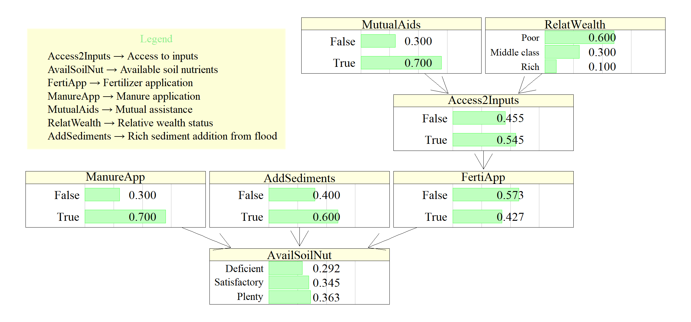
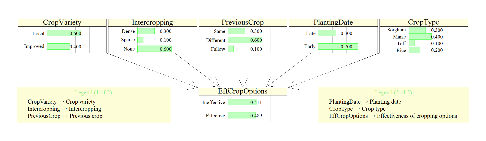
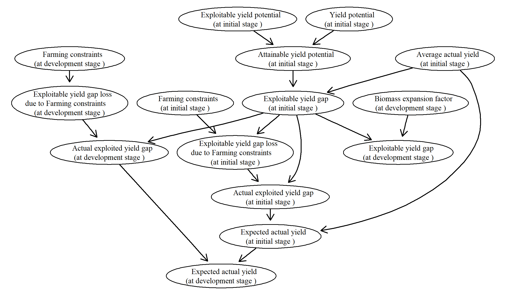

```{r, include=FALSE}
options(tinytex.engine = 'xelatex')
```

<!-- ```{r setup, include=FALSE} -->
<!-- knitr::opts_chunk$set(echo = TRUE,out.extra = '',fig.align='center',fig.pos='!htbp',cache=TRUE) -->
<!-- ``` -->

```{r setup, include=FALSE}
knitr::opts_chunk$set(echo = TRUE,out.extra = '',fig.align='center',fig.pos='!h',cache=TRUE)
```

\beginsupplement

```{r Setting the Scene, include = FALSE, echo = FALSE, cache = FALSE}

set.seed(123)

### Installing devtools package to get decisionSupportExtra from github ####
if (!require("devtools")) {
  install.packages("devtools")
}

## Installing decisionSupportExtra package from github ####
if (!require("decisionSupportExtra")) {
  devtools::install_github("Issoufou-Liman/decisionSupportExtra", build = TRUE, force = TRUE,
                           upgrade = "always", build_opts = c("--no-resave-data", "--no-manual"))

}

## loading required packages ####
if (!require("pacman")) install.packages("pacman")
pacman::p_load(gRain,
               bnlearn,
               Rgraphviz,
               ggplot2,
               grid,
               gridExtra,
               decisionSupport,
               fitdistrplus,
               rriskDistributions,
               scales
)

## Loading decisionSupportExtra package ####
library(decisionSupportExtra)

## Loading the Bayesian network ####
source("source_files/BNs.R")

## removing objects that are no longer needed ####
# rm(list=setdiff(ls(), "network_bn_fit"))

## A function responsable plotting the locol BNs
source("source_files/graphviz_chart_bn.R")

## some common plots specifications
legend_bg <- adjustcolor( "yellow", alpha.f = 0.15)
plots_lwd <- 0.5
min_plots_width_in <- 2.63
max_plots_width_in <- 7.5
max_plots_height_in <- 8.75
min_plots_res <- 300
plots_compression <- "lzw"
plots_font_family <- 'serif' # 'sans'
plots_font <- 1 # 2
plot_font_size <- 10

## exporting the plot to file.####
export_fun <- function(export, output_dir = "figures"){
  paste0(output_dir, '/', export, ".png")
}

export_fun_tiff <- function(export, output_dir = "figures"){
  paste0(output_dir, '/', export, ".tif")
}

my_theme <- theme_bw(base_size = plot_font_size, 
                     base_family = plots_font_family) +
  theme(panel.grid.minor = element_blank(),
        # strip.background = element_blank(),
        legend.title = element_blank(),
        # remove facet spacing on x-direction
        panel.spacing = unit(0,"line"),
        
        panel.border = element_rect(color = "black", fill = NA, size = 0.25),
        axis.ticks = element_line(colour = 'black', size = 0.05),
        legend.position="top",
        legend.justification = 'right',
        strip.background = element_rect(fill='lightgoldenrodyellow', color = "gray", size = 0.075),
        strip.text = element_text(colour = 'black'),
        plot.subtitle=element_text(size=9.5, face="italic", color="blue"))
```

# Introduction {-}

Crop modelling has been used to provide guidance to scientists and decision makers on various aspects of agriculture. Several of these crop models were developed to assess aspects of high agricultural importance (e.g. soil water, soil carbon, crop growth, crop yield under constraints). Despite their usefulness and widespread use across the globe, there are often concerns about several aspects such as the requirement for precise data which are largely unavailable or the complexity of the system being model. 
This work attempts to address these concerns by using a set of Decision Theory methods to propose a new approach to crop modelling. We use all available sources of information to develop a generic crop model for flood-based farming systems (FBFS) by fusing Bayesian networks (BNs) and Monte Carlo models. BNs are used to include qualitative variables, whereas MC models were used for quantitative ones. We describe how such a model can be developed and provide ways for deriving customized models for specific situations using three case studies. Each case study presents a customized instance of the generic model to demonstrate the usefulness and usability of the model from different perspectives. The modelling exercise took place in Kisumu County in Kenya and the Tigray region in Ethiopia. This document provides supplementary materials supporting the main paper. The details provided here concern, mainly, the different modules and sub-module that make up the generic model. Still, this material will only give a general idea about the model. The full model is provided as reproducible code in two repositories available on GitHub. [The first one](https://github.com/Issoufou-Liman/decisionSupportExtra) is a package describing the different functions. [The second](https://github.com/Issoufou-Liman/Modelling_FBFS) is an Rmarkdown folder containing the necessary ingredient to reproduce the main paper and this supplementary material.

#	Description of the modules in the BN models {#refs1}

##	Farming constraints at farming plot level	{#refs11}

The purpose of the BNs is to describe the node ‘farming constraints’ (FarmConstraints), which accounts for all limiting factors deemed important to FBFS in the study areas. The most important limiting factors describing the farming constraints in the study areas (Figure \@ref(fig:fig1)) are the adequacy of water supply to crops (AdeqWatSupl), the effectiveness of cropping systems (EffCropSystems), and the quality of farming practices (AgricManagEff) resulting from farmers’ managements options (Figure \@ref(fig:fig2) to Figure \@ref(fig:fig6)). These were described in three modules: the soil water, the cropping system and the management modules. They are described in more detail in sections \@ref(refs12) to \@ref(refs14).

```{r Farming constraints BNs,eval=TRUE, include = FALSE, echo = FALSE, cache = FALSE}

## Farming constraints BNs ####

# net <- model2network ("[AgricManagEff][EffCropOptions][AdeqWatSupl][FarmConstraints|EffCropOptions:AdeqWatSupl:AgricManagEff]")

abbr_node_names <- c("AgricManagEff",
                     "EffCropOptions",
                     "FarmConstraints",
                     "AdeqWatSupl")

net <- model2network ("[Agricultural_management_efficiency_at_initial_stage][Effectiveness_of_cropping_options][Water_supply_adequacy_at_initial_stage][Local_constraints_at_initial_stage|Effectiveness_of_cropping_options:Water_supply_adequacy_at_initial_stage:Agricultural_management_efficiency_at_initial_stage]")

legende <- bnlearn::nodes(net)
```

```{r Farming constraints BNs writing, eval=FALSE,include=FALSE,echo=FALSE, cache = FALSE}
net <- decisionSupportExtra::extract_bn(bn = network_bn_fit, string_model = net)
saveRDS(net,  "output_files/Modelling_FBFS_Suppl_Farming_Constraints_BNs_data.rds")
```

```{r Farming constraints BNs reading, eval=TRUE,include=FALSE,echo=FALSE, cache = FALSE}
net <- readRDS("output_files/Modelling_FBFS_Suppl_Farming_Constraints_BNs_data.rds")
```

```{r Farming constraints BNs plot, eval=TRUE, include = FALSE, echo = FALSE, cache = FALSE}

bnlearn::nodes(net) <- abbr_node_names

legende <- mapply(paste, abbr_node_names, sprintf('\u2192'), legende)
legende <- gsub("_", " ",  legende)
legende <- gsub(" at initial stage", "",  legende)
legende <- gsub("Local constraints", "Farming constraints",  legende)


leg_breaks <- list(3:length(legende), 1:2)
legende <- lapply(leg_breaks, function(i) legende[i])
legend_pos <- c('bottomleft', 'bottomright')
legend_title <- c("Legend (1 of 2)", "Legend (2 of 2)")

inset <- list(c(0.035, 0.15), c(0.035, 0.15))
text_width_ext <- c(0.55*1, 0.55)


png(export_fun(export = "Modelling_FBFS_Suppl_Farming_Constraints_BNs_plot"),
     res = min_plots_res,
     units = 'in',
     # compression = plots_compression,
     width = max_plots_width_in, 
     height = max_plots_height_in/3.5,
     pointsize = 12)

par(font = plots_font, family = plots_font_family, lwd=plots_lwd)

graphviz_chart_bn (x = net, type = "barprob", layout = "dot", draw.levels = TRUE,abbreviate=FALSE,
                   grid = TRUE, scale = c(max_plots_height_in/3.5, max_plots_width_in), col = "black", bg = "transparent",
                   text.col = "black", bar.col = "green", strip.bg = "lightyellow")

lapply(1:length(legende), function(i) {
  legend(legend_pos[i], legend = legende[[i]], text.width = text_width_ext[i]*strwidth(legende[[i]][which.max(nchar(legende[[i]]))]), 
         cex=0.5, ncol = 1,
         bty="o", box.lwd=1, box.col='lightyellow', xjust=1, yjust=1, bg=legend_bg,
         title = legend_title[i], title.col = 'lightgreen', inset=inset[[i]])
})
dev.off()

#-----------> tif
tiff(export_fun_tiff(export = "figure_s1"),
     res = min_plots_res,
     units = 'in',
     compression = plots_compression,
     width = max_plots_width_in, 
     height = max_plots_height_in/3.5,
     pointsize = 12)

par(font = plots_font, family = plots_font_family, lwd=plots_lwd)

graphviz_chart_bn (x = net, type = "barprob", layout = "dot", draw.levels = TRUE,abbreviate=FALSE,
                   grid = TRUE, scale = c(max_plots_height_in/3.5, max_plots_width_in), col = "black", bg = "transparent",
                   text.col = "black", bar.col = "green", strip.bg = "lightyellow")

lapply(1:length(legende), function(i) {
  legend(legend_pos[i], legend = legende[[i]], text.width = text_width_ext[i]*strwidth(legende[[i]][which.max(nchar(legende[[i]]))]), 
         cex=0.5, ncol = 1,
         bty="o", box.lwd=1, box.col='lightyellow', xjust=1, yjust=1, bg=legend_bg,
         title = legend_title[i], title.col = 'lightgreen', inset=inset[[i]])
})
dev.off()
```

```{r fig1, echo=FALSE, out.width = '100%', fig.cap="Bayesian Network describing important variables as part of a mixed model describing the farming constraints in FBFS in Kenya and Ethiopia."}
knitr::include_graphics("figures/Modelling_FBFS_Suppl_Farming_Constraints_BNs_plot.png")
```

##	Water supply adequacy	{#refs12}

Because of the complexity of water supply in FBFS, water supply adequacy was described via 2 sub-modules (Figure \@ref(fig:fig2); Figure \@ref(fig:fig3)). The amount of flood reaching the farming plot (FloodReachsPlot) was assessed separately, since it is an important variable with regard to the overall available water for crop development in FBFS settings.

```{r Water Supply Adequacy local BNs,eval=TRUE, include = FALSE, echo = FALSE, cache = FALSE}

local_net <- compileCPT(list(Type_of_water_diversion, 
                        Sediment_load_at_initial_stage, 
                        Rainfall_amount_at_initial_stage,
                        
                        Soil_type,
                        Evapotranspiration_at_initial_stage,
                        Initial_soil_water_content,
                        Soil_water_holding_capacity,
                        Available_soil_water_at_initial_stage,
                        Water_supply_adequacy_at_initial_stage,
                        Crop_type,
                        Manure_application,
                        
                        Slope, 
                        Social_arrangements,
                        Rain_event_occurence_at_initial_stage,
                        Main_canal_maintenance_at_initial_stage, 
                        Amount_of_shared_flood_at_initial_stage, 
                        Upstream_abstraction_at_initial_stage,
                        Location_of_the_plot, 
                        Field_canal_maintenance_at_initial_stage, 
                        Presence_of_the_farmer_during_flood_event_at_initial_stage,
                        Amount_of_flood_reaching_the_plot_at_initial_stage))
local_net <- grain(local_net)
local_net <- as.bn.fit(local_net)
```

```{r Flood reaching plot BNs,eval=TRUE, include = FALSE, echo = FALSE, cache = FALSE}

## Flood reaching plot BNs ####

# net <- model2network("[DiversionType][Slope][SocialArrang][RainOccur][PlotLocat][FieldCanalMaint][Pznt4Flood][SedimentLoad|DiversionType][MainCanalMaint|DiversionType:SocialArrang][UpsAbstract|SocialArrang:PlotLocat][SharedFlood|RainOccur:MainCanalMaint:SedimentLoad:Slope][FloodReachsPlot|FieldCanalMaint:Pznt4Flood:SharedFlood:UpsAbstract]")

abbr_node_names <- c("FloodReachsPlot",
                     "SharedFlood",
                     "FieldCanalMaint",
                     "PlotLocat",
                     "MainCanalMaint", 
                     "Pznt4Flood", 
                     "RainOccur",
                     "SedimentLoad",
                     "Slope",
                     "SocialArrang",
                     "DiversionType",
                     "UpsAbstract")

net <- model2network("[Type_of_water_diversion][Slope][Social_arrangements][Rain_event_occurence_at_initial_stage][Location_of_the_plot][Field_canal_maintenance_at_initial_stage][Presence_of_the_farmer_during_flood_event_at_initial_stage][Sediment_load_at_initial_stage|Type_of_water_diversion][Main_canal_maintenance_at_initial_stage|Type_of_water_diversion:Social_arrangements][Upstream_abstraction_at_initial_stage|Social_arrangements:Location_of_the_plot][Amount_of_shared_flood_at_initial_stage|Rain_event_occurence_at_initial_stage:Main_canal_maintenance_at_initial_stage:Sediment_load_at_initial_stage:Slope][Amount_of_flood_reaching_the_plot_at_initial_stage|Field_canal_maintenance_at_initial_stage:Presence_of_the_farmer_during_flood_event_at_initial_stage:Amount_of_shared_flood_at_initial_stage:Upstream_abstraction_at_initial_stage]")

legende <- bnlearn::nodes(net)
```

```{r Flood reaching plot BNs writing, eval=TRUE,include=FALSE,echo=FALSE, cache = FALSE}
net <- decisionSupportExtra::extract_bn(bn = local_net, string_model = net)
saveRDS(net,  "output_files/Modelling_FBFS_Suppl_Flood_reaching_plot_BNs_data.rds")
```

```{r Flood reaching plot BNs reading, eval=TRUE,include=FALSE,echo=FALSE, cache = FALSE}
net <- readRDS("output_files/Modelling_FBFS_Suppl_Flood_reaching_plot_BNs_data.rds")
```

```{r Flood reaching plot BNs plot, eval=TRUE, include = FALSE, echo = FALSE, cache = FALSE}

bnlearn::nodes(net) <- abbr_node_names

legende <- mapply(paste, abbr_node_names, sprintf('\u2192'), legende)
legende <- gsub("_", " ",  legende)
legende <- gsub(" at initial stage", "",  legende)
legende <- lapply(list(1:6, 7:length(legende)), function(i){
  legende[i]
})

legend_pos <- c('topright', 'bottomleft')
legend_title <- c("Legend (1 of 2)", "Legend (2 of 2)")
inset <- list(c(0.09, 0.067), c(0.05, 0.07))
ncol_leg <- c(1,2)

png(export_fun(export = "Modelling_FBFS_Suppl_flood_reaching_plot_BNs_plot"),
     res = min_plots_res,
     units = 'in',
     # compression = plots_compression,
     width = max_plots_width_in, 
     height = max_plots_height_in/2.5,
     pointsize = 11)

par(font = plots_font, family = plots_font_family, lwd=plots_lwd)

graphviz_chart_bn (x = net, type = "barprob", layout = "dot", draw.levels = TRUE,abbreviate=FALSE,
                   grid = TRUE, scale = c(max_plots_height_in/3, max_plots_width_in), col = "black", bg = "transparent",
                   text.col = "black", bar.col = "green", strip.bg = "lightyellow")

lapply(1:length(legende), function (i){
  legend(legend_pos[i], legend = legende[[i]], text.width = 0.57*strwidth(legende[[i]][which.max(nchar(legende[[i]]))]), 
         cex=0.55, ncol = ncol_leg[i],
         bty="o", box.lwd=1, box.col='lightyellow', xjust=1, yjust=1, bg=legend_bg,
         title = legend_title[i], title.col = 'lightgreen', inset=inset[[i]])
})

dev.off()

#-----------> tiff

tiff(export_fun_tiff(export = "figure_s2"),
     res = min_plots_res,
     units = 'in',
     compression = plots_compression,
     width = max_plots_width_in, 
     height = max_plots_height_in/2.5,
     pointsize = 11)

par(font = plots_font, family = plots_font_family, lwd=plots_lwd)

graphviz_chart_bn (x = net, type = "barprob", layout = "dot", draw.levels = TRUE,abbreviate=FALSE,
                   grid = TRUE, scale = c(max_plots_height_in/3, max_plots_width_in), col = "black", bg = "transparent",
                   text.col = "black", bar.col = "green", strip.bg = "lightyellow")

lapply(1:length(legende), function (i){
  legend(legend_pos[i], legend = legende[[i]], text.width = 0.57*strwidth(legende[[i]][which.max(nchar(legende[[i]]))]), 
         cex=0.55, ncol = ncol_leg[i],
         bty="o", box.lwd=1, box.col='lightyellow', xjust=1, yjust=1, bg=legend_bg,
         title = legend_title[i], title.col = 'lightgreen', inset=inset[[i]])
})

dev.off()
```

```{r fig2, echo=FALSE, out.width = '100%', fig.cap="Bayesian Network describing important variables as part of a mixed model describing the amount of flood at the farming plot level in FBFS in Kenya and Ethiopia."}

```

At the root of the BN that describes the amount of flood reaching the plot are the nodes describing water diversion type (DiversionType), the social arrangement for water acquisition and sharing (SocialArrang), and the location of the farming plot (PlotLocat). The water diversion type is important, since it determines the overall water delivery (SharedFlood) and ultimately the overall expected flood amount at the plot level (FloodReachsPlot). It acts via the way in which farmers are committed as a group (SocialArrang) to maintain their main water distribution networks (MainCanalMaint) and its efficiency with regard to sediment load (SedimentLoad). If the social organisation (SocialArrang) is not adequate along a topographic gradient (Slope), this may lead to unfair upstream abstraction (UpsAbstract), hence penalising water users downstream (FloodReachsPlot). Flood water is trapped in FBFS fields using earthen bunds, which need to be opened at the right time either for irrigation or for water release if there is too much water. Individual farmers, therefore, need to make sure this happens by being present at the right time and making sure the water is diverted from the main canal to the respective secondary and tertiary sub-divisions of their water distribution system. Given the adequacy of the above-mentioned aspects, the presence of the farmers in the field during floods (Pznt4Flood) and the quality of canal maintenance (FieldCanalMaint) can still strongly affect the amount of flood reaching the plot (FloodReachsPlot), and ultimately the overall soil water budget. The presence of the farmer and the quality of canal maintenance  can either have minor importance when it rains on the field (RainOccur = On-site) or major importance in the case of spontaneous flood events from upstream (RainOccur = Off-site).

```{r Water Supply Adequacy BNs,eval=TRUE, include = FALSE, echo = FALSE, cache = FALSE}

## Water Supply Adequacy BNs ####

# net <- model2network("[CropType][SoilType][ManureApp][SoilHoldWater|SoilType:ManureApp][EvapoTranspirat][InitWaterCont][RainAmount][FloodReachsPlot][AvailSoilWater|SoilHoldWater:EvapoTranspirat:RainAmount:InitWaterCont:FloodReachsPlot][AdeqWatSupl|AvailSoilWater:CropType]")

abbr_node_names <- c("FloodReachsPlot",
                     "AvailSoilWater",
                     "CropType",
                      "EvapoTranspirat", 
                     "InitWaterCont",
                     "ManureApp", 
                     "RainAmount", 
                     "SoilType",
                     "SoilHoldWater", 
                     "AdeqWatSupl")

net <- model2network("[Crop_type][Soil_type][Manure_application][Soil_water_holding_capacity|Soil_type:Manure_application][Evapotranspiration_at_initial_stage][Initial_soil_water_content][Rainfall_amount_at_initial_stage][Amount_of_flood_reaching_the_plot_at_initial_stage][Available_soil_water_at_initial_stage|Soil_water_holding_capacity:Evapotranspiration_at_initial_stage:Rainfall_amount_at_initial_stage:Initial_soil_water_content:Amount_of_flood_reaching_the_plot_at_initial_stage][Water_supply_adequacy_at_initial_stage|Available_soil_water_at_initial_stage:Crop_type]")

legende <- bnlearn::nodes(net)
```

```{r Water Supply Adequacy BNs writing, eval=TRUE,include=FALSE,echo=FALSE, cache = FALSE}
net <- decisionSupportExtra::extract_bn(bn = local_net, string_model = net)
saveRDS(net,  "output_files/Modelling_FBFS_Suppl_Water_supply_adequacy_BNs_data.rds")
```

```{r Water Supply Adequacy BNs reading, eval=TRUE,include=FALSE,echo=FALSE, cache = FALSE}
net <- readRDS("output_files/Modelling_FBFS_Suppl_Water_supply_adequacy_BNs_data.rds")
```

```{r Water Supply Adequacy BNs plot, eval=TRUE, include = FALSE, echo = FALSE, cache = FALSE}

bnlearn::nodes(net) <- abbr_node_names

legende <- mapply(paste, abbr_node_names, sprintf('\u2192'), legende)
legende <- gsub("_", " ",  legende)
legende <- gsub(" at initial stage", "",  legende)

png(export_fun(export = "Modelling_FBFS_Suppl_Water_Supply_Adequacy_BNs_plot"),
     res = min_plots_res,
     units = 'in',
     # compression = plots_compression,
     width = max_plots_width_in, 
     height = max_plots_height_in/2,
     pointsize = 10.5)

par(font = plots_font, family = plots_font_family, lwd=plots_lwd)

graphviz_chart_bn (x = net, type = "barprob", layout = "dot", draw.levels = TRUE,abbreviate=FALSE,
                   grid = TRUE, scale = c(max_plots_height_in/2, max_plots_width_in), col = "black", bg = "transparent",
                   text.col = "black", bar.col = "green", strip.bg = "lightyellow")

legend('topleft', legend = legende, text.width = 0.65*strwidth(legende[which.max(nchar(legende))]), 
       cex=0.65, ncol = 2,
       bty="o", box.lwd=1, box.col='lightyellow', xjust=1, yjust=1, bg=legend_bg,
       title = 'Legend', title.col = 'lightgreen', inset=c(0.04, 0.06))

dev.off()

#-----------> tif

tiff(export_fun_tiff(export = "figure_s3"),
     res = min_plots_res,
     units = 'in',
     compression = plots_compression,
     width = max_plots_width_in, 
     height = max_plots_height_in/2,
     pointsize = 10.5)

par(font = plots_font, family = plots_font_family, lwd=plots_lwd)

graphviz_chart_bn (x = net, type = "barprob", layout = "dot", draw.levels = TRUE,abbreviate=FALSE,
                   grid = TRUE, scale = c(max_plots_height_in/2, max_plots_width_in), col = "black", bg = "transparent",
                   text.col = "black", bar.col = "green", strip.bg = "lightyellow")

legend('topleft', legend = legende, text.width = 0.65*strwidth(legende[which.max(nchar(legende))]), 
       cex=0.65, ncol = 2,
       bty="o", box.lwd=1, box.col='lightyellow', xjust=1, yjust=1, bg=legend_bg,
       title = 'Legend', title.col = 'lightgreen', inset=c(0.04, 0.06))

dev.off()

```

```{r fig3, echo=FALSE, out.width = '100%', fig.cap="Bayesian Network describing important variables as part of a mixed model describing the available soil water content in FBFS in Kenya and Ethiopia."}
knitr::include_graphics("figures/Modelling_FBFS_Suppl_Water_Supply_Adequacy_BNs_plot.png")
```

The soil water profile of a given farming plot includes important biophysical aspects related to soils and climate. The available water for crops is determined by the soil water holding capacity (SoilHoldWater), the total amount and temporal distribution of rainfall (RainAmount) and residual soil moisture (InitWaterCont), which can be significant under certain FBFS such as flood recession agriculture. Soil water holding capacity (SoilHoldWater) can vary greatly depending on the soil type (SoilType) and the soil management strategies employed by the farmer (e.g. manure application; ManureApp). 

##	Agricultural management efficiency	{#refs13}

Agricultural management efficiency (AgricManagEff) is described using two submodules (Figure \@ref(fig:fig4); Figure \@ref(fig:fig5)): one describing the availability of soil nutrients (AvailSoilNut), and another describing the overall agricultural management efficiency. The availability of soil nutrients is defined by fertilizer applications either in the form of organic (ManureApp) or mineral additions (FertiApp) by the farmer, and on the other hand by the sediment naturally brought by the flood water. Here, it is important to distinguish between coarse sediments (SedimentLoad) described under the rubric Available soil water, which are likely to have negative impacts, and the fine rich sediments (AddSediments), which have positive impacts on crops. Fertilizer application can only be expected when the fertilizer desired by the farmer is available on the market at the time when the farmers can afford it (Access2Inputs). This depends on the purchasing power of farmers and their willingness to acquire the fertilizers (RelativeWealth), as well as on mutual assistance (MutualAids) among farmers.

```{r Available soil Nutrients local BNs,eval=TRUE, include = FALSE, echo = FALSE, cache = FALSE}

local_net <- compileCPT(list(Relative_wealth_status,
                        Mutual_assistance,
                        Access_to_inputs_at_initial_stage,
                        Available_labor_force_at_initial_stage,
                        Available_paid_labor_at_initial_stage,
                        Skills_of_the_farmer,
                        Application_of_traditional_crop_protection_methods_at_initial_stage,
                        Manure_application,
                        Chemical_application_at_initial_stage,
                        Fertilizer_application_at_initial_stage,
                        Rich_sediment_addition_from_flood_at_initial_stage,
                        Available_soil_nutrients_at_initial_stage,
                       nutrient_supply_adequacy_at_initial_stage, Effectiveness_of_pest_and_disease_reduction_practices_at_initial_stage,
                        Effectiveness_of_weeding_at_initial_stage,
                        Pest_and_disease_impacts_at_initial_stage,
                        Weed_impacts_at_initial_stage,
                        # Farming_efficiency_at_initial_stage,
                        Agricultural_management_efficiency_at_initial_stage,
                        Crop_type
))
local_net <- grain(local_net)
local_net <- as.bn.fit(local_net)
```

```{r Available soil Nutrients BNs,eval=TRUE, include = FALSE, echo = FALSE, cache = FALSE}

## Available soil Nutrients ####

# net <- net <- model2network("[RelatWealth][MutualAids][AddSediments][ManureApp][FertiApp|Access2Inputs][Access2Inputs|RelatWealth:MutualAids][AvailSoilNut|ManureApp:FertiApp:AddSediments]")

abbr_node_names <- c("Access2Inputs", 
                     "AvailSoilNut", 
                     "FertiApp", 
                     "ManureApp", 
                     "MutualAids",
                     "RelatWealth", 
                     "AddSediments"
                     )


net <- model2network("[Relative_wealth_status][Mutual_assistance][Rich_sediment_addition_from_flood_at_initial_stage][Manure_application][Fertilizer_application_at_initial_stage|Access_to_inputs_at_initial_stage][Access_to_inputs_at_initial_stage|Relative_wealth_status:Mutual_assistance][Available_soil_nutrients_at_initial_stage|Manure_application:Fertilizer_application_at_initial_stage:Rich_sediment_addition_from_flood_at_initial_stage]")

legende <- bnlearn::nodes(net)
```

```{r Available soil Nutrients BNs writing, eval=TRUE,include=FALSE,echo=FALSE, cache = FALSE}
net <- decisionSupportExtra::extract_bn(bn = local_net, string_model = net)
saveRDS(net,  "output_files/Modelling_FBFS_Available_soil_Nutrients_BNs_data.rds")
```

```{r Available soil Nutrients BNs reading, eval=TRUE,include=FALSE,echo=FALSE, cache = FALSE}
net <- readRDS("output_files/Modelling_FBFS_Available_soil_Nutrients_BNs_data.rds")
```

```{r Available soil Nutrients BNs plot, eval=TRUE, include = FALSE, echo = FALSE, cache = FALSE}

bnlearn::nodes(net) <- abbr_node_names

legende <- mapply(paste, abbr_node_names, sprintf('\u2192'), legende)
legende <- gsub("_", " ",  legende)
legende <- gsub(" at initial stage", "",  legende)

png(export_fun(export = "Modelling_FBFS_Available_soil_Nutrients_BNs_plot"),
     res = min_plots_res,
     units = 'in',
     # compression = plots_compression,
     width = max_plots_width_in, 
     height = max_plots_height_in/2.5,
     pointsize = 12)

par(font = plots_font, family = plots_font_family, lwd=plots_lwd)

graphviz_chart_bn (x = net, type = "barprob", layout = "dot", draw.levels = TRUE,abbreviate=FALSE,
                   grid = TRUE, scale = c(max_plots_height_in/2.5, max_plots_width_in*1.5), col = "black", bg = "transparent",
                   text.col = "black", bar.col = "green", strip.bg = "lightyellow")

legend('topleft', legend = legende, text.width = 0.725*strwidth(legende[which.max(nchar(legende))]), 
       cex=0.725, ncol = 1,
       bty="o", box.lwd=1, box.col='lightyellow', xjust=1, yjust=1, bg = legend_bg,
       title = 'Legend', title.col = 'lightgreen', inset=c(0.04, 0.09))

dev.off()

# ---------> tif

tiff(export_fun_tiff(export = "figure_s4"),
     res = min_plots_res,
     units = 'in',
     compression = plots_compression,
     width = max_plots_width_in, 
     height = max_plots_height_in/2.5,
     pointsize = 12)

par(font = plots_font, family = plots_font_family, lwd=plots_lwd)

graphviz_chart_bn (x = net, type = "barprob", layout = "dot", draw.levels = TRUE,abbreviate=FALSE,
                   grid = TRUE, scale = c(max_plots_height_in/2.5, max_plots_width_in*1.5), col = "black", bg = "transparent",
                   text.col = "black", bar.col = "green", strip.bg = "lightyellow")

legend('topleft', legend = legende, text.width = 0.725*strwidth(legende[which.max(nchar(legende))]), 
       cex=0.725, ncol = 1,
       bty="o", box.lwd=1, box.col='lightyellow', xjust=1, yjust=1, bg = legend_bg,
       title = 'Legend', title.col = 'lightgreen', inset=c(0.04, 0.09))

dev.off()

```

```{r fig4, echo=FALSE, out.width = '100%', fig.cap="Bayesian Network describing important variables as part of a mixed model describing the available nutrients in FBFS in Kenya and Ethiopia."}

```

```{r Agricultural management efficiency BNs,eval=TRUE, include = FALSE, echo = FALSE, cache = FALSE}

## Agricultural management efficiency ####

# net <- model2network("[RelatWealth][MutualAids][AvailPaidLabor][FarmerSkills][TradiCropProtect][CropType][Access2Inputs|RelatWealth:MutualAids][AvailLaborForce|RelatWealth:MutualAids:AvailPaidLabor][ChemicalApp|Access2Inputs][EffWeeding|AvailLaborForce:FarmerSkills][AvailSoilNut][EffPestDiseaseReduc|ChemicalApp:TradiCropProtect:AvailLaborForce:FarmerSkills][WeedsImpact|EffWeeding:CropType][PestDeseaseImpact|EffPestDiseaseReduc:CropType][AgricManagEff|AvailSoilNut:PestDeseaseImpact:WeedsImpact]")

abbr_node_names <- c("Access2Inputs", 
                     "AgricManagEff", "TradiCropProtect", "AvailLaborForce",
                     "AvailPaidLabor", "AvailSoilNut", "ChemicalApp", "CropType",
                     "EffPestDiseaseReduc", "EffWeeding", "MutualAids",
                     "PestDeseaseImpact", "RelatWealth", "FarmerSkills", "WeedsImpact"
                     )

net <- model2network("[Relative_wealth_status][Mutual_assistance][Available_paid_labor_at_initial_stage][Skills_of_the_farmer][Application_of_traditional_crop_protection_methods_at_initial_stage][Crop_type][Access_to_inputs_at_initial_stage|Relative_wealth_status:Mutual_assistance][Available_labor_force_at_initial_stage|Relative_wealth_status:Mutual_assistance:Available_paid_labor_at_initial_stage][Chemical_application_at_initial_stage|Access_to_inputs_at_initial_stage][Effectiveness_of_weeding_at_initial_stage|Available_labor_force_at_initial_stage:Skills_of_the_farmer][Available_soil_nutrients_at_initial_stage][Effectiveness_of_pest_and_disease_reduction_practices_at_initial_stage|Chemical_application_at_initial_stage:Application_of_traditional_crop_protection_methods_at_initial_stage:Available_labor_force_at_initial_stage:Skills_of_the_farmer][Weed_impacts_at_initial_stage|Effectiveness_of_weeding_at_initial_stage:Crop_type][Pest_and_disease_impacts_at_initial_stage|Effectiveness_of_pest_and_disease_reduction_practices_at_initial_stage:Crop_type][Agricultural_management_efficiency_at_initial_stage|Available_soil_nutrients_at_initial_stage:Pest_and_disease_impacts_at_initial_stage:Weed_impacts_at_initial_stage]")

legende <- bnlearn::nodes(net)
```

```{r Agricultural management efficiency BNs writing, eval=TRUE,include=FALSE,echo=FALSE, cache = FALSE}
net <- decisionSupportExtra::extract_bn(bn = local_net, string_model = net)
saveRDS(net,  "output_files/Modelling_FBFS_Agricultural_management_efficiency_BNs_data.rds")
```

```{r Agricultural management efficiency BNs reading, eval=TRUE,include=FALSE,echo=FALSE, cache = FALSE}
net <- readRDS("output_files/Modelling_FBFS_Agricultural_management_efficiency_BNs_data.rds")
```

```{r Agricultural management efficiency BNs plot, eval=TRUE, include = FALSE, echo = FALSE, cache = FALSE}

bnlearn::nodes(net) <- abbr_node_names

legende <- mapply(paste, abbr_node_names, sprintf('\u2192'), legende)
legende <- gsub("_", " ",  legende)
legende <- gsub(" at initial stage", "",  legende)

leg_breaks <- list(1:7, 8:length(legende))
legende <- lapply(leg_breaks, function(i) legende[i])
legend_pos <- c('topleft', 'bottomright')
legend_title <- c("Legend (1 of 2)", "Legend (2 of 2)")

inset <- list(c(0.04, 0.16), c(0.05, 0.035))


png(export_fun(export = "Modelling_FBFS_Agricultural_management_efficiency_BNs_plot"),
     res = min_plots_res,
     units = 'in',
     # compression = plots_compression,
     width = max_plots_width_in, 
     height = max_plots_height_in/1.5,
     pointsize = 14)

par(font = plots_font, family = plots_font_family, lwd=plots_lwd)

graphviz_chart_bn (x = net, type = "barprob", layout = "dot", draw.levels = TRUE,abbreviate=FALSE,
                   grid = TRUE, scale = c(max_plots_height_in/2, max_plots_width_in*1.5), col = "black", bg = "transparent",
                   text.col = "black", bar.col = "green", strip.bg = "lightyellow")

lapply(1:length(legende), function(i) {
  legend(legend_pos[i], legend = legende[[i]], text.width = 0.45*strwidth(legende[[i]][which.max(nchar(legende[[i]]))]), 
         cex=0.4, ncol = 1,
         bty="o", box.lwd=1, box.col='lightyellow', xjust=1, yjust=1, bg=legend_bg,
         title = legend_title[i], title.col = 'lightgreen', inset=inset[[i]])
  
})

dev.off()

# ---------> tif

tiff(export_fun_tiff(export = "figure_s5"),
     res = min_plots_res,
     units = 'in',
     compression = plots_compression,
     width = max_plots_width_in, 
     height = max_plots_height_in/1.5,
     pointsize = 14)

par(font = plots_font, family = plots_font_family, lwd=plots_lwd)

graphviz_chart_bn (x = net, type = "barprob", layout = "dot", draw.levels = TRUE,abbreviate=FALSE,
                   grid = TRUE, scale = c(max_plots_height_in/2, max_plots_width_in*1.5), col = "black", bg = "transparent",
                   text.col = "black", bar.col = "green", strip.bg = "lightyellow")

lapply(1:length(legende), function(i) {
  legend(legend_pos[i], legend = legende[[i]], text.width = 0.45*strwidth(legende[[i]][which.max(nchar(legende[[i]]))]), 
         cex=0.4, ncol = 1,
         bty="o", box.lwd=1, box.col='lightyellow', xjust=1, yjust=1, bg=legend_bg,
         title = legend_title[i], title.col = 'lightgreen', inset=inset[[i]])
  
})

dev.off()
```

```{r fig5, echo=FALSE, out.width = '100%', fig.cap="Bayesian Network describing important variables as part of a mixed model describing the effectiveness of agricultural management in FBFS in Kenya and Ethiopia."}
knitr::include_graphics("figures/Modelling_FBFS_Agricultural_management_efficiency_BNs_plot.png")
```

The factors of agricultural management efficiency include the available soil nutrients (AvailSoilNut), crop exposure/sensitivity to pests and diseases (PestDiseaseImpact) and the severity of weeds (WeedsImpact). The magnitude and recurrence of damage to crops due to pests & diseases and yield losses due to weeds can be related to the skills of the farmers (FarmerSkills) in crop protection, the farmers’ ability to acquire chemicals, and other aspects such as the available labour force, which may influence the effectiveness of crop protection. 

##	Effectiveness of cropping options	{#refs14}

The ‘effectiveness of cropping options’ (EffCropsOptions) BN describes the various factors shaping the cropping system at the very early stages of crop growth. Crops are defined by their type (CropType: rice, maize, sorghum, teff), their variety (CropVariety) and the farmers’ decision regarding which crops to grow and how to grow them (Intercropping). The decision of the farmer to grow a given type of crop and variety have strong yield implications. 

```{r Effectiveness of cropping options BNs,eval=TRUE, include = FALSE, echo = FALSE, cache = FALSE}

## Effectiveness of cropping options BNs ####

net <- compileCPT(list(Crop_variety,
                        Intercropping,
                        Previous_crop, 
                        Planting_date,
                        Crop_type,
                        Effectiveness_of_cropping_options
))

net <- grain(net)
net <- as.bn.fit(net)

legende <- bnlearn::nodes(net)

abbr_node_names <- c("CropVariety", 
                "Intercropping",
                "PreviousCrop",
                "PlantingDate",
                'CropType',
                "EffCropOptions")
```

```{r Effectiveness of cropping options BNs writing, eval=TRUE,include=FALSE,echo=FALSE, cache = FALSE}
# net <- decisionSupportExtra::extract_bn(bn = network_bn_fit, string_model = net)
saveRDS(net,  "output_files/Modelling_FBFS_Suppl_Effectiveness_of_cropping_options_BNs_data.rds")
```

```{r Effectiveness of cropping options BNs reading, eval=TRUE,include=FALSE,echo=FALSE, cache = FALSE}
net <- readRDS("output_files/Modelling_FBFS_Suppl_Effectiveness_of_cropping_options_BNs_data.rds")
```

```{r Effectiveness of cropping options BNs plot, eval=TRUE, include = FALSE, echo = FALSE, cache = FALSE}

bnlearn::nodes(net) <- abbr_node_names

legende <- mapply(paste, abbr_node_names, sprintf('\u2192'), legende)
legende <- gsub("_", " ",  legende)
legende <- gsub(" at initial stage", "",  legende)

leg_breaks <- list(1:3, 4:length(legende))
legende <- lapply(leg_breaks, function(i) legende[i])
legend_pos <- c('bottomleft', 'bottomright')
legend_title <- c("Legend (1 of 2)", "Legend (2 of 2)")

inset <- list(c(0.035, 0.13), c(0.035, 0.13))
text_width_ext <- c(0.55*1.905, 0.6)

png(export_fun(export = "Modelling_FBFS_Suppl_Effectiveness_of_cropping_options_BNs_plot"),
     res = min_plots_res,
     units = 'in',
     # compression = plots_compression,
     width = max_plots_width_in, 
     height = max_plots_height_in/4,
     pointsize = 12)

par(font = plots_font, family = plots_font_family, lwd=plots_lwd)

graphviz_chart_bn (x = net, type = "barprob", layout = "dot", draw.levels = TRUE,abbreviate=FALSE,
                   grid = TRUE, scale = c(max_plots_height_in/2, max_plots_width_in*1.5), col = "black", bg = "transparent",
                   text.col = "black", bar.col = "green", strip.bg = "lightyellow")

lapply(1:length(legende), function(i) {
  legend(legend_pos[i], legend = legende[[i]], text.width = text_width_ext[i]*strwidth(legende[[i]][which.max(nchar(legende[[i]]))]), 
         cex=0.55, ncol = 1,
         bty="o", box.lwd=1, box.col='lightyellow', xjust=1, yjust=1, bg=legend_bg,
         title = legend_title[i], title.col = 'lightgreen', inset=inset[[i]])
  
})
dev.off()

# ---------> tif

tiff(export_fun_tiff(export = "figure_s6"),
     res = min_plots_res,
     units = 'in',
     compression = plots_compression,
     width = max_plots_width_in, 
     height = max_plots_height_in/4,
     pointsize = 12)

par(font = plots_font, family = plots_font_family, lwd=plots_lwd)

graphviz_chart_bn (x = net, type = "barprob", layout = "dot", draw.levels = TRUE,abbreviate=FALSE,
                   grid = TRUE, scale = c(max_plots_height_in/2, max_plots_width_in*1.5), col = "black", bg = "transparent",
                   text.col = "black", bar.col = "green", strip.bg = "lightyellow")

lapply(1:length(legende), function(i) {
  legend(legend_pos[i], legend = legende[[i]], text.width = text_width_ext[i]*strwidth(legende[[i]][which.max(nchar(legende[[i]]))]), 
         cex=0.55, ncol = 1,
         bty="o", box.lwd=1, box.col='lightyellow', xjust=1, yjust=1, bg=legend_bg,
         title = legend_title[i], title.col = 'lightgreen', inset=inset[[i]])
  
})
dev.off()
```

```{r fig6, echo=FALSE, out.width = '100%', fig.cap="Bayesian Network describing important variables as part of a mixed model of the effectiveness of cropping options in FBFS in Kenya and Ethiopia."}

```

#	BN structures and node sensitivity in relation to crop development	{#refs2}

The local BNs described above were connected to form a single BN accounting for the complexity of the farming system. This BN aims to integrate the joint effect of all farming constraints in one single variable (see section \@ref(refs11)) to be used along with other variables described in the MC model. In the MC model, the entire BN was replicated with some changes in the CPTs and the causal relations when necessary. For example, the impact of weeds may depend on the crop development stage. The model assumes that crop sensitivity to biotic and abiotic factors depends on the period when these factors are considered. Therefore, these stage-specific BNs or rather the concepts embedded in their nodes, their causal relationships, and their CPTs were developed according to available information. BNs were developed to estimate the farming constraint at plot level and at each phenological stage of crop development. The BN nodes ( Figure \@ref(fig:fig1) to Figure \@ref(fig:fig6)) are represented in the model in four crop development stages (e.g. amount of shared flood at initial stage, development stage, mid stage, and late stage). A few BN nodes that are expected to remain constant (e.g. the type of water diversion (DiversionType), the slope etc.), however, were represented only once in the model and transported through the various crop development stages. For example, the BN nodes ‘soil type’ and ‘location of the farming plot’ are considered static variables over time. They are unlikely to change, at least not within a few years, in contrast to other nodes such as the impact of weeds and diseases, which differs between consecutive phenological stages. We focus on processes at the initial stage in the description, but the target variable is assessed quantitively at each of the four stages to feed the MC model.

#	Quantitative assessment of Farming Constraints	{#refs3}

The inclusion of the farming constraint variable in the MC models requires its quantitative description capturing all possible scenarios for the variable. For each scenario, these estimates include the range of variable values spanning the 90% confidence interval and its probability distribution as required by the [mcSimulation](https://www.rdocumentation.org/packages/decisionSupport/versions/1.103.8/topics/mcSimulation) function [@Luedeling_Goehring_et_al_2019, see also the main paper]. We generated the probabilities of the variable from the BN based on the query of interest. The resulting data were used to compute the lower bound, the median and the upper bound of the 90% confidence interval, and to estimate the shape of the best-fitting probability distribution given several candidate distributions and the ranges of skewness and kurtosis (Cellen and Fray graph, also skewness-kurtosis plot) of the generated data [@Cullen_and_Frey_1999; @Delignette-Muller_and_Dutang_2015]. The probability distribution of the variable at the four crop development stages was assessed via visual observation of the Cullen and Fray graph (see example for the initial stage of crop development in Figure \@ref(fig:fig7)). 

```{r Cullen and Frey graph, include=FALSE, eval=TRUE}

obs_geom_size = 2
boot_geom_size = 0.01
dist_geom_pts_size = 2
dist_geom_line_size = 0.6
axis_text_size = 9
axis_title_size = 10
plot_title_size = 14
plot_subtitle_size = 10
strip_text_size = 10
legend_text_size = 6

p1 <- ggplot_descdist_bn(bn=network_bn_fit, node = "Local_constraints_at_initial_stage", title="Farming constraints at initial stage", subtitle = "Cullen and Frey graph",
                   obs_geom_size = obs_geom_size, boot_geom_size = boot_geom_size, dist_geom_pts_size = dist_geom_pts_size,
                   dist_geom_line_size = dist_geom_line_size, axis_text_size = axis_text_size, axis_title_size = axis_title_size,
                   plot_title_size = plot_title_size, plot_subtitle_size = plot_subtitle_size,
                   strip_text_size = strip_text_size, legend_text_size = legend_text_size)


ggsave(plot=p1, device = 'png', filename = "figures/Local_constraints_at_initial_stage_ggplot_distributions.png", 
       width = max_plots_width_in, 
       height =max_plots_height_in/2.5, units = "in", dpi = min_plots_res
)

#--------------> tif

ggsave(plot=p1, device = 'tiff', filename = "figures/figure_s7.tif", 
       width = max_plots_width_in, 
       height =max_plots_height_in/2.5, units = "in", dpi = min_plots_res,
       compression = plots_compression
)
```

```{r fig7,echo=FALSE, out.width = '100%',fig.cap="Cullen and Frey graph showing the bounds for skewness and kurtosis and the best fitting distribution of three states of the variable ‘farming constraint’ derived from the joint distribution of a Bayesian network used to feed a Monte Carlo model as part of a mixed crop model for flood-based farming systems in Kisumu (Kenya) and Tigray (Ethiopia). The Bayesian network describes the variable farming constraint at 4 crop development stages (i.e. initial, development, mid-season, and late stages). This figure provides an example for the initial stage."}

```

```{r quantile and probability plots, include=FALSE, eval=TRUE}

fit_Local_constraints_at_initial_stage <- fit_node_states_distr (bn = network_bn_fit, 
                                                                 node = "Local_constraints_at_initial_stage", 
                                                                 distr = c('beta', 'unif', 'unif'), 
                                                                 method = rep("mge", 3))


hist_bar_size = 0.3
dist_geom_pts_size = 0.03
dist_geom_smooth_size = 0.3
dist_geom_abline_size = 0.3
axis_text_size = 8
axis_title_size = 10
plot_subtitle_size = 12
plot_title_size = 14
strip_text_size = 10

p1 <- gg_plotdist(fit_Local_constraints_at_initial_stage, title = "Farming_constraints_at_initial_stage",
                 hist_bar_size = hist_bar_size, dist_geom_pts_size = dist_geom_pts_size,
                 dist_geom_smooth_size = dist_geom_smooth_size, dist_geom_abline_size = dist_geom_abline_size,
                 axis_text_size = axis_text_size, axis_title_size = axis_title_size, plot_subtitle_size = plot_subtitle_size,
                 plot_title_size = plot_title_size, strip_text_size = strip_text_size)

ggsave(plot=p1, device = 'png', filename = "figures/Local_constraints_at_initial_stage_fitted_distribution.png", 
       width = max_plots_width_in, 
       height =max_plots_height_in/2.5, units = "in", dpi = min_plots_res
)
#---------> tif 
ggsave(plot=p1, device = 'tiff', filename = "figures/figure_s8.tif", 
       width = max_plots_width_in, 
       height =max_plots_height_in/2.5, units = "in", dpi = min_plots_res,
       compression = plots_compression
)
```

```{r fig8,echo=FALSE, out.width = '100%',fig.cap="Graphical assessment of probability distribution fits, including the quantile and probability plots along with the theoretical and empirical density and cumulative distribution functions, for the variable farming constraint derived from the joint distribution of a Bayesian network used to feed a Monte Carlo model as part of a mixed crop model for flood-based farming systems in Kisumu (Kenya) and Tigray (Ethiopia). The Bayesian network describes the variable farming constraint at 4 crop development stages (i.e. initial, development, mid-season, and late stages). This figure provides example for the initial stage."}


```

The best fit for candidate distributions of the target node (farming constraints) derived from the sampling of the posterior probabilities of the BNs are shown in Figure \@ref(fig:fig7). In these examples (corresponding to the case study on the probabilistic assessment of crop biomass in section \@ref(refs52)), the distribution of the farming constraint variable at the initial stage of crop development was fitted to beta, uniform, and uniform distributions, respectively, for the three states of the variable (i.e. high, medium, low) owing to the values of the bootstrapped samples lying within reasonable bounds for skewness and kurtosis characterising these distributions. A graphical assessment of the fit including the quantile and probability plots, along with the theoretical and empirical density and cumulative distribution functions, is presented in Figure \@ref(fig:fig8).

#	Model Carlo model	{#refs4}

Several MC nodes were considered to quantitatively describe crop yield following the crop development subdivided into 4 stages. Figure \@ref(fig:fig9) presents the graphical model including the initial and development stages. Note that the mid and the late stages were described using the same concept as in the case of development stage. Potential yield, average actual yield and biomass expansion factor were modelled using gamma distributions, whereas the exploitable yield potential and the harvest index were modelled using uniform distributions.

```{r Monte Carlo Simulation plot, eval=TRUE, include = FALSE, echo = FALSE, cache = FALSE}

net5 <- model2network("[Exploitable_yield_potential_at_initial_stage][Yield_potential_at_initial_stage][Farming_constraints_at_initial_stage][Average_actual_yield_at_initial_stage][Biomass_expansion_factor_at_development_stage][Farming_constraints_at_development_stage][Attainable_yield_potential_at_initial_stage|Exploitable_yield_potential_at_initial_stage:Yield_potential_at_initial_stage][Exploitable_yield_gap_at_initial_stage|Attainable_yield_potential_at_initial_stage:Average_actual_yield_at_initial_stage][Exploitable_yield_gap_loss_due_to_Farming_constraints_at_initial_stage|Exploitable_yield_gap_at_initial_stage:Farming_constraints_at_initial_stage][Actual_exploited_yield_gap_at_initial_stage|Exploitable_yield_gap_at_initial_stage:Exploitable_yield_gap_loss_due_to_Farming_constraints_at_initial_stage][Expected_actual_yield_at_initial_stage|Average_actual_yield_at_initial_stage:Actual_exploited_yield_gap_at_initial_stage][Exploitable_yield_gap_at_development_stage|Biomass_expansion_factor_at_development_stage:Exploitable_yield_gap_at_initial_stage][Exploitable_yield_gap_loss_due_to_Farming_constraints_at_development_stage|Farming_constraints_at_development_stage][Actual_exploited_yield_gap_at_development_stage|Exploitable_yield_gap_at_initial_stage:Exploitable_yield_gap_loss_due_to_Farming_constraints_at_development_stage][Expected_actual_yield_at_development_stage|Actual_exploited_yield_gap_at_development_stage:Expected_actual_yield_at_initial_stage]")
dput(nodes(net5))
node_n <- gsub('_at_', "_   \n      (at_", nodes(net5))
node_n <- gsub('_loss_', "_loss_   \n", node_n)

node_n <- paste("      ", node_n, ")      ")
nodes(net5) <- node_n


highlit_some_nodes <-   grepl(" Farming_constraints_|Expected|Actual|Exploitable_yield_gap|Exploited_yield" , nodes(net5))
highlit_some_nodes <- nodes(net5)[highlit_some_nodes]
highlit_some_nodes <- gsub("_", " ", highlit_some_nodes)

highlit_some_FC_nodes_col <- rep("black", 2) #rep("lightgoldenrodyellow", 2) # rep(adjustcolor( "yellow", alpha.f = 0.2), 2)
highlit_some_MC_nodes_col <- rep("black", 8)  # rep("forestgreen", 8) # rep(adjustcolor( "forestgreen", alpha.f = 0.2), 8)
highlit_some_nodes_col <- c(highlit_some_MC_nodes_col, highlit_some_FC_nodes_col)

## exporting the plot to file.####

png(export_fun(export = "Modelling_FBFS_Monte_carlo_model"),
     res = min_plots_res,
     units = 'in',
     # compression = plots_compression,
     width = max_plots_width_in, 
     height = max_plots_height_in/2,
     pointsize = 12)

par(font = plots_font, family = plots_font_family, lwd=plots_lwd)


graphviz_plot_net(net5, shape="ellipse", layout = "dot", cex = 0.5, plot_bg = 'white', highlit_some_nodes = highlit_some_nodes,
                  highlit_some_nodes_col = highlit_some_nodes_col,
                   abbreviate = FALSE, node_col = "black", edge_col = 'black',node_lwd = 1, edge_lwd = 1.5, 
                  textCol = "black", split_labels_accross_lines = FALSE,
                  #   leg_w =strwidth("1,000,000,000,000,000,000,000,000,000") ,leg_cex = 0.75,
                  leg_w =strwidth("1,000,000,000") ,leg_cex = 0.75)
dev.off()

#----------> tif

tiff(export_fun_tiff(export = "figure_s9"),
     res = min_plots_res,
     units = 'in',
     compression = plots_compression,
     width = max_plots_width_in, 
     height = max_plots_height_in/2,
     pointsize = 12)

par(font = plots_font, family = plots_font_family, lwd=plots_lwd)


graphviz_plot_net(net5, shape="ellipse", layout = "dot", cex = 0.5, plot_bg = 'white', highlit_some_nodes = highlit_some_nodes,
                  highlit_some_nodes_col = highlit_some_nodes_col,
                   abbreviate = FALSE, node_col = "black", edge_col = 'black',node_lwd = 1, edge_lwd = 1.5, 
                  textCol = "black", split_labels_accross_lines = FALSE,
                  #   leg_w =strwidth("1,000,000,000,000,000,000,000,000,000") ,leg_cex = 0.75,
                  leg_w =strwidth("1,000,000,000") ,leg_cex = 0.75)
dev.off()
```

```{r fig9, echo=FALSE, out.width = '100%', fig.cap="Monte Carlo model describing important variables as part of a mixed model describing the expected crop yield at different stages of crop development in flood-based farming systems in Kisumu (Kenya) and Tigray (Ethiopia)."}

```

We modelled biomass accumulation following the crop development, and ultimately converted biomass into grain yield using a realistic range of possible harvest index values. The maximum attainable biomass yield (Attainable yield potential) depends on the crop potential yield (Yield potential) and its achievable limit (Exploitable yield potential). This concept acknowledges that it is impossible for farmers to fully eliminate the farming constraints. The exploitable yield gap is then estimated by subtracting the long-term average yield (Average actual yield) from the attainable yield. Yield opportunity losses (Exploitable yield gap), therefore, are proportional to the difference in input allocation among farmers (Farming constraints) relative to the exploitable yield gap. Therefore, additional yield opportunity for a given farmer (Actual exploited yield gap) can be estimated by subtracting the yield opportunity loss from the exploitable yield gap. Finally, farm yield (Expected actual yield) can be obtained by adding the yield opportunity to the average yield.

#	Case studies: rationale and methods	{#refs5}

##	Soil water assessment in flood-based livelihood systems	{#refs51}

FBFS are possible solutions to the challenges of high rainfall variability and drought risk that characterize rainfed agriculture in many places, because they can harness additional water sources for supplementary irrigation. To resolve potential drought risk, farmers must store enough flood water in soils without creating lasting anaerobic conditions that would be detrimental for crops. This requires maximizing water storage in soils, while limiting waterlogging and restricting water losses through evaporation, run-off or percolation. In FBFS, drought and waterlogging depend heavily on the amount of floodwater reaching the plot, and water losses are inversely related to the quality and quantity of soil organic amendments and other intrinsic soil properties, as well as climatic factors. Depending on the soil type, farmers optimize soil water at plot level by diverting the desired amount of floodwater, sometimes in combination with manure application and tillage (e.g. ploughing / rotavating). While most farmers use one or more soil and water conservation techniques, we encountered limited understanding of which techniques are most effective. The objective of this case study is to demonstrate how the generic model can be customized to prescribe optimum pre-season cultural practices for improved soil water on specific soil types using the soil water module in the BN sub-model. To this end, this instance of the model consists in querying the soil water module (see **_Figure 5_** in the main paper material) targeting the node describing the available soil water, conditional on various combinations of the states of 3 parent nodes that are relevant for soil water. We formulated all possible scenarios, accounting for each set of child-parent state relationships to ultimately investigate the probability of obtaining a specific soil water level. The emerging insights can be used diagnostically to prescribe optimal pre-season management for FBFS.
The target node is a child node of nodes describing the amount of floodwater reaching the plot, the level of evapotranspiration, the initial water content and the amount of rainfall. The available soil water node is also dependent on the soil’s water holding capacity, which in turn is a child of manure application and soil type. These were considered only at the initial stage of crop development as a basis for querying the soil water module. The resulting posterior distributions were then used to study the probability of obtaining each of 3 levels of available soil water (drought risk, normal, waterlogging risk). 

##	Probabilistic assessment of crop biomass in flood-based farming systems	{#refs52}

Apart from their substantial contribution to food security, FBFS also provide extensive amounts of fodder and post-harvest grazing opportunities for livestock in many areas. In both the Tigray region and in Kisumu County, livestock feed on crop residues and other flood recession grasses, which make substantial contributions to livestock production. The symbiotic relationship between crops and livestock is well known and common to many farming systems. While crop biomass makes a substantial contribution to livestock production, most crop models focus their attention on grain yields, often failing to consider biomass yield at all. This case study provides a purely probabilistic attempt towards using the crop growth module for assessing the expected biomass yield and other important biomass yield metrics (e.g. biomass yield gap, exploited biomass yield). By providing these estimates at different stages of crop development, this instance of the generic model may also serve as a monitoring tool for biomass accumulation over the growing season.  
The biomass expansion model was specified as described in the main paper and used to simulate the biomass yield along with several important yield metrics (see sections on **_Models for quantitative variables_**, and **_Crop growth module_** in the main paper material) at both the initial and late stages of crop development. The **_Figure 7_** in the main paper summarises the MC model including the relationships between the quantitative variables and the mathematical calculations involved at the initial and development stages. The Bayesian networks describing the qualitative variables along with the full MC model are presented in the supplementary and technical materials. In this lumped assessment, all possible scenarios across the different nodes specified in the BN were considered. With the 3 states for each of the 4 nodes describing the farming constraints at the 4 crop development stages (section \@ref(refs52) and section on **_Models for quantitative variables_** in the main paper material), and the 4 metrics considered (i.e. exploitable yield gap, exploitable yield gap loss due to constraints, actual exploited yield gap, and expected actual yield), the model simulation produced 324 ($324 = 3\times3\times3\times4$) results corresponding to the total set of possibilities. Only a few of these results are presented here to showcase the model. We selected the initial and the late stages of crop development along with the worst, medium, and best-case scenarios to show the biomass accumulation over time, and to illustrate the effect of varying farming constraints on crop development.

##	Impact of major constraints on grain yield variability of rice and sorghum	{#refs53}

Many important risk factors that affect farms (e.g. pests, diseases and weeds) are ignored by many crop models, because they are either difficult to measure or too complex to include. The stochastic nature of many risk factors makes them difficult to predict with accuracy. In many agricultural settings, water, weeds, and pests & diseases rank among the top concerns and are perceived by farmers as major impediments to agricultural production. This is particularly important for FBFS, where the type of water management can strongly affect yield losses due to pests, diseases and weeds. Crop spacing can have a strong influence on the skills required of farmers for adequate management of biotic stressors. For example, weed removal in teff can be difficult and time consuming compared to sorghum, which is traditionally planted in relatively sparse rows. Weed seeds can be washed onto fields by the flood water, along with moisture that creates suitable conditions for their germination and growth. In most FBFS, therefore, farmers must protect their crops at every stage against a host of biotic stressors. This becomes challenging when the available labour force is limited, in which case a farmer must prioritize certain crop protection activities over others. Such prioritization should be based on comparative analysis of plausible outcomes for different scenarios. The objective of this short case study is to demonstrate how the model can be customized for use in assessments of the relative impacts of the top three yield-related concerns of farmers in the study area. As in the first case study, we formulated evidence-based specifications to derive this instance of the generic model to study the joint effect of pests & diseases, weeds, and available soil water on grain yield of rice and sorghum.
To assess the effect of pests & diseases, weeds, available soil water and crop type on grain yield, the FBFS model was queried to simulate grain yields of rice and sorghum for FBFS settings in Kisumu County (Kenya) and Tigray region (Ethiopia). Each query was run 1000 times using the [mcSimulation](https://www.rdocumentation.org/packages/decisionSupport/versions/1.103.8/topics/mcSimulation) function [@Luedeling_Goehring_et_al_2019]. The derived model consists of three important levels of customization based on recommendations from the farmers. The first one, applied to the BN sub-model, consisted of selecting the two extreme states of the nodes of interest to derive a sequence of all possible combinations, which were later used as evidence to query the posterior distribution of the ‘farming constraint’ node (see **_Figure 9_** in the main paper material). The results of the BN queries were used to provide customized estimates of the ‘farming constraints’ node for the MC model, as described in section \@ref(refs4) and section on **_Modelling interface_** in the main paper. The second feature concerns the MC model where the `farming constraint` variable is assumed to directly affect crop growth by affecting the `biomass expansion factor` variable. The third one is that the average yield estimates used to feed the MC model were derived by the farmers who were asked to provide the ranges of values that are plausible on their farms. Scenarios were developed for the mid stage of crop development and the simulated grain yield data were analysed, accounting for uncertainty in estimates.

# References	{-}

<div id="refs"></div>

# Acknowledgements{-}

This study was jointly funded by the [Deutscher Akademischer Austauschdienst](https://www.daad.de/en/) (German Academic Exchange Service; DAAD) and the [World Agroforestry Centre](http://www.worldagroforestry.org/) (International Centre for Research in Agroforestry; ICRAF). We thank the farmers and experts who contributed in various ways during the development of the model. We thank the department of Dryland Agriculture of Mekelle University for guidance on the sampling frame in the Tigray region and for facilitating logistics during field work. Thanks to the participants of the leadership course in flood-based farming and water harvesting in Kenya and the participants of the International Training on Integrated Watershed Management and FBFS in Ethiopia, who drafted the models.