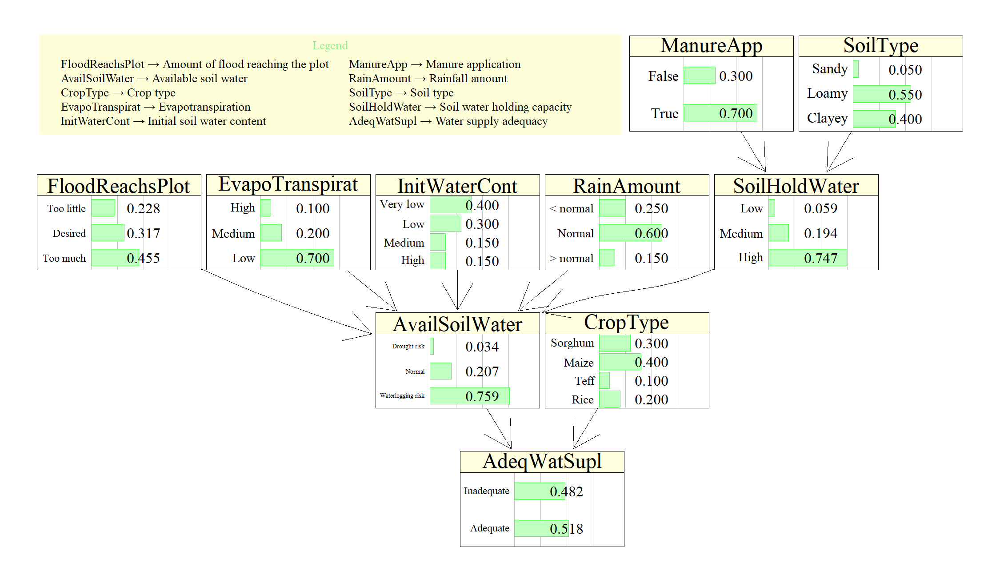

```{r setup, include=FALSE}
knitr::opts_chunk$set(echo = TRUE,out.extra = '',fig.align='center',fig.pos='!htbp',cache=TRUE)
```

```{r Message, include = FALSE, echo = FALSE, cache = FALSE}
warning("Heavy computation may be disabled. Please check the chunks!")
```

# Introduction {#I}

A complex crop model was developed for Flood-based Farming Systems across the Kisumu County in Kenya and Tigray region in Ethiopia. This document provides supplementary materials supporting some of the claims made in the result section of the main paper.

# Result {#II}

```{r Setting the Scene, include = FALSE, echo = FALSE, cache = FALSE}

set.seed(123)

### Installing devtools package to get decisionSupportExtra from github ####
if (!require("devtools")) {
  install.packages("devtools")
}

## Installing decisionSupportExtra package from github ####
if (!require("decisionSupportExtra")) {
  devtools::install_github("Issoufou-Liman/decisionSupportExtra", build = TRUE, force = TRUE,
                           upgrade = "always", build_opts = c("--no-resave-data", "--no-manual"))

}

## loading required packages ####
if (!require("pacman")) install.packages("pacman")
pacman::p_load(gRain,
               bnlearn,
               Rgraphviz,
               ggplot2,
               grid,
               gridExtra,
               decisionSupport,
               fitdistrplus,
               rriskDistributions,
               scales
)

## Loading decisionSupportExtra package ####
library(decisionSupportExtra)

## Loading the Bayesian network ####
source("source_files/BNs.R")

## removing objects that are no longer needed ####
# rm(list=setdiff(ls(), "network_bn_fit"))

## A function responsable plotting the locol BNs
source("source_files/graphviz_chart_bn.R")

## some common plots specifications
legend_bg <- adjustcolor( "yellow", alpha.f = 0.15)
plots_lwd <- 0.5
min_plots_width_in <- 2.63
max_plots_width_in <- 7.5
max_plots_height_in <- 8.75
min_plots_res <- 300
plots_compression <- "lzw"
plots_font_family <- 'serif' # 'sans'
plots_font <- 1 # 2
plot_font_size <- 10

## exporting the plot to file.####
export_fun <- function(export, output_dir = "figures"){
  paste0(output_dir, '/', export, ".png")
}

my_theme <- theme_bw(base_size = plot_font_size, 
                     base_family = plots_font_family) +
  theme(panel.grid.minor = element_blank(),
        # strip.background = element_blank(),
        legend.title = element_blank(),
        # remove facet spacing on x-direction
        panel.spacing = unit(0,"line"),
        
        panel.border = element_rect(color = "black", fill = NA, size = 0.25),
        axis.ticks = element_line(colour = 'black', size = 0.05),
        legend.position="top",
        legend.justification = 'right',
        strip.background = element_rect(fill='lightgoldenrodyellow', color = "gray", size = 0.075),
        strip.text = element_text(colour = 'black'),
        plot.subtitle=element_text(size=9.5, face="italic", color="blue"))
```

## Bayesian Networks Models {# II1}

### Farming Constraints at farming plot level {#II11}

A BN describing the farming constraints in presented in Figure \@ref(fig:fig1). The most important limiting factors describing the farming constraints in the study areas the adequacy of water supply to crops (AdeqWatSupl), the effectiveness of cropping systems (EffCropSystems), and the quality of farming practices (AgricManagEff) resulting from farmers’ managements options (Figures \@ref(fig:fig2) to \@ref(fig:fig6)).  These will be described in more details in sections \@ref(I12) to \@ref(I14).

```{r Farming constraints BNs,eval=TRUE, include = FALSE, echo = FALSE, cache = FALSE}

## Farming constraints BNs ####

# net <- model2network ("[AgricManagEff][EffCropOptions][AdeqWatSupl][FarmConstraints|EffCropOptions:AdeqWatSupl:AgricManagEff]")

abbr_node_names <- c("AgricManagEff",
                     "EffCropOptions",
                     "FarmConstraints",
                     "AdeqWatSupl")

net <- model2network ("[Agricultural_management_efficiency_at_initial_stage][Effectiveness_of_cropping_options][Water_supply_adequacy_at_initial_stage][Local_constraints_at_initial_stage|Effectiveness_of_cropping_options:Water_supply_adequacy_at_initial_stage:Agricultural_management_efficiency_at_initial_stage]")

legende <- bnlearn::nodes(net)
```

```{r Farming constraints BNs writing, eval=FALSE,include=FALSE,echo=FALSE, cache = FALSE}
net <- decisionSupportExtra::extract_bn(bn = network_bn_fit, string_model = net)
saveRDS(net,  "output_files/Modelling_FBFS_Suppl_Farming_Constraints_BNs_data.rds")
```

```{r Farming constraints BNs reading, eval=TRUE,include=FALSE,echo=FALSE, cache = FALSE}
net <- readRDS("output_files/Modelling_FBFS_Suppl_Farming_Constraints_BNs_data.rds")
```

```{r Farming constraints BNs plot, eval=TRUE, include = FALSE, echo = FALSE, cache = FALSE}

bnlearn::nodes(net) <- abbr_node_names

legende <- mapply(paste, abbr_node_names, sprintf('\u2192'), legende)
legende <- gsub("_", " ",  legende)
legende <- gsub(" at initial stage", "",  legende)
legende <- gsub("Local constraints", "Farming constraints",  legende)


leg_breaks <- list(3:length(legende), 1:2)
legende <- lapply(leg_breaks, function(i) legende[i])
legend_pos <- c('bottomleft', 'bottomright')
legend_title <- c("Legend (1 of 2)", "Legend (2 of 2)")

inset <- list(c(0.035, 0.15), c(0.035, 0.15))
text_width_ext <- c(0.55*1, 0.55)


png(export_fun(export = "Modelling_FBFS_Suppl_Farming_Constraints_BNs_plot"),
     res = min_plots_res,
     units = 'in',
     # compression = plots_compression,
     width = max_plots_width_in, 
     height = max_plots_height_in/3.5,
     pointsize = 12)

par(font = plots_font, family = plots_font_family, lwd=plots_lwd)

graphviz_chart_bn (x = net, type = "barprob", layout = "dot", draw.levels = TRUE,abbreviate=FALSE,
                   grid = TRUE, scale = c(max_plots_height_in/3.5, max_plots_width_in), col = "black", bg = "transparent",
                   text.col = "black", bar.col = "green", strip.bg = "lightyellow")

lapply(1:length(legende), function(i) {
  legend(legend_pos[i], legend = legende[[i]], text.width = text_width_ext[i]*strwidth(legende[[i]][which.max(nchar(legende[[i]]))]), 
         cex=0.5, ncol = 1,
         bty="o", box.lwd=1, box.col='lightyellow', xjust=1, yjust=1, bg=legend_bg,
         title = legend_title[i], title.col = 'lightgreen', inset=inset[[i]])
})
dev.off()
```

```{r fig1, echo=FALSE, out.width = '100%', fig.cap="BNs describing important variables as part of a mixed model describing the farming constraints in FBFS in Kisumu (Kenya) and Tigray (Ethiopia)."}
knitr::include_graphics("figures/Modelling_FBFS_Suppl_Farming_Constraints_BNs_plot.png")
```

### Water Supply Adequacy {# II12}

A BN describing the processes leading to the amount of flood reaching the plot (FloodReachsPlot) is presented in Figure \@ref(fig:fig2). The amount of flood reaching the farming plot was assessed separately since it is an important variable with regards to the overall available water for crop development under FBFS setting.

```{r Water Supply Adequacy local BNs,eval=TRUE, include = FALSE, echo = FALSE, cache = FALSE}

local_net <- compileCPT(list(Type_of_water_diversion, 
                        Sediment_load_at_initial_stage, 
                        Rainfall_amount_at_initial_stage,
                        
                        Soil_type,
                        Evapotranspiration_at_initial_stage,
                        Initial_soil_water_content,
                        Soil_water_holding_capacity,
                        Available_soil_water_at_initial_stage,
                        Water_supply_adequacy_at_initial_stage,
                        Crop_type,
                        Manure_application,
                        
                        Slope, 
                        Social_arrangements,
                        Rain_event_occurence_at_initial_stage,
                        Main_Canals_Maitnenance_at_initial_stage, 
                        Amount_of_shared_flood_at_initial_stage, 
                        Upstream_abstraction_at_initial_stage,
                        Location_of_the_plot, 
                        Field_canal_maintenance_at_initial_stage, 
                        Presence_of_the_farmer_during_flood_event_at_initial_stage,
                        Amount_of_flood_reaching_the_plot_at_initial_stage))
local_net <- grain(local_net)
local_net <- as.bn.fit(local_net)
```

```{r Flood reaching plot BNs,eval=TRUE, include = FALSE, echo = FALSE, cache = FALSE}

## Flood reaching plot BNs ####

# net <- model2network("[DiversionType][Slope][SocialArrang][RainOccur][PlotLocat][FieldCanalMaint][Pznt4Flood][SedimentLoad|DiversionType][MainCanalMaint|DiversionType:SocialArrang][UpsAbstract|SocialArrang:PlotLocat][SharedFlood|RainOccur:MainCanalMaint:SedimentLoad:Slope][FloodReachsPlot|FieldCanalMaint:Pznt4Flood:SharedFlood:UpsAbstract]")

abbr_node_names <- c("FloodReachsPlot",
                     "SharedFlood",
                     "FieldCanalMaint",
                     "PlotLocat",
                     "MainCanalMaint", 
                     "Pznt4Flood", 
                     "RainOccur",
                     "SedimentLoad",
                     "Slope",
                     "SocialArrang",
                     "DiversionType",
                     "UpsAbstract")

net <- model2network("[Type_of_water_diversion][Slope][Social_arrangements][Rain_event_occurence_at_initial_stage][Location_of_the_plot][Field_canal_maintenance_at_initial_stage][Presence_of_the_farmer_during_flood_event_at_initial_stage][Sediment_load_at_initial_stage|Type_of_water_diversion][Main_Canals_Maitnenance_at_initial_stage|Type_of_water_diversion:Social_arrangements][Upstream_abstraction_at_initial_stage|Social_arrangements:Location_of_the_plot][Amount_of_shared_flood_at_initial_stage|Rain_event_occurence_at_initial_stage:Main_Canals_Maitnenance_at_initial_stage:Sediment_load_at_initial_stage:Slope][Amount_of_flood_reaching_the_plot_at_initial_stage|Field_canal_maintenance_at_initial_stage:Presence_of_the_farmer_during_flood_event_at_initial_stage:Amount_of_shared_flood_at_initial_stage:Upstream_abstraction_at_initial_stage]")

legende <- bnlearn::nodes(net)
```

```{r Flood reaching plot BNs writing, eval=TRUE,include=FALSE,echo=FALSE, cache = FALSE}
net <- decisionSupportExtra::extract_bn(bn = local_net, string_model = net)
saveRDS(net,  "output_files/Modelling_FBFS_Suppl_Flood_reaching_plot_BNs_data.rds")
```

```{r Flood reaching plot BNs reading, eval=TRUE,include=FALSE,echo=FALSE, cache = FALSE}
net <- readRDS("output_files/Modelling_FBFS_Suppl_Flood_reaching_plot_BNs_data.rds")
```

```{r Flood reaching plot BNs plot, eval=TRUE, include = FALSE, echo = FALSE, cache = FALSE}

bnlearn::nodes(net) <- abbr_node_names

legende <- mapply(paste, abbr_node_names, sprintf('\u2192'), legende)
legende <- gsub("_", " ",  legende)
legende <- gsub(" at initial stage", "",  legende)
legende <- lapply(list(1:6, 7:length(legende)), function(i){
  legende[i]
})

legend_pos <- c('topright', 'bottomleft')
legend_title <- c("Legend (1 of 2)", "Legend (2 of 2)")
inset <- list(c(0.09, 0.067), c(0.05, 0.07))
ncol_leg <- c(1,2)

png(export_fun(export = "Modelling_FBFS_Suppl_flood_reaching_plot_BNs_plot"),
     res = min_plots_res,
     units = 'in',
     # compression = plots_compression,
     width = max_plots_width_in, 
     height = max_plots_height_in/2.5,
     pointsize = 11)

par(font = plots_font, family = plots_font_family, lwd=plots_lwd)

graphviz_chart_bn (x = net, type = "barprob", layout = "dot", draw.levels = TRUE,abbreviate=FALSE,
                   grid = TRUE, scale = c(max_plots_height_in/3, max_plots_width_in), col = "black", bg = "transparent",
                   text.col = "black", bar.col = "green", strip.bg = "lightyellow")

lapply(1:length(legende), function (i){
  legend(legend_pos[i], legend = legende[[i]], text.width = 0.57*strwidth(legende[[i]][which.max(nchar(legende[[i]]))]), 
         cex=0.55, ncol = ncol_leg[i],
         bty="o", box.lwd=1, box.col='lightyellow', xjust=1, yjust=1, bg=legend_bg,
         title = legend_title[i], title.col = 'lightgreen', inset=inset[[i]])
})

dev.off()
```

```{r fig2, echo=FALSE, out.width = '100%', fig.cap="BNs describing important variables as part of a mixed model describing the amount of flood at the farming plot level in FBFS in Kisumu (Kenya) and Tigray (Ethiopia)."}
knitr::include_graphics("figures/Modelling_FBFS_Suppl_flood_reaching_plot_BNs_plot.png")
```

At the root of the amount of flood reaching the plot BNs are the nodes describing water diversion type (DiversionType), the social arrangement for water acquisition and sharing (SocialArrang), and the location of the farming plot (PlotLocat). The water diversion type is important since it determines the overall water delivery (SharedFlood) and ultimately the overall expected flood amount at the plot level (FloodReachsPlot) via the way in which farmers are committed as a group (SocialArrang) to maintain their main water distribution networks (MainCanalMaint) and its efficiency with regards to sediment budget (SedimentLoad). If the social organisation (SocialArrang) is not adequate along a topographic gradient (Slope), it may lead to unfair upstream abstraction (UpsAbstract), hence penalising water users downstream (FloodReachsPlot). Flood water is trapped in FBFS using earthen bunds (Figure \@ref(fig:fig1); Main) which need to be close/open at the right time either for irrigation if need or water release if too much. Individual farmers, therefore, need to make sure this happens by being present at the right time and making sure the water is diverted from the main canal to their respective secondary and tertiary sub-water distribution system. Given the adequacy of the above-mentioned aspects, farmers presence in the field during floods (Pznt4Flood) and the quality of their maintenance of the canals (FieldCanalMaint) can still strongly affect the amount of flood reaching their plot (FloodReachsPlot), and ultimately the overall soil water budget. These may have minor importance when there is rainfall on the field (RainOccur = On-site) and major importance in the case of spontaneous flood event from upstream (RainOccur = Off-site).

```{r Water Supply Adequacy BNs,eval=TRUE, include = FALSE, echo = FALSE, cache = FALSE}

## Water Supply Adequacy BNs ####

# net <- model2network("[CropType][SoilType][ManureApp][SoilHoldWater|SoilType:ManureApp][EvapoTranspirat][InitWaterCont][RainAmount][FloodReachsPlot][AvailSoilWater|SoilHoldWater:EvapoTranspirat:RainAmount:InitWaterCont:FloodReachsPlot][AdeqWatSupl|AvailSoilWater:CropType]")

abbr_node_names <- c("FloodReachsPlot",
                     "AvailSoilWater",
                     "CropType",
                      "EvapoTranspirat", 
                     "InitWaterCont",
                     "ManureApp", 
                     "RainAmount", 
                     "SoilType",
                     "SoilHoldWater", 
                     "AdeqWatSupl")

net <- model2network("[Crop_type][Soil_type][Manure_application][Soil_water_holding_capacity|Soil_type:Manure_application][Evapotranspiration_at_initial_stage][Initial_soil_water_content][Rainfall_amount_at_initial_stage][Amount_of_flood_reaching_the_plot_at_initial_stage][Available_soil_water_at_initial_stage|Soil_water_holding_capacity:Evapotranspiration_at_initial_stage:Rainfall_amount_at_initial_stage:Initial_soil_water_content:Amount_of_flood_reaching_the_plot_at_initial_stage][Water_supply_adequacy_at_initial_stage|Available_soil_water_at_initial_stage:Crop_type]")

legende <- bnlearn::nodes(net)
```

```{r Water Supply Adequacy BNs writing, eval=TRUE,include=FALSE,echo=FALSE, cache = FALSE}
net <- decisionSupportExtra::extract_bn(bn = local_net, string_model = net)
saveRDS(net,  "output_files/Modelling_FBFS_Suppl_Water_supply_adequacy_BNs_data.rds")
```

```{r Water Supply Adequacy BNs reading, eval=TRUE,include=FALSE,echo=FALSE, cache = FALSE}
net <- readRDS("output_files/Modelling_FBFS_Suppl_Water_supply_adequacy_BNs_data.rds")
```

```{r Water Supply Adequacy BNs plot, eval=TRUE, include = FALSE, echo = FALSE, cache = FALSE}

bnlearn::nodes(net) <- abbr_node_names

legende <- mapply(paste, abbr_node_names, sprintf('\u2192'), legende)
legende <- gsub("_", " ",  legende)
legende <- gsub(" at initial stage", "",  legende)

png(export_fun(export = "Modelling_FBFS_Suppl_Water_Supply_Adequacy_BNs_plot"),
     res = min_plots_res,
     units = 'in',
     # compression = plots_compression,
     width = max_plots_width_in, 
     height = max_plots_height_in/2,
     pointsize = 10.5)

par(font = plots_font, family = plots_font_family, lwd=plots_lwd)

graphviz_chart_bn (x = net, type = "barprob", layout = "dot", draw.levels = TRUE,abbreviate=FALSE,
                   grid = TRUE, scale = c(max_plots_height_in/2, max_plots_width_in), col = "black", bg = "transparent",
                   text.col = "black", bar.col = "green", strip.bg = "lightyellow")

legend('topleft', legend = legende, text.width = 0.65*strwidth(legende[which.max(nchar(legende))]), 
       cex=0.65, ncol = 2,
       bty="o", box.lwd=1, box.col='lightyellow', xjust=1, yjust=1, bg=legend_bg,
       title = 'Legend', title.col = 'lightgreen', inset=c(0.04, 0.06))

dev.off()
```

```{r fig3, echo=FALSE, out.width = '100%', fig.cap="BNs describing important variables as part of a mixed model describing the water supply adequacy in FBFS in Kisumu (Kenya) and Tigray (Ethiopia)."}

```

The soil water profile of a given farming plot includes important biophysical aspects related to soils and climate. The available water for crops is determined by the soil water holding capacity (SoilHoldWater), the total amount and temporal distribution of rainfall (RainAmount) along with residual soil moisture (InitWaterCont), which can be significant under certain FBFS such as flood recession agriculture. Soil water holding capacity (SoilHoldWater) can vary greatly depending on the soil type (SoilType), and the soil management strategies employed by the farmer (e.g. manure application (ManureApp). 

### Agricultural management efficiency {#II13}

A BN describing the process that can lead to farming inefficiency (FarmingIneff) is presented using two graphs, one (Figure \@ref(fig:fig4)) describing the available soil nutrient (AvailSoilNut), and the other (Figure \@ref(fig:fig5)) describing the overall agricultural management efficiency. The amount of available soil nutrients is defined by the fertilizer applications either in the form of organic (ManureApp) or mineral addition (FertiApp) by the farmer, and on the other hand by the sediment naturally brought by the flood water. Here, it is important to distinguish between coarse sediments (SedimentLoad) described under the rubric Available soil water which are likely to have negative impact and the fine rich sediments (AddSediments) which have positive impact on crops. Fertilizer application can only be expected when the desired fertilizer by the farmer is available on the market at the time when the farmers can afford it (Access2Inputs). This depends on the purchasing power of farmers and their willingness to acquire the fertilizers (RelativeWealth) in the one hand and the mutual aids (MutualAids) among peer farmers.

```{r Available soil Nutrients local BNs,eval=TRUE, include = FALSE, echo = FALSE, cache = FALSE}

local_net <- compileCPT(list(Relative_wealth_status,
                        Mutual_aids,
                        Access_to_inputs_at_initial_stage,
                        Available_Labor_force_at_initial_stage,
                        Available_paid_labor_at_initial_stage,
                        skills_of_the_farmer,
                        Application_of_traditional_crop_protection_Methods_at_initial_stage,
                        Manure_application,
                        Chemical_application_at_initial_stage,
                        Fertilizers_application_at_initial_stage,
                        Rich_sediments_addition_from_flood_at_initial_stage,
                        Available_soil_nutrients_at_initial_stage,
                        Effectiveness_of_pest_and_disease_reduction_practices_at_initial_stage,
                        Effectiveness_of_Weeding_at_initial_stage,
                        Pest_and_desease_impact_at_initial_stage,
                        Weeds_impact_at_initial_stage,
                        # Farming_efficiency_at_initial_stage,
                        Agricultural_management_efficiency_at_initial_stage,
                        Crop_type
))
local_net <- grain(local_net)
local_net <- as.bn.fit(local_net)
```

```{r Available soil Nutrients BNs,eval=TRUE, include = FALSE, echo = FALSE, cache = FALSE}

## Available soil Nutrients ####

# net <- net <- model2network("[RelatWealth][MutualAids][AddSediments][ManureApp][FertiApp|Access2Inputs][Access2Inputs|RelatWealth:MutualAids][AvailSoilNut|ManureApp:FertiApp:AddSediments]")

abbr_node_names <- c("Access2Inputs", 
                     "AvailSoilNut", 
                     "FertiApp", 
                     "ManureApp", 
                     "MutualAids",
                     "RelatWealth", 
                     "AddSediments"
                     )


net <- model2network("[Relative_wealth_status][Mutual_aids][Rich_sediments_addition_from_flood_at_initial_stage][Manure_application][Fertilizers_application_at_initial_stage|Access_to_inputs_at_initial_stage][Access_to_inputs_at_initial_stage|Relative_wealth_status:Mutual_aids][Available_soil_nutrients_at_initial_stage|Manure_application:Fertilizers_application_at_initial_stage:Rich_sediments_addition_from_flood_at_initial_stage]")

legende <- bnlearn::nodes(net)
```

```{r Available soil Nutrients BNs writing, eval=TRUE,include=FALSE,echo=FALSE, cache = FALSE}
net <- decisionSupportExtra::extract_bn(bn = local_net, string_model = net)
saveRDS(net,  "output_files/Modelling_FBFS_Available_soil_Nutrients_BNs_data.rds")
```

```{r Available soil Nutrients BNs reading, eval=TRUE,include=FALSE,echo=FALSE, cache = FALSE}
net <- readRDS("output_files/Modelling_FBFS_Available_soil_Nutrients_BNs_data.rds")
```

```{r Available soil Nutrients BNs plot, eval=TRUE, include = FALSE, echo = FALSE, cache = FALSE}

bnlearn::nodes(net) <- abbr_node_names

legende <- mapply(paste, abbr_node_names, sprintf('\u2192'), legende)
legende <- gsub("_", " ",  legende)
legende <- gsub(" at initial stage", "",  legende)

png(export_fun(export = "Modelling_FBFS_Available_soil_Nutrients_BNs_plot"),
     res = min_plots_res,
     units = 'in',
     # compression = plots_compression,
     width = max_plots_width_in, 
     height = max_plots_height_in/2.5,
     pointsize = 12)

par(font = plots_font, family = plots_font_family, lwd=plots_lwd)

graphviz_chart_bn (x = net, type = "barprob", layout = "dot", draw.levels = TRUE,abbreviate=FALSE,
                   grid = TRUE, scale = c(max_plots_height_in/2.5, max_plots_width_in*1.5), col = "black", bg = "transparent",
                   text.col = "black", bar.col = "green", strip.bg = "lightyellow")

legend('topleft', legend = legende, text.width = 0.725*strwidth(legende[which.max(nchar(legende))]), 
       cex=0.725, ncol = 1,
       bty="o", box.lwd=1, box.col='lightyellow', xjust=1, yjust=1, bg = legend_bg,
       title = 'Legend', title.col = 'lightgreen', inset=c(0.04, 0.09))

dev.off()
```

```{r fig4, echo=FALSE, out.width = '100%', fig.cap="BNs describing important variables as part of a mixed model describing the available nutrients in FBFS in Kisumu (Kenya) and Tigray (Ethiopia)."}
knitr::include_graphics("figures/Modelling_FBFS_Available_soil_Nutrients_BNs_plot.png")
```

The factors that of agricultural management efficiency include the available soil nutrients (AvailSoilNut), crops exposure/sensitivity to pest and diseases (PestDiseaseImpact) and the severity of weeds (WeedsImpact). The magnitude and recurrence of damage to crops due to pests & diseases and yield losses due to weeds can be related to the skills of the farmers (FarmerSkills) in crop protection, the farmers’ ability to acquire chemicals, and other aspects such as the available labour force, which may influence the effectiveness of crop protection. 

```{r Agricultural management efficiency BNs,eval=TRUE, include = FALSE, echo = FALSE, cache = FALSE}

## Agricultural management efficiency ####

# net <- model2network("[RelatWealth][MutualAids][AvailPaidLabor][FarmerSkills][TradiCropProtect][CropType][Access2Inputs|RelatWealth:MutualAids][AvailLaborForce|RelatWealth:MutualAids:AvailPaidLabor][ChemicalApp|Access2Inputs][EffWeeding|AvailLaborForce:FarmerSkills][AvailSoilNut][EffPestDiseaseReduc|ChemicalApp:TradiCropProtect:AvailLaborForce:FarmerSkills][WeedsImpact|EffWeeding:CropType][PestDeseaseImpact|EffPestDiseaseReduc:CropType][AgricManagEff|AvailSoilNut:PestDeseaseImpact:WeedsImpact]")

abbr_node_names <- c("Access2Inputs", 
                     "AgricManagEff", "TradiCropProtect", "AvailLaborForce",
                     "AvailPaidLabor", "AvailSoilNut", "ChemicalApp", "CropType",
                     "EffPestDiseaseReduc", "EffWeeding", "MutualAids",
                     "PestDeseaseImpact", "RelatWealth", "FarmerSkills", "WeedsImpact"
                     )

net <- model2network("[Relative_wealth_status][Mutual_aids][Available_paid_labor_at_initial_stage][skills_of_the_farmer][Application_of_traditional_crop_protection_Methods_at_initial_stage][Crop_type][Access_to_inputs_at_initial_stage|Relative_wealth_status:Mutual_aids][Available_Labor_force_at_initial_stage|Relative_wealth_status:Mutual_aids:Available_paid_labor_at_initial_stage][Chemical_application_at_initial_stage|Access_to_inputs_at_initial_stage][Effectiveness_of_Weeding_at_initial_stage|Available_Labor_force_at_initial_stage:skills_of_the_farmer][Available_soil_nutrients_at_initial_stage][Effectiveness_of_pest_and_disease_reduction_practices_at_initial_stage|Chemical_application_at_initial_stage:Application_of_traditional_crop_protection_Methods_at_initial_stage:Available_Labor_force_at_initial_stage:skills_of_the_farmer][Weeds_impact_at_initial_stage|Effectiveness_of_Weeding_at_initial_stage:Crop_type][Pest_and_desease_impact_at_initial_stage|Effectiveness_of_pest_and_disease_reduction_practices_at_initial_stage:Crop_type][Agricultural_management_efficiency_at_initial_stage|Available_soil_nutrients_at_initial_stage:Pest_and_desease_impact_at_initial_stage:Weeds_impact_at_initial_stage]")

legende <- bnlearn::nodes(net)
```

```{r Agricultural management efficiency BNs writing, eval=TRUE,include=FALSE,echo=FALSE, cache = FALSE}
net <- decisionSupportExtra::extract_bn(bn = local_net, string_model = net)
saveRDS(net,  "output_files/Modelling_FBFS_Agricultural_management_efficiency_BNs_data.rds")
```

```{r Agricultural management efficiency BNs reading, eval=TRUE,include=FALSE,echo=FALSE, cache = FALSE}
net <- readRDS("output_files/Modelling_FBFS_Agricultural_management_efficiency_BNs_data.rds")
```

```{r Agricultural management efficiency BNs plot, eval=TRUE, include = FALSE, echo = FALSE, cache = FALSE}

bnlearn::nodes(net) <- abbr_node_names

legende <- mapply(paste, abbr_node_names, sprintf('\u2192'), legende)
legende <- gsub("_", " ",  legende)
legende <- gsub(" at initial stage", "",  legende)

leg_breaks <- list(1:7, 8:length(legende))
legende <- lapply(leg_breaks, function(i) legende[i])
legend_pos <- c('topleft', 'bottomright')
legend_title <- c("Legend (1 of 2)", "Legend (2 of 2)")

inset <- list(c(0.04, 0.16), c(0.05, 0.035))


png(export_fun(export = "Modelling_FBFS_Agricultural_management_efficiency_BNs_plot"),
     res = min_plots_res,
     units = 'in',
     # compression = plots_compression,
     width = max_plots_width_in, 
     height = max_plots_height_in/1.5,
     pointsize = 14)

par(font = plots_font, family = plots_font_family, lwd=plots_lwd)

graphviz_chart_bn (x = net, type = "barprob", layout = "dot", draw.levels = TRUE,abbreviate=FALSE,
                   grid = TRUE, scale = c(max_plots_height_in/2, max_plots_width_in*1.5), col = "black", bg = "transparent",
                   text.col = "black", bar.col = "green", strip.bg = "lightyellow")

lapply(1:length(legende), function(i) {
  legend(legend_pos[i], legend = legende[[i]], text.width = 0.45*strwidth(legende[[i]][which.max(nchar(legende[[i]]))]), 
         cex=0.4, ncol = 1,
         bty="o", box.lwd=1, box.col='lightyellow', xjust=1, yjust=1, bg=legend_bg,
         title = legend_title[i], title.col = 'lightgreen', inset=inset[[i]])
  
})

dev.off()
```

```{r fig5, echo=FALSE, out.width = '100%', fig.cap="BNs describing important variables as part of a mixed model describing the effectiveness of agricultural management in FBFS in Kisumu (Kenya) and Tigray (Ethiopia)."}

```

### Effectiveness of cropping options {# II14}

The effectiveness of cropping options (EffCropsOptions) BN describes the various factors shaping the cropping system at the very early stages of crops growth. Crops are defined by their type (CropType [rice, maize, sorghum, teff]), their variety (CropVariety) and the farmers’ decision regarding which crops to grow and how to grow them (Intercropping). The decision of the farmer to grow a given type of crop and variety have strong implication on yield. 

```{r Effectiveness of cropping options BNs,eval=TRUE, include = FALSE, echo = FALSE, cache = FALSE}

## Effectiveness of cropping options BNs ####

net <- compileCPT(list(Crop_variety,
                        Intercropping,
                        Previous_crop, 
                        Planting_date,
                        Crop_type,
                        Effectiveness_of_cropping_options
))

net <- grain(net)
net <- as.bn.fit(net)

legende <- bnlearn::nodes(net)

abbr_node_names <- c("CropVariety", 
                "Intercropping",
                "PreviousCrop",
                "PlantingDate",
                'CropType',
                "EffCropOptions")
```

```{r Effectiveness of cropping options BNs writing, eval=TRUE,include=FALSE,echo=FALSE, cache = FALSE}
# net <- decisionSupportExtra::extract_bn(bn = network_bn_fit, string_model = net)
saveRDS(net,  "output_files/Modelling_FBFS_Suppl_Effectiveness_of_cropping_options_BNs_data.rds")
```

```{r Effectiveness of cropping options BNs reading, eval=TRUE,include=FALSE,echo=FALSE, cache = FALSE}
net <- readRDS("output_files/Modelling_FBFS_Suppl_Effectiveness_of_cropping_options_BNs_data.rds")
```

```{r Effectiveness of cropping options BNs plot, eval=TRUE, include = FALSE, echo = FALSE, cache = FALSE}

bnlearn::nodes(net) <- abbr_node_names

legende <- mapply(paste, abbr_node_names, sprintf('\u2192'), legende)

leg_breaks <- list(1:3, 4:length(legende))
legende <- lapply(leg_breaks, function(i) legende[i])
legend_pos <- c('bottomleft', 'bottomright')
legend_title <- c("Legend (1 of 2)", "Legend (2 of 2)")

inset <- list(c(0.035, 0.13), c(0.035, 0.13))
text_width_ext <- c(0.55*1.905, 0.6)

png(export_fun(export = "Modelling_FBFS_Suppl_Effectiveness_of_cropping_options_BNs_plot"),
     res = min_plots_res,
     units = 'in',
     # compression = plots_compression,
     width = max_plots_width_in, 
     height = max_plots_height_in/4,
     pointsize = 12)

par(font = plots_font, family = plots_font_family, lwd=plots_lwd)

graphviz_chart_bn (x = net, type = "barprob", layout = "dot", draw.levels = TRUE,abbreviate=FALSE,
                   grid = TRUE, scale = c(max_plots_height_in/2, max_plots_width_in*1.5), col = "black", bg = "transparent",
                   text.col = "black", bar.col = "green", strip.bg = "lightyellow")

lapply(1:length(legende), function(i) {
  legend(legend_pos[i], legend = legende[[i]], text.width = text_width_ext[i]*strwidth(legende[[i]][which.max(nchar(legende[[i]]))]), 
         cex=0.55, ncol = 1,
         bty="o", box.lwd=1, box.col='lightyellow', xjust=1, yjust=1, bg=legend_bg,
         title = legend_title[i], title.col = 'lightgreen', inset=inset[[i]])
  
})
dev.off()
```

```{r fig6, echo=FALSE, out.width = '100%', fig.cap="BNs describing important variables as part of a mixed model describing the effectiveness of cropping options in FBFS in Kisumu (Kenya) and Tigray (Ethiopia)."}
knitr::include_graphics("figures/Modelling_FBFS_Suppl_Effectiveness_of_cropping_options_BNs_plot.png")
```

###	BNs structures and nodes sensitivity in relation to crop development {#II15}

In the MC, the whole BNs were replicated with some changes in the CPTs and the causal relations when necessary. For example, the impact of weeds may be different depending on the crop development stages. Our model assumes that crop sensitivity to biotic and abiotic factors depends on the period when these factors are considered. Therefore, these stage-specific BNs or rather the concepts embedded in their nodes, their causal relationships, and their CPTs were made accordingly based on the available source of information. BNs were developed to estimate the farming constraint at plot level and at each phenological stage of crop development. The BN nodes (shown in Figures \@ref(fig:fig5) to \@ref(fig:fig6) are internally represented in four different crop development stages of the model (e.g. amount of shared flood at initial stage, amount of shared flood at development stage, amount of shared flood at mid stage amount of shared flood at late stage). Few of them that are expected to remain constant over a relatively short period of time (e.g. the type of water diversion (DiversionType), the slope etc.), however, were represented only once in the model and transported through the various crop development stages. For example, BN nodes soil type and location of the farming plot are considered as static variables as they are unlikely to change, at least not within few years, contrary to other nodes such as the impact of weeds and diseases which differ between consecutive phenological stages. We focus on processes at the initial stage in the description, but the target is assessed quantitively at each of the four stages to feed the MC model.

### Quantitative assessment of Farming Constraints {#II16}

The best fit for candidate distributions of the target node (farming constraints) derived from the sampling of the posterior probabilities of the BNs are shown in Figure \@ref(fig:fig7). These were fitted to a beta distribution seems owing to the nature of the data (ratio), and the values of the bootstrapped samples lying within reasonable bounds for skewness and kurtosis characterising a reasonable beta function for all the three farming constraints states (low, medium, high). A graphical assessment of the fit including the quantile and probability plots along with the theoretical and empirical density and cumulative distribution functions are presented in Figure \@ref(fig:fig8). 

```{r Cullen and Frey graph, include=FALSE, eval=TRUE}

obs_geom_size = 2
boot_geom_size = 0.01
dist_geom_pts_size = 2
dist_geom_line_size = 0.6
axis_text_size = 9
axis_title_size = 10
plot_title_size = 14
plot_subtitle_size = 10
strip_text_size = 10
legend_text_size = 6

p1 <- ggplot_descdist_bn(bn=network_bn_fit, node = "Local_constraints_at_initial_stage", 
                   obs_geom_size = obs_geom_size, boot_geom_size = boot_geom_size, dist_geom_pts_size = dist_geom_pts_size,
                   dist_geom_line_size = dist_geom_line_size, axis_text_size = axis_text_size, axis_title_size = axis_title_size,
                   plot_title_size = plot_title_size, plot_subtitle_size = plot_subtitle_size,
                   strip_text_size = strip_text_size, legend_text_size = legend_text_size)


ggsave(plot=p1, device = 'png', filename = "figures/Local_constraints_at_initial_stage_ggplot_distributions.png", 
       width = max_plots_width_in, 
       height =max_plots_height_in/2.5, units = "in", dpi = min_plots_res
)
```

```{r fig7,echo=FALSE,fig.width=max_plots_width_in,fig.height=max_plots_height_in/2.5,dpi=min_plots_res,fig.cap="Cullen and Frey graph showing the fit of candidate distributions for the joint distribution of the BNs to be used in MC simulation as part of a mixed model describing farming constraints in FBFS in Kisumu (Kenya) and Tigray (Ethiopia) (example for initial stage of crop development)."}

p1
```

```{r quantile and probability plots, include=FALSE, eval=TRUE}

fit_Local_constraints_at_initial_stage <- fit_node_states_distr (bn = network_bn_fit, 
                                                                 node = "Local_constraints_at_initial_stage", 
                                                                 distr = rep("beta", 3), 
                                                                 method = rep("mge", 3))


hist_bar_size = 0.3
dist_geom_pts_size = 0.03
dist_geom_smooth_size = 0.3
dist_geom_abline_size = 0.3
axis_text_size = 8
axis_title_size = 10
plot_subtitle_size = 12
plot_title_size = 14
strip_text_size = 10

p1 <- gg_plotdist(fit_Local_constraints_at_initial_stage, title = "Farming_constraints_at_initial_stage",
                 hist_bar_size = hist_bar_size, dist_geom_pts_size = dist_geom_pts_size,
                 dist_geom_smooth_size = dist_geom_smooth_size, dist_geom_abline_size = dist_geom_abline_size,
                 axis_text_size = axis_text_size, axis_title_size = axis_title_size, plot_subtitle_size = plot_subtitle_size,
                 plot_title_size = plot_title_size, strip_text_size = strip_text_size)

ggsave(plot=p1, device = 'png', filename = "figures/Local_constraints_at_initial_stage_fitted_distribution.png", 
       width = max_plots_width_in, 
       height =max_plots_height_in/2.5, units = "in", dpi = min_plots_res
)
```

```{r fig8,echo=FALSE,fig.width=max_plots_width_in,fig.height=max_plots_height_in/2.5,dpi=min_plots_res,fig.cap="Graphical assessment of the fit including the quantile and probability plots along with the theoretical and empirical density and cumulative distribution functions for beta distribution fit assessment as part of a mixed model describing the farming constraints in FBFS in Kisumu (Kenya) and Tigray (Ethiopia) (example for initial stage of crop development)."}

grid.draw(p1)
```

# reference {#III}
